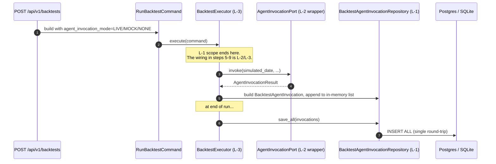

# Task 217 — BacktestAgentInvocation entity, port, adapter, migration (Phase L-1)

**Status**: Scoped, not started
**Branch**: `feat/l-backtest-agent-invocation-entity`
**Agent**: `backend-swe`
**Internal phase ID**: L-1 (the proposal labels these J-1..J-7 — Phase J already shipped, so the external phase is L. Internal sub-task IDs L-1/L-2/L-3 match the proposal's first three rows in §3.6.)

## Overview

Foundation entity for Phase L (agent-driven backtests). This task adds the persistence layer for one row per simulated trigger fire during a backtest: a new domain entity `BacktestAgentInvocation`, the matching repository port, a SQLModel adapter, an Alembic migration, and the in-memory adapter used by tests.

Plus one small but contract-defining extension to `RunBacktestCommand` (and the API request schema that surfaces it): the new `agent_invocation_mode: BacktestAgentInvocationMode` field — enum `NONE` / `MOCK` / `LIVE` — that tells the executor whether to call the agent at all on simulated trigger fires.

This task does **not** wire the executor or build the wrapping adapter. Those land in L-2 (#218) and L-3 (#219).

Origin: `docs/planning/agent-platform-next-steps.md` §3.4 ("New entities") and §3.6 row L-1 / J-1 ("Domain entity `BacktestAgentInvocation` + repository + migration").

## Context (what exists today)

The backtest pipeline (`backend/src/zebu/application/services/backtest_executor.py`) currently has no agent-decision concept. The simulated loop runs purely from the `TradingStrategy` implementation's `generate_signals` output — no triggers are evaluated and no agent is invoked. The result of a backtest is a `BacktestRun` row plus a synthetic `Portfolio` and its `Transaction[]` ledger.

In live execution, the trigger pipeline (Phase F-3) is the canonical agent-invocation site: `TriggerEvaluationService` fires evaluable triggers → `TriggerInvocationOrchestrator.fire()` calls the `AgentInvocationPort` adapter → writes a `TriggerFireRecord` audit row. The proposal calls for the backtest pipeline to grow a parallel-but-different audit row (`BacktestAgentInvocation`) that records the same kind of event in the simulated dimension.

Existing reference patterns this task mirrors:

- `TriggerFireRecord` entity (`backend/src/zebu/domain/entities/trigger_fire_record.py`) — the live-mode audit row. Same general shape but no `simulated_date` and no `backtest_run_id` FK; uses `fired_at` (wall-clock) instead.
- `TriggerFireRepository` port (`backend/src/zebu/application/ports/trigger_fire_repository.py`) — append-only repository contract; insert + a few read paths, no update / delete.
- `f001_trigger_entities.py` migration — the canonical Alembic shape for an append-only audit table with FKs (cascade / set-null / restrict).
- `j003_trigger_mode.py` migration — the canonical add-column-with-server-default Alembic shape (good reference for the `backtest_runs.agent_invocation_mode` column).
- `RunBacktestCommand` (`backend/src/zebu/application/commands/run_backtest.py`) — frozen dataclass with `api_key_id`; the new `agent_invocation_mode` field follows the same `api_key_id` pattern (optional + default value).

## Architecture

### New domain value object: `BacktestAgentInvocationMode`

A new `StrEnum` at `backend/src/zebu/domain/value_objects/backtest_agent_invocation_mode.py`. Mirrors `TriggerInvocationMode` in shape and naming convention.

| Value | Wire string | Meaning |
|---|---|---|
| `NONE` | `"none"` | Current behavior. Backtests run without agent invocation — no triggers evaluated, no `BacktestAgentInvocation` rows. Default. |
| `MOCK` | `"mock"` | The executor evaluates simulated triggers but the agent invocation port returns a deterministic, no-op decision (`HOLD`). Used for cheap integration testing of the executor wiring without paying for Anthropic calls. Still persists rows. |
| `LIVE` | `"live"` | Real Anthropic calls via the L-2 backtest-safe wrapper adapter. Costs real money; needs cost guardrails (L-6). |

### New domain entity: `BacktestAgentInvocation`

Append-only audit row at `backend/src/zebu/domain/entities/backtest_agent_invocation.py`. One row per simulated trigger fire during a backtest. Lives alongside `BacktestRun`; backtest_run cascade-deletes its rows.

#### Properties

| Property | Type | Constraints |
|---|---|---|
| `id` | `UUID` | Primary key. |
| `backtest_run_id` | `UUID` | FK → `backtest_runs.id`. Cascade-deletes with the run. |
| `simulated_date` | `date` | The in-simulation date this fire happened on. Distinct from any wall-clock timestamp. Must be `>= backtest_run.start_date` and `<= backtest_run.end_date` (enforced at service layer, not entity — the entity has no access to the run). |
| `trigger_id` | `UUID` | FK → `strategy_condition_triggers.id`. `ON DELETE SET NULL` so deleting a trigger doesn't break the audit row; entity must permit `None` for that recovered state. |
| `condition_evaluation_data` | `Mapping[str, object]` | Per-condition snapshot JSON (same shape as the live `TriggerFireRecord` field). Validated as a `Mapping` at the entity, opaque internally. |
| `agent_decision` | `AgentDecision \| None` | Post-guardrail decision from the agent. `None` only when `invocation_mode == MOCK` and the platform recorded a synthetic invocation, AND in any future mode that does not produce a decision (defensive). For `LIVE` invocations, must be set (including `INVOCATION_FAILED` on transport / parse error). |
| `rationale` | `str` | Free-text agent rationale. Truncated to 8000 chars at write time (entity raises if longer — caller must truncate). Empty string for `MOCK` rows. |
| `decision_payload` | `Mapping[str, object] \| None` | Decision-specific payload as emitted by the agent (the `AgentInvocationResult.payload` mapping). `None` for `MOCK` rows; set for all `LIVE` rows including `HOLD`. Stored as JSON column; entity treats opaque except for the dict-check normalisation. |
| `decision_executed` | `bool` | `True` when the simulated decision actually mutated the simulated trade book (i.e. a BUY/SELL/MODIFY_STRATEGY produced a transaction or strategy change in the simulation). `False` for HOLD, NEEDS_HUMAN, INVOCATION_FAILED, downgrade-to-HOLD outcomes, and MOCK rows. The L-3 executor sets this; the entity stores it. |
| `simulated_trade_id` | `UUID \| None` | When the decision produced a simulated transaction, the resulting `Transaction.id`. `None` otherwise. (Open question: see "Open design questions" §1 below — Tim should weigh in on whether this lives here or stays implicit via the transaction's own `trigger_id` column.) |
| `invocation_mode` | `BacktestAgentInvocationMode` | One of `MOCK` / `LIVE` — the per-row mode. (`NONE` is run-level, not per-row; no `BacktestAgentInvocation` rows are written in `NONE` mode.) |
| `agent_invocation_id` | `str \| None` | The Anthropic message ID (from `AgentInvocationResult.invocation_id`) for `LIVE` rows. `None` for `MOCK` rows. |
| `latency_ms` | `int` | Round-trip latency for the agent invocation. `>= 0`. `0` for `MOCK` rows. |
| `model` | `str` | Anthropic model identifier used (e.g. `"claude-haiku-4-5-20251001"`). Empty string for `MOCK` rows. |
| `created_at` | `datetime` | UTC wall-clock when the row was written (separate from `simulated_date`). |

#### Invariants

- `latency_ms >= 0`.
- `len(rationale) <= 8000` — same cap as `TriggerFireRecord.agent_response_raw`.
- `len(model) <= 100` — generous cap matching `agent_invocation_id` column width.
- `condition_evaluation_data` must be a `Mapping`. Like `TriggerFireRecord`, the entity normalises into a fresh `dict` on `__post_init__` to defend against caller-side mutation.
- `decision_payload`, if not `None`, must be a `Mapping`. Same normalisation.
- `invocation_mode == MOCK` requires: `agent_decision is None OR == HOLD` (exact contract decided in L-2; entity should accept either to keep the entity decoupled from the adapter contract — see "Open design questions" §3 below), `decision_payload is None`, `rationale == ""`, `model == ""`, `latency_ms == 0`, `agent_invocation_id is None`, `decision_executed is False`.
- `invocation_mode == LIVE` requires: `agent_decision is not None`, `rationale` may be empty string only when `agent_decision == INVOCATION_FAILED` (matches `TriggerFireRecord` truncation semantics), `model != ""`, `agent_invocation_id` may be `None` (transport error before the SDK assigned one).
- `decision_executed == True` is allowed only when `agent_decision in {BUY, SELL, MODIFY_STRATEGY}` and `invocation_mode == LIVE`. Otherwise must be `False`.
- `created_at` must be timezone-aware UTC (other entities follow this rule; the entity should raise on naive `created_at`).
- `simulated_date` is a `datetime.date`, not `datetime` — the simulation's notion of "today" has no intraday component. Enforced via the type only; no range check at entity level.

#### Operations

| Operation | Parameters | Returns | Notes |
|---|---|---|---|
| `__post_init__` | — | `None` | Validates all invariants; raises `InvalidBacktestAgentInvocationError`. |
| `__eq__`, `__hash__`, `__repr__` | — | per Python contract | Identity by `id`. Match `TriggerFireRecord` shape. |

No mutation methods — the entity is `frozen=True` and append-only.

New exception class `InvalidBacktestAgentInvocationError(InvalidEntityError)` in `backend/src/zebu/domain/exceptions.py`. Mirrors `InvalidTriggerFireError`.

### New port: `BacktestAgentInvocationRepository`

Append-only repository contract at `backend/src/zebu/application/ports/backtest_agent_invocation_repository.py`. Mirrors `TriggerFireRepository`.

#### Methods

| Method | Parameters | Returns | Errors |
|---|---|---|---|
| `get` | `invocation_id: UUID` | `BacktestAgentInvocation \| None` | `None` when not found. |
| `list_for_backtest_run` | `backtest_run_id: UUID, *, limit: int \| None = None, offset: int = 0` | `list[BacktestAgentInvocation]` | Ordered by `simulated_date` ascending, then `created_at` ascending (chronological in simulation time). |
| `count_for_backtest_run` | `backtest_run_id: UUID` | `int` | Used for paginated list endpoints. |
| `save` | `invocation: BacktestAgentInvocation` | `None` | Insert-only. Duplicate `id` raises (mapped via integrity error in SQL adapter, raised directly in in-memory adapter). |
| `save_all` | `invocations: Sequence[BacktestAgentInvocation]` | `None` | Bulk insert. Important for performance — see "Persistence performance" below. |

#### Implementation requirements

- Append-only — no update / delete on the port.
- `save_all` MUST batch into a single DB round-trip (`session.add_all` + one `flush`) to keep the simulated-day loop bounded. A 2-year daily-fire backtest with 500 rows must not be 500 round-trips. The L-3 executor will accumulate in-memory and flush at the end of `_run_pipeline`, mirroring the existing `transaction_repo.save_all` pattern.
- Ordering on `list_for_backtest_run` is stable across runs even when multiple rows share the same `simulated_date` (ties broken by `created_at` ascending).
- SQL adapter MUST handle the `ON DELETE SET NULL` cascade on `trigger_id` correctly — orphaned rows still load (the entity allows `trigger_id is None` — see "Open design questions" §2 below for whether the entity actually allows null trigger_id or we mark it `NOT NULL` with restrict).

### Extension: `RunBacktestCommand.agent_invocation_mode`

Add the new field to `RunBacktestCommand` (`backend/src/zebu/application/commands/run_backtest.py`):

| Field | Type | Default | Wire serialisation |
|---|---|---|---|
| `agent_invocation_mode` | `BacktestAgentInvocationMode` | `BacktestAgentInvocationMode.NONE` | StrEnum — serialises as `"none"` / `"mock"` / `"live"`. |

Default of `NONE` preserves backwards compatibility — every existing call site continues to behave exactly as today (no agent invocation, no `BacktestAgentInvocation` rows).

API request schema mirror in `backend/src/zebu/adapters/inbound/api/schemas/backtests.py` (or wherever the existing `POST /api/v1/backtests` request body lives — agent should confirm by reading): add the optional `agent_invocation_mode` field with the same enum, default `"none"`.

Field placement decision (Tim 2026-05-23): the mode also lives as a column on `backtest_runs.agent_invocation_mode`. Resolves the ambiguity where zero audit rows could mean either NONE-mode or LIVE-with-no-fires; gives the UI / activity-feed a single-row lookup for the badge label without scanning the audit table. The column is `VARCHAR(16) NOT NULL DEFAULT 'none'` (server default for back-fill of existing rows).

### Migration: `l001_backtest_agent_invocations`

New file at `backend/migrations/versions/l001_backtest_agent_invocations.py`. Revision id `l001_backtest_agent_invocations` (<32 chars). Down-revision is `j004_audit_field_cleanup` (the current head, verified by `ls backend/migrations/versions/`).

#### Schema

```
TABLE backtest_agent_invocations
  id                          UUID         PK
  backtest_run_id             UUID         NOT NULL, FK -> backtest_runs.id ON DELETE CASCADE
  simulated_date              DATE         NOT NULL
  trigger_id                  UUID         NULLABLE,  FK -> strategy_condition_triggers.id ON DELETE SET NULL
  condition_evaluation_data   JSON         NOT NULL
  agent_decision              VARCHAR(30)  NULLABLE   (matches TriggerFireRecord.agent_response width; null for MOCK)
  rationale                   VARCHAR(8000) NOT NULL  (empty string allowed; matches TriggerFireRecord.agent_response_raw)
  decision_payload            JSON         NULLABLE
  decision_executed           BOOLEAN      NOT NULL DEFAULT FALSE
  simulated_trade_id          UUID         NULLABLE,  FK -> transactions.id ON DELETE SET NULL
  invocation_mode             VARCHAR(16)  NOT NULL  (matches BacktestAgentInvocationMode width)
  agent_invocation_id         VARCHAR(200) NULLABLE   (matches TriggerFireRecord.agent_invocation_id width)
  latency_ms                  INTEGER      NOT NULL DEFAULT 0
  model                       VARCHAR(100) NOT NULL DEFAULT ''
  created_at                  DATETIME     NOT NULL

ALTER TABLE backtest_runs
  ADD COLUMN agent_invocation_mode  VARCHAR(16)  NOT NULL DEFAULT 'none'
                                                 -- back-fills existing rows
                                                 -- (matches BacktestAgentInvocationMode width)
```

#### Indexes

- `idx_bt_agent_invocation_run_date` — `(backtest_run_id, simulated_date)`. Backs `list_for_backtest_run` newest-/oldest-by-sim-date ordering and the per-run count.
- `idx_bt_agent_invocation_trigger` — `(trigger_id)`. Optional but cheap; backs "all backtest invocations of a given trigger" queries (analytics — not in scope of L-1 itself, but the index is so cheap it's worth adding now to avoid a follow-up migration).

#### FK behaviour summary

| FK | ON DELETE |
|---|---|
| `backtest_run_id` → `backtest_runs.id` | `CASCADE` (deleting a run deletes its invocations) |
| `trigger_id` → `strategy_condition_triggers.id` | `SET NULL` (deleting a trigger orphans rows; audit preserved) |
| `simulated_trade_id` → `transactions.id` | `SET NULL` (deleting an orphan transaction shouldn't lose the rationale) |

Idempotency: match the inspector-based exists checks used by `j003_trigger_mode.py` and `f001_trigger_entities.py`. Both upgrade and downgrade.

### SQLModel adapter: `SQLModelBacktestAgentInvocationRepository`

New file `backend/src/zebu/adapters/outbound/database/backtest_agent_invocation_repository.py`. Mirrors `trigger_fire_repository.py`.

- Constructor takes an `AsyncSession`.
- `save` uses the same pre-check (`session.get` for the id → raise `ValueError` on duplicate) the trigger-fire repo uses, so the error message is "BacktestAgentInvocation with id=... already exists; the audit log is append-only" instead of a raw `IntegrityError`.
- `save_all` calls `session.add_all([...])` then `await self._session.flush()` in one shot. **Do NOT loop per-row save** — see "Persistence performance" below for the rationale.
- `to_domain` / `from_domain` model in `backend/src/zebu/adapters/outbound/database/models.py` follows the same pattern as `TriggerFireRecordModel`. Pay attention to:
  - JSON columns deserialise to `dict`; the entity's `Mapping`-normalisation handles that.
  - `agent_decision` round-trips through `AgentDecision(stringvalue)` with the same `INVOCATION_FAILED`-is-system-only check the trigger-fire path applies.
  - `invocation_mode` round-trips through `BacktestAgentInvocationMode(stringvalue)`.

### In-memory adapter: `InMemoryBacktestAgentInvocationRepository`

New file `backend/src/zebu/application/ports/in_memory_backtest_agent_invocation_repository.py`. Same simple `dict[UUID, BacktestAgentInvocation]` shape as `in_memory_trigger_fire_repository.py`. Returns shallow copies on read so callers can mutate without affecting stored state. `save_all` simply iterates `save`.

## Data flow



## Decisions and rationale

| Decision | Rationale |
|---|---|
| Separate entity from `TriggerFireRecord` (not "add a `simulated_date` column to the existing table") | The two have different lifecycles (live audit rows are scheduled by APScheduler and live forever; backtest rows cascade-delete with the run), different invariants (live needs `api_key_id` for trade attribution; backtest doesn't), and different read patterns (live: per-trigger / per-activation; backtest: per-run). Co-locating them in one table would force the live audit to grow optional fields it doesn't need. Two tables, parallel shape, separate ports. |
| `invocation_mode` enum on the entity (not just on `RunBacktestCommand`) | Each row records its own mode so a single backtest run could in principle mix MOCK and LIVE rows (e.g. fall back to MOCK after a budget cap). L-6 (cost guardrails) is the future caller of that. |
| `agent_decision` is `AgentDecision \| None` (not a separate `BacktestAgentDecision` enum) | The live and backtest invocations produce the same decision shape — there's no reason to fork the enum. `INVOCATION_FAILED` works the same way in both contexts. |
| `condition_evaluation_data` stays JSON-opaque on the entity | Same precedent as `TriggerFireRecord`. The per-condition shape is the evaluator's contract, not the entity's. |
| Append-only — no update path | Audit log integrity. Corrections happen via a new row, not by mutating an existing one. |
| FK on `trigger_id` is `ON DELETE SET NULL` | Deleting a trigger after the backtest ran shouldn't delete the historical audit row — the rationale and condition snapshot are still useful for retrospective analysis. (Open question §2 — Tim may prefer `RESTRICT` instead.) |
| `agent_invocation_mode` lives on **both** `RunBacktestCommand` (input) and `BacktestRun` (durable state, new column) | The command carries the operator's choice into the executor; the `BacktestRun` column stamps it for downstream readers (UI badge, activity feed, analytics) so they don't have to scan `backtest_agent_invocations` to label a run. Resolves "zero audit rows = NONE-mode? or = LIVE with no fires?" ambiguity. |
| Migration revision id prefix `l001` | Phase L is post-J; matches the existing prefix convention (`f`, `h`, `j`). |

## Implementation plan

Single PR. Order within the branch:

1. **Domain VO** `BacktestAgentInvocationMode` + unit test (enum membership, string values).
2. **Domain entity** `BacktestAgentInvocation` + invariants + `InvalidBacktestAgentInvocationError` + unit tests covering each invariant.
3. **Port** `BacktestAgentInvocationRepository` (Protocol).
4. **In-memory adapter** `InMemoryBacktestAgentInvocationRepository` + unit tests covering all port methods.
5. **Migration** `l001_backtest_agent_invocations` (idempotent — inspector checks for table and each index). Run `alembic upgrade head` against a clean SQLite to verify.
6. **SQLModel model + adapter** — `BacktestAgentInvocationModel` in `models.py` with `to_domain` / `from_domain`. `SQLModelBacktestAgentInvocationRepository` mirroring `trigger_fire_repository.py`. Integration test against SQLite covering save / save_all / get / list_for_backtest_run / count_for_backtest_run.
7. **Command extension** — `RunBacktestCommand.agent_invocation_mode` field with `NONE` default. Update API request schema in `adapters/inbound/api/schemas/backtests.py` (or equivalent). API integration test that the field round-trips through the request → command → response shape (response shape is unchanged because the L-3 executor isn't wired yet, but the field should appear in the request schema and pass through).
8. **Backtest-run column** — extend the existing `BacktestRun` entity (`backend/src/zebu/domain/entities/backtest_run.py`) and `BacktestRunModel` to carry `agent_invocation_mode: BacktestAgentInvocationMode` (default `NONE`). The L-1 use case that creates a `BacktestRun` stamps the value from the command. Add a property to the API response schema so the UI can read it. Unit test that the round-trip preserves the mode.
9. **Wire-up audit** — every constructor of `RunBacktestCommand` and `BacktestRun` in tests / fixtures gets the new field (or relies on the default). Grep for `RunBacktestCommand(` and `BacktestRun(` across the repo and ensure none are broken.

The migration must apply cleanly to a fresh prod-like DB (Postgres) and a fresh test DB (SQLite). Both branches of the inspector-based `_has_table` / `_has_index` checks must be exercised.

## Testing strategy

**Unit**:

- `BacktestAgentInvocationMode` enum: values, string serialisation, membership lookup.
- `BacktestAgentInvocation` entity: each invariant raises `InvalidBacktestAgentInvocationError`. Include cross-mode invariant tests (`LIVE` without `agent_decision`, `MOCK` with `decision_payload`, etc.).
- `InvalidBacktestAgentInvocationError` is a subclass of `InvalidEntityError`.
- `RunBacktestCommand` accepts the new field; default is `NONE`.

**In-memory adapter unit tests**:

- `save` → `get` round-trips.
- `save` of duplicate id raises.
- `save_all` of a mixed batch (MOCK + LIVE rows) round-trips and preserves ordering on `list_for_backtest_run`.
- `count_for_backtest_run` matches `len(list_for_backtest_run(...))`.

**Integration tests** (SQLModel adapter):

- All in-memory unit tests above, repeated against the SQL adapter and a SQLite test DB.
- FK cascade: deleting the parent `BacktestRun` row removes all invocations.
- FK set-null: deleting the parent `Trigger` row sets `trigger_id` on the row to `NULL`; reloading the entity reflects that.
- Bulk insert performance check: 500 rows via `save_all` should complete in well under a second (sanity check, not a strict perf gate).

**Migration tests**:

- `alembic upgrade head` from `j004_audit_field_cleanup` applies cleanly.
- `alembic downgrade -1` removes the table and indexes cleanly.
- Re-running `alembic upgrade head` after the downgrade re-creates everything (idempotency).

**API integration test**:

- `POST /api/v1/backtests` with `{"agent_invocation_mode": "live", ...}` returns 201 and the field round-trips back in the response (or, if the response shape doesn't yet include the field, the command-layer test asserts the field was set on the command). Default omission yields `NONE` on the command.

## Quality bar (non-negotiable)

- No `Any` / `any`; no Pyright suppressions.
- Behavior-focused tests at port boundaries only; do not mock internal logic.
- Conventional commits (this branch shipped as one PR).
- `task quality:backend` + `task ci` green.

## Design decisions (resolved 2026-05-23)

1. **`simulated_trade_id` on the invocation entity** — keep as specified. Trade-side attribution via a future `transactions.backtest_agent_invocation_id` column is a separate concern; not blocking L-1.

2. **`trigger_id` `ON DELETE SET NULL`** — confirmed. Triggers are mutable user-owned entities; locking trigger deletion against historical backtest audit rows would be a footgun for cleanup.

3. **MOCK-mode decision value** — the entity is permissive (accepts both `None` and `HOLD` for `MOCK` rows). L-2 will pick one shape and write consistently; entity invariants stay flexible.

4. **`backtest_runs.agent_invocation_mode` column** — **ADDED** (Tim's call, overriding the architect's "implicit by row count" default). The column lives at the run level so the UI / activity feed can label a run as MOCK / LIVE / NONE without scanning the audit table, and to disambiguate "zero rows = NONE-mode" from "zero rows = LIVE with no fires". Schema in the migration section above; back-filled with server default `'none'`.

5. **No `provider` field on the invocation row** — the `model` string already carries provider-derivable info. Pre-adding `provider` would be dead weight until a Gemini backtest adapter ships; a future migration is cheap if needed.

## Out of scope (do not draft / implement here)

- The `BacktestAgentInvocationAdapter` (the L-2 wrapper around `AnthropicAgentInvocationAdapter` that enforces backtest-safe tools and the simulated-date filter). Spec'd in #218.
- The `BacktestExecutor` integration that actually calls the adapter on simulated trigger fires. Spec'd in #219.
- Tool restrictions / `BACKTEST_SAFE_TOOLS` whitelist enforcement. L-2 owns this.
- UI surfaces (#220 / L-4 — backtest config form, result page invocation log). Not yet spec'd.
- Cost guardrails (#221 / L-6). Not yet spec'd.
- Operating manual updates (#222 / L-5). Not yet spec'd.

## Success criteria

- `task ci` green.
- `alembic upgrade head` + `alembic downgrade -1` + re-upgrade all succeed against a clean SQLite.
- A consumer can call `repo.save(BacktestAgentInvocation(...))` and read it back via `repo.get(...)` and `repo.list_for_backtest_run(...)`.
- `RunBacktestCommand(agent_invocation_mode=BacktestAgentInvocationMode.LIVE)` accepts the new field; existing call sites continue to work with the default.
- The existing backtest happy path (PR #292's MCP smoke flow against the real DB) continues to work unchanged — the new table exists but is unused until L-3 lands.

## References

- `docs/planning/agent-platform-next-steps.md` §3.4 (new entities) and §3.6 row J-1 (renamed L-1 externally; J-1 internally per proposal text)
- `backend/src/zebu/domain/entities/trigger_fire_record.py` — canonical append-only audit-row entity to mirror
- `backend/src/zebu/application/ports/trigger_fire_repository.py` — port shape to mirror
- `backend/src/zebu/adapters/outbound/database/trigger_fire_repository.py` — SQL adapter shape to mirror
- `backend/src/zebu/domain/value_objects/trigger_invocation_mode.py` — enum shape to mirror
- `backend/migrations/versions/f001_trigger_entities.py` — multi-table audit migration reference
- `backend/migrations/versions/j003_trigger_mode.py` — single-column-with-default migration reference
- `backend/src/zebu/application/commands/run_backtest.py` — command to extend
- `docs/architecture/principles.md` — Clean Architecture rules
- Sibling task specs: #218 (L-2), #219 (L-3)
