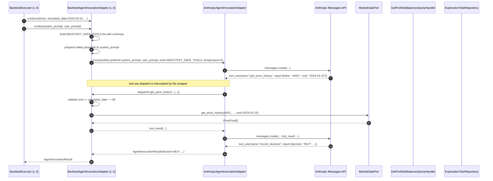
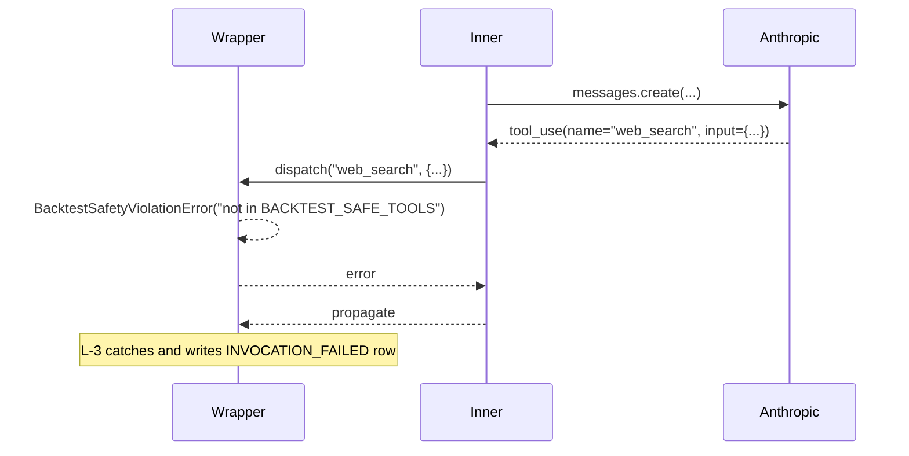

# Task 218 — BacktestAgentInvocationAdapter — backtest-safe agent invocation (Phase L-2)

**Status**: Scoped, not started (depends on #217)
**Branch**: `feat/l-backtest-agent-invocation-adapter`
**Agent**: `backend-swe`
**Internal phase ID**: L-2

## Overview

Phase L-2 adds the **backtest-safe wrapper** around the production `AnthropicAgentInvocationAdapter`. The wrapper enforces two things:

1. **Tool surface restriction.** Only a whitelisted set of `BACKTEST_SAFE_TOOLS` is exposed to the agent; the rest of the platform's read-tool surface (and any third-party MCP tool the agent might otherwise reach) is hidden.
2. **Simulated-date filter on tool calls.** Every whitelisted tool that takes a date parameter is automatically capped at `simulated_date` so the agent can never read data from after the in-simulation "today". This is the primary defense against future-data leakage — proposal §3.2 calls this the #1 pitfall.

The wrapper implements the same `AgentInvocationPort` contract as the production adapter (so the L-3 executor injects it via DI with no awareness of the wrapping), with one additional construction parameter: the `simulated_date` for the current invocation. Each invocation builds a fresh wrapper instance (or, equivalently, calls a `with_simulated_date(d)` helper) so the date scope is per-fire, not per-backtest.

This task adds the **two MOCK and LIVE invocation paths** (LIVE-via-wrapped-Anthropic and MOCK-returns-no-op), but **does not** wire the executor (that's L-3 / #219).

Origin: `docs/planning/agent-platform-next-steps.md` §3.5 (tool restrictions) and §3.6 row J-2 (renamed L-2).

## Context (what exists today)

`AgentInvocationPort` is the contract the F-3 orchestrator uses to invoke the agent. The production implementation `AnthropicAgentInvocationAdapter` (`backend/src/zebu/adapters/outbound/anthropic/agent_invocation_adapter.py`) calls the Anthropic Messages API with tool-use coercion: a synthetic `record_decision` tool is prepended, the agent is forced to call it to terminate, and the response is parsed into `AgentInvocationResult`.

The adapter currently accepts caller-supplied tools via the `tools: list[ToolDefinition] | None` parameter on `.invoke(...)` — those would be the read-tools the agent could call before deciding. In production today, F-3 passes `tools=None` (no MCP read-tools wired into the inline prompt — that's deferred per the F-3 design). The MCP read-tools live in the standalone `zebu-mcp` server (`mcp/src/zebu_mcp/`) that desktop clients attach to, NOT in the inline F-3 trigger pipeline.

This means the existing inline F-3 invocation has **no tool surface** — it's pure prompt-in, decision-out. The L-2 work specifically adds a controlled tool surface for the backtest mode: the agent can call `get_price_history`, `get_portfolio_state(as_of=...)`, etc. through the wrapper while the simulated-date filter keeps it honest.

Reference: see the proposal §3.5 quoted whitelist.

## Architecture

### New value object: `BacktestSafeTool`

A typed identifier for each backtest-safe tool. New file `backend/src/zebu/domain/value_objects/backtest_safe_tool.py`. StrEnum so it serialises cleanly in logs.

| Value | Wire string | Backed by | Date-arg semantics |
|---|---|---|---|
| `GET_PRICE_HISTORY` | `"get_price_history"` | `MarketDataPort.get_price_history` (capped at `end <= simulated_date`) | Cap `end` to `simulated_date` end-of-UTC-day. Reject `end > simulated_date` outright. |
| `GET_PORTFOLIO_STATE` | `"get_portfolio_state"` | `GetPortfolioBalancesQueryHandler.as_of` (existing path) | Set `as_of = simulated_date` end-of-UTC-day. Reject if caller passes a later `as_of`. |
| `LIST_EXPLORATION_TASKS` | `"list_exploration_tasks"` | `ExplorationTaskRepository.list_*` filtered by `claimed_before <= simulated_date` | Cap `claimed_before` to `simulated_date`. Reject if caller passes a later filter. |

The Anthropic SDK calls a tool by name; the wrapper resolves the name back to this enum, then dispatches to the right adapter / handler. Anything outside this list — `web_search`, `fetch_news`, `get_current_price`, `create_strategy`, `run_backtest`, any third-party MCP — is **not registered as a callable tool on the wrapped invocation** and so cannot be invoked. Defense in depth: any unknown tool name reaching the wrapper raises `BacktestSafetyViolationError` rather than silently passing through.

### New domain exception: `BacktestSafetyViolationError`

In `backend/src/zebu/domain/exceptions.py`, subclass `AgentInvocationError`. Raised when:

- The agent attempts to call a tool not on the `BACKTEST_SAFE_TOOLS` allowlist.
- The agent passes a date/datetime argument that exceeds `simulated_date`.

Carries `tool_name: str | None`, `simulated_date: date`, and a human-readable `reason: str`. The L-3 executor catches these and writes them onto the `BacktestAgentInvocation.rationale` + sets `agent_decision = INVOCATION_FAILED` (the agent broke the safety contract; the row records the violation for audit).

### Port contract — unchanged

The wrapper IS-A `AgentInvocationPort`. Its `.invoke(...)` signature matches the port: same `system_prompt`, `user_prompt`, `tools`, `timeout_secs` parameters, returning the same `AgentInvocationResult`.

The simulated-date is passed via the **constructor** of the wrapper, not as a method parameter. This keeps the port contract clean (no leaky abstraction where every consumer must thread a date through) and lets L-3 construct a fresh wrapper per simulated-day iteration. See "Enforcement mechanism" below for why this is preferred over a request-header-based approach.

### New adapter: `BacktestAgentInvocationAdapter`

New file at `backend/src/zebu/adapters/outbound/anthropic/backtest_agent_invocation_adapter.py`.

#### Constructor

| Parameter | Type | Notes |
|---|---|---|
| `inner` | `AgentInvocationPort` | The production Anthropic adapter (or any other live adapter). Injected so tests can use a `StaticAgentInvocationPort` to simulate a fixed decision. |
| `simulated_date` | `date` | The in-simulation "today". The wrapper hard-caps every tool call to this date. |
| `market_data` | `MarketDataPort` | For `GET_PRICE_HISTORY` dispatch. |
| `portfolio_balances_handler` | `GetPortfolioBalancesQueryHandler` | For `GET_PORTFOLIO_STATE` dispatch with `as_of=simulated_date`. |
| `exploration_task_repo` | `ExplorationTaskRepository` | For `LIST_EXPLORATION_TASKS` dispatch with `claimed_before=simulated_date`. |
| `agent_temperature` | `float \| None` | Optional override for the model's `temperature` parameter. Default `0.0` (deterministic by setting; see "Non-determinism" below). When `None`, falls through to the inner adapter's default. |

#### Method

| Method | Parameters | Returns | Errors |
|---|---|---|---|
| `invoke` | same as port (`system_prompt`, `user_prompt`, `tools`, `timeout_secs`) | `AgentInvocationResult` | `BacktestSafetyViolationError` if agent calls a non-whitelisted tool or passes a future-dated argument; `AgentInvocationError` / `AgentResponseParseError` propagated from `inner`. |

#### Behaviour

1. **Tool surface injection.** The caller-supplied `tools` argument is **ignored** — the wrapper supplies its own `tools` list to `inner.invoke(...)`: exactly the three `BACKTEST_SAFE_TOOLS` `ToolDefinition` entries, with schemas that **mention the simulated-date constraint in the description** so the agent reads "you may not request data past <simulated_date>" in the prompt itself. Belt-and-braces with the runtime enforcement.

2. **Inner invocation.** The wrapper calls `inner.invoke(system_prompt=<safety-prefixed>, user_prompt=user_prompt, tools=<BACKTEST_SAFE_TOOLS>, timeout_secs=timeout_secs)`. The `system_prompt` is the caller's prompt with an additional safety preamble appended: "You are running in backtest mode. The current simulated date is <simulated_date>. You may NOT call tools that return data after this date. Available tools: <list>." (Tests assert structural properties of the modified prompt — section present, simulated_date inlined — not exact string equality.)

3. **Tool-call interception.** When the inner adapter invokes a tool (the Anthropic SDK's tool-use loop), the wrapper intercepts the dispatch:
   - Resolve the tool name to `BacktestSafeTool`. Unknown name → raise `BacktestSafetyViolationError`.
   - Validate any date/datetime arguments against `simulated_date`. Out-of-bounds → raise `BacktestSafetyViolationError`.
   - Dispatch to the appropriate adapter / handler with the validated arguments. Return the result to the agent as a tool result.

4. **Result.** The `AgentInvocationResult` from `inner.invoke` is returned unmodified. Latency, model id, invocation id, and the decision payload come straight through.

#### Implementation requirements

- The wrapper MUST NOT call the Anthropic SDK directly. It composes `inner` (which is the SDK-wrapping adapter). This keeps the wrapper testable with a fake `inner` and keeps the SDK dependency localised.
- The simulated-date filter MUST be enforced both in the **schema description** of each tool (so the agent is informed) AND at the **dispatch site** (so an agent that ignores the description still can't violate). Tests cover both layers.
- Time zones: `simulated_date` is a calendar date with no time-of-day. When comparing against a tool argument that's a `datetime`, the wrapper converts the date to `datetime(year, month, day, 23, 59, 59, tzinfo=UTC)` — end-of-UTC-day — for the cap, mirroring the convention used by `HistoricalDataPreparer.prepare`. This is the most permissive cap that's still safe (lets the agent see "today's" close but not tomorrow's).
- The MOCK and NONE modes do **not** go through this adapter. L-3 (#219) instantiates a separate, trivial port for MOCK mode (see "Mock-mode shape" below). NONE mode bypasses the agent invocation entirely. This adapter exists only for LIVE mode.

### New port implementation: `MockBacktestAgentInvocationPort`

A second, separate port implementation at `backend/src/zebu/application/ports/in_memory_agent_invocation_port.py` (alongside the existing `StaticAgentInvocationPort` / `ScriptedAgentInvocationPort` / `FailingAgentInvocationPort`). New class:

| Class | Behaviour |
|---|---|
| `MockBacktestAgentInvocationPort` | Always returns a deterministic, no-op `AgentInvocationResult`. The decision is `AgentDecision.HOLD`. Payload is `{"notes": "MOCK invocation — no action taken"}`. Rationale is empty string. Model is empty string. Latency is `0`. Invocation id is `None`. |

This is the MOCK-mode contract referenced from #217. The L-3 executor instantiates this directly (no construction parameters needed) for MOCK invocations.

(Open question: see "Open design questions" §3 below. Default position adopted: returns `HOLD` per the proposal; the entity in #217 is permissive enough to accept this shape.)

### Enforcement mechanism — adapter-level filter vs request-header middleware

The proposal §3.5 sketches "Enforced server-side via a request middleware that reads the `X-Zebu-Simulated-Date` header set by the backtest executor." That suggests a request-middleware layer.

**Decision adopted in this spec: adapter-level enforcement only.** Rationale:

- The inline F-3 trigger pipeline already has no tool surface — there's no HTTP request from the agent back to the Zebu API that a middleware could intercept. The agent's "tool calls" are tool-use blocks in the Anthropic Messages API response that the adapter dispatches in-process. So a `X-Zebu-Simulated-Date` header doesn't have a request to live on.
- Adapter-level filter is simpler, fewer moving parts, and the only layer that actually sits between the agent decision and the data adapters. Any defence at the HTTP layer would be a second pass that re-implements the same checks.
- An HTTP middleware would matter for the **MCP server** path (where the desktop agent calls Zebu over HTTP using `X-API-Key`). That's relevant to a future capability — "let desktop Claude run a backtest replay with the same safety guarantees" — but it's out of scope for L-2. Flagging in "Future work" below.

If, during implementation, the SWE finds the adapter-level dispatch hard to retrofit (e.g. the SDK's tool-use loop runs in a way that hides arguments), surface that and re-open the design question. The fallback is to add a request middleware that intercepts the existing `GET /price-history`, `GET /portfolios/{id}/balances`, and `GET /exploration-tasks` endpoints, but that introduces a second enforcement layer and a `X-Zebu-Simulated-Date` header convention; prefer to avoid.

### Future-data leakage controls — explicit failure modes

For each `BacktestSafeTool`:

| Tool | Out-of-bounds case | Wrapper behaviour |
|---|---|---|
| `GET_PRICE_HISTORY` | Agent calls with `end > simulated_date` end-of-day | Raise `BacktestSafetyViolationError(tool_name="get_price_history", simulated_date=..., reason="end date <iso> exceeds simulated_date")`. |
| `GET_PRICE_HISTORY` | Agent calls with `end == simulated_date` end-of-day | Allowed. The simulated close is the freshest information. |
| `GET_PRICE_HISTORY` | Agent calls without an `end` argument | Wrapper defaults `end = simulated_date end-of-day`. |
| `GET_PORTFOLIO_STATE` | Agent calls with `as_of > simulated_date` | Raise `BacktestSafetyViolationError`. |
| `GET_PORTFOLIO_STATE` | Agent calls without `as_of` | Wrapper defaults `as_of = simulated_date end-of-day`. |
| `LIST_EXPLORATION_TASKS` | Agent calls with `claimed_before > simulated_date` | Raise `BacktestSafetyViolationError`. |
| `LIST_EXPLORATION_TASKS` | Agent calls without filters | Wrapper defaults `claimed_before = simulated_date end-of-day`. Also filters status to `done` only (per proposal). |
| Any non-whitelisted tool name | Agent calls e.g. `web_search`, `fetch_news`, `get_current_price` | Raise `BacktestSafetyViolationError(tool_name=<name>, reason="not in BACKTEST_SAFE_TOOLS")`. |

`BacktestSafetyViolationError` is a domain exception, not an `AgentResponseParseError` — the agent emitted a valid response, it just emitted one that violates the simulation invariants. L-3's executor treats it the same as any agent-side failure (writes an `INVOCATION_FAILED` `BacktestAgentInvocation` row with the violation reason as the rationale, downgrades any pending decision).

### Non-determinism — reconciliation with proposal §3.7

Proposal §3.7 says "don't try to make it deterministic" (Communicate variance in the result). Proposal §5 Q4 says default `temperature=0`. These aren't actually in conflict, but L-2 must surface the contract:

- **Defaults**: `agent_temperature = 0.0` via the new constructor param. The wrapper passes this through to `inner.invoke` (this requires extending the inner port to accept a `temperature` parameter — see "Port extension" below).
- **Per-backtest override**: `RunBacktestCommand` should grow an optional `agent_temperature: float | None = None` field for the next-level caller (the API route) to surface. L-3 reads this and constructs the wrapper accordingly.
- **Documented reality**: even at `temperature=0`, the agent's response is **not** byte-stable across re-runs (Anthropic's sampling is not fully deterministic at temp=0, and the SDK / server side can pad tokens). The cost guardrail (L-6) and the result-rendering (L-4) need to communicate this — "you'll get a similar but not identical decision sequence on re-run."

**Default position adopted**: `temperature=0` by default for cost reasons (each run consumes fewer thinking tokens at 0) and reproducibility intent, but the operating manual + UI explicitly warns the user the results are best-effort deterministic, not bit-stable.

### Port extension — adding `agent_temperature` to `AgentInvocationPort`

Today the port's `.invoke` signature has no `agent_temperature` parameter. To plumb `temperature=0` through, we extend the port:

```text
AgentInvocationPort.invoke(
  *,
  system_prompt: str,
  user_prompt: str,
  tools: list[ToolDefinition] | None = None,
  timeout_secs: float = 60.0,
  agent_temperature: float | None = None,   # NEW — backwards-compatible default
) -> AgentInvocationResult
```

`AnthropicAgentInvocationAdapter` passes the value through to `messages.create(temperature=...)` when not `None`. All three in-memory test adapters (`StaticAgentInvocationPort`, `ScriptedAgentInvocationPort`, `FailingAgentInvocationPort`) accept and ignore the new parameter (so no test breaks).

This is a small but cross-cutting change — call it out in the PR so reviewers see why the port signature moves.

### Persistence performance — recap

This task does not persist anything directly (L-3 owns the persistence path). But the **shape of the data this adapter returns** has implications for L-3's persistence:

- Each `invoke` call returns one `AgentInvocationResult`. L-3 builds one `BacktestAgentInvocation` row from it. For a 2-year daily-fire backtest, that's ~500 rows.
- The wrapper's tool dispatch is also a write-amplifier: each agent invocation may issue 0-5 tool calls before deciding. **None of these tool calls hit the audit table.** Only the final `record_decision` result lands as a row. So 500 fires => 500 rows.
- 500 rows is fine for a single bulk insert. L-3 should accumulate in memory and `save_all` once at the end of `_run_pipeline`. The L-1 port contract requires `save_all` to be a single round-trip.

## Data flow



Alternative path on violation:



## Decisions and rationale

| Decision | Rationale |
|---|---|
| Adapter-level enforcement, not HTTP middleware | The inline agent dispatch happens in-process inside `messages.create`'s tool-use loop. There's no request to attach a header to. Middleware is the right pattern when the consumer crosses an HTTP boundary; not here. Re-evaluate when the MCP server path needs the same guarantee. |
| `simulated_date` on the **constructor**, not `.invoke(...)` parameter | Keeps the port contract clean. L-3 builds a fresh wrapper per simulated-day iteration; the wrapper instance is short-lived (one `invoke` call per construction) so no resource concerns. |
| Wrapper supplies its own `tools` list, ignoring caller's | Belt-and-braces. Even if a future L-3 mistake passes `tools=None`, the wrapper guarantees the agent has access to the BACKTEST_SAFE_TOOLS and nothing else. |
| Safety preamble in the system prompt | The agent should know it's in backtest mode. Pure runtime enforcement without telling the agent leads to lots of `BacktestSafetyViolationError`s and wasted tokens; telling it up front front-loads the constraint into reasoning. |
| `BacktestSafetyViolationError` is a domain exception, not a parse error | Semantic clarity: the agent gave a parseable response, the response just broke a simulation invariant. The audit row marks the invocation as `INVOCATION_FAILED`. |
| New `agent_temperature` parameter on the port (cross-cutting change) | The proposal §5 Q4 default `temperature=0` is a port-level concern (every adapter should support it), not a backtest-specific concern. Putting it on the port keeps the live path consistent. |
| MOCK port lives next to existing in-memory ports | `MockBacktestAgentInvocationPort` is a test/runtime fake — same category as `StaticAgentInvocationPort`. Co-locating keeps the in-memory adapter file the one place to read for "what ports exist as fakes". |
| Tool dispatch goes through ports already shared with live (market_data, balances, exploration tasks), not separate adapters | Behaviour parity between backtest and live: same query semantics, same data corrections, same caching. Adding a separate "backtest data adapter" would introduce drift risk. |
| Decision payload returned unchanged from inner | The wrapper doesn't reshape decisions — the agent's choice and rationale are the artefact. The wrapper restricts what the agent could see and call to make the decision, not what the decision is. |
| Safety enforcement at TWO layers (prompt + runtime) | Defence in depth. The proposal §3.2 calls this the #1 pitfall; missing it once is a credibility-breaking bug in the entire L phase. |

## Implementation plan

Single PR. Order within the branch:

1. **Port extension** — add `agent_temperature: float | None = None` to `AgentInvocationPort.invoke(...)`. Update `AnthropicAgentInvocationAdapter.invoke` to accept it and thread it to `messages.create`. Update all three in-memory adapters to accept and ignore it. Add unit tests for the new parameter on the production adapter (mock the SDK, assert temperature appears on the call).
2. **Domain VO** `BacktestSafeTool` + unit test.
3. **Domain exception** `BacktestSafetyViolationError` + unit test (carries fields, subclass of `AgentInvocationError`).
4. **Mock port** `MockBacktestAgentInvocationPort` in `in_memory_agent_invocation_port.py` + unit test (always returns HOLD, no-op payload, fixed shape).
5. **Adapter** `BacktestAgentInvocationAdapter`:
    - Constructor accepts inner + simulated_date + market_data + balances handler + exploration task repo + optional temperature.
    - `BACKTEST_SAFE_TOOLS_DEFINITIONS` — list of `ToolDefinition` with schemas. Schemas reference `simulated_date` in the description.
    - `_build_safety_preamble(simulated_date)` — pure function building the system-prompt section.
    - `invoke` — composes safety preamble + system prompt, ignores caller-supplied `tools`, calls `inner.invoke` with `tools=BACKTEST_SAFE_TOOLS_DEFINITIONS` and `agent_temperature`.
    - Tool dispatch: depends on how `inner` (the Anthropic adapter) surfaces tool-use blocks. **Implementation detail to confirm at start of work**: the existing F-3 adapter doesn't actually run a tool-use loop today (the only tool is the synthetic `record_decision`, called once). L-2 introduces the **first tool-use loop in this codebase** — the wrapper, or the inner adapter extended to support it, must iterate: send messages, receive tool_use, dispatch, send tool_result, loop until `record_decision`. See "Implementation note" below.
6. **Tool dispatch helpers** — three small async helpers (`_dispatch_get_price_history`, `_dispatch_get_portfolio_state`, `_dispatch_list_exploration_tasks`) that validate inputs against `simulated_date` and call the underlying port/handler/repo. Each raises `BacktestSafetyViolationError` on out-of-bounds.
7. **Unit tests** for the adapter:
    - LIVE path with no tool calls (agent decides on first response) → `AgentInvocationResult` flows through unmodified.
    - LIVE path with one tool call to `get_price_history` at `end < simulated_date` → tool_result returned to agent, decision proceeds.
    - LIVE path with one tool call to `get_price_history` at `end > simulated_date` → `BacktestSafetyViolationError` raised.
    - LIVE path with one tool call to `web_search` (not on allowlist) → `BacktestSafetyViolationError` raised.
    - LIVE path with `agent_temperature=0.5` → temperature appears on the inner call.
    - Safety preamble: assert `simulated_date.isoformat()` appears in the system prompt sent to inner, and that the BACKTEST_SAFE_TOOLS names appear.
    - Caller-supplied `tools` argument is ignored: passing `[ToolDefinition(name="evil")]` does NOT make `evil` a callable tool.
    - MOCK port: always returns HOLD, no Anthropic call ever happens (assert via a `FailingAgentInvocationPort` injected as inner — should never be called).

#### Implementation note — Anthropic SDK tool-use loop

The existing F-3 adapter uses `tool_choice={"type": "tool", "name": "record_decision"}` to force a single-call termination. That's a one-shot interaction with no looping.

For L-2 the agent may want to call read-tools before deciding. The Anthropic Messages API protocol for this is well-known: send messages → receive a `tool_use` block → execute the tool → send a follow-up `messages.create` with the tool_result appended to messages → repeat until the model returns a non-tool-use stop (or in our case, calls `record_decision`).

The L-2 SWE has two choices:

- **A. Extend the inner adapter** with a loop mode (e.g. add `enable_tool_use_loop=True` to its constructor) so the inner adapter handles the loop and exposes a `dispatch_tool(name, input) -> Awaitable[str]` callback the wrapper provides. The wrapper supplies the dispatch callback.
- **B. Implement the loop in the wrapper itself.** The wrapper iterates against the inner adapter using a lower-level entry point (or directly against the Anthropic SDK, breaking the "wrapper doesn't import anthropic" principle).

**Recommended approach**: Option A. Extend the inner adapter once to support a tool-use loop, gated by an optional dispatch callback in `.invoke`. This keeps the SDK dependency localised in the inner adapter and makes the same loop reusable for any future F-4-style "let live agents call MCP read-tools" work. The wrapper supplies its own dispatch closure (which does the simulated-date checks and raises `BacktestSafetyViolationError` on violation).

This is a non-trivial change to the inner adapter. Flag it in the PR; reviewers should understand the loop is being added for L-2's benefit (and will be reusable for future inline-tool-use work). **Specifically: the production inline-trigger path's behavior must NOT change** — when the callback is not supplied, the existing single-shot termination logic continues to apply.

## Testing strategy

**Unit**:

- `BacktestSafeTool` enum: values, string serialisation.
- `BacktestSafetyViolationError`: subclass of `AgentInvocationError`, carries fields, repr / message format.
- `MockBacktestAgentInvocationPort.invoke` always returns HOLD with the documented shape.
- `BacktestAgentInvocationAdapter._build_safety_preamble`: deterministic, contains the simulated_date and tool names.
- Date arithmetic: end-of-UTC-day conversion of a `date`; comparison with a `datetime` arg.

**Integration / behavior**:

- Adapter with a fake `inner` (a `StaticAgentInvocationPort` returning HOLD): assert the safety preamble and tool list reach the inner adapter.
- Adapter with a fake `inner` that simulates a tool-use loop (a custom test fake that calls back into `dispatch_tool` once with `get_price_history`, then with `record_decision`): assert the wrapper's dispatch invokes the market_data port with the capped end date.
- Adapter with a fake `inner` that simulates the same loop but with `end > simulated_date`: assert `BacktestSafetyViolationError` propagates.
- Adapter with a fake `inner` that calls `web_search`: assert `BacktestSafetyViolationError` propagates.
- Adapter rejection of caller-supplied `tools`: pass `tools=[ToolDefinition(name="evil", description="...")]`, assert the inner adapter receives only the BACKTEST_SAFE_TOOLS list.
- `agent_temperature` plumbs through to the inner call.

**Port-extension tests**:

- `AnthropicAgentInvocationAdapter` (production) accepts and threads `agent_temperature`. Mock the SDK; assert `temperature=...` on the call.
- All three in-memory adapters (`StaticAgentInvocationPort` / `ScriptedAgentInvocationPort` / `FailingAgentInvocationPort`) accept the new parameter without errors.
- Existing tests for `AnthropicAgentInvocationAdapter` continue to pass.

**Live-mode regression**:

- F-3 inline trigger pipeline tests (the orchestrator + Anthropic adapter happy path) continue to pass unchanged. The port extension must be backwards-compatible.

## Quality bar (non-negotiable)

- No `Any` / `any`; no Pyright suppressions.
- Behavior-focused tests; mock only at port boundaries (the Anthropic SDK, the `MarketDataPort` adapter, etc. — not the wrapper's internal helpers).
- Conventional commits.
- `task quality:backend` + `task ci` green.

## Design decisions (resolved 2026-05-23)

1. **Adapter-level enforcement** — confirmed (Tim 2026-05-23). The F-3 pipeline runs in-process via the Anthropic SDK's tool-use loop; no HTTP boundary exists for an `X-Zebu-Simulated-Date` middleware to attach to. Adapter-level filter is the natural boundary.

2. **Reusable tool-use loop** — confirmed (Tim 2026-05-23). Land the multi-turn tool-use loop in the inner Anthropic adapter as a first-class feature with a dispatch-callback parameter. F-3 (current single-shot) passes a no-op callback; L-2 passes the backtest-safe callback that enforces the whitelist + `simulated_date` filter. Any future F-4 inline tool-use inherits the same machinery. Cross-cutting change to the inner adapter — call out explicitly in the L-2 PR body so reviewers don't get blindsided.

3. **MOCK-mode decision: returns `HOLD` with the no-op payload** as specified. Synthetic invocations log a row so MOCK runs cross-check executor wiring.

4. **Cost-guardrail handoff stays in L-3 / L-6** — wrapper is budget-agnostic. L-3 owns the per-run budget; if exhausted, L-3 substitutes the MOCK port mid-run and writes a `MOCK` invocation row so the gap is visible. Simpler than threading a budget through the adapter.

5. **`simulated_date` boundary = end-of-UTC-day** — the agent needs that day's close to decide for that day's market. Matches live-invocation semantics.

6. **No-tool-call path allowed** — agent may emit `record_decision` immediately; wrapper returns unchanged.

7. **No L-2 cap on tool-call count** — cost concerns belong to L-6. Soft pressure via prompt preamble ("use tools sparingly, decide quickly").

## Out of scope

- The `BacktestExecutor` integration (#219 / L-3).
- The `BacktestAgentInvocation` entity / repository (#217 / L-1).
- UI surfaces (#220 / L-4).
- Cost guardrails (#221 / L-6).
- Operating manual (#222 / L-5).
- Multi-provider (Gemini) adapter for backtest mode (deferred).

## Success criteria

- `task ci` green.
- `BacktestAgentInvocationAdapter.invoke(...)` produces an `AgentInvocationResult` from a happy-path mock inner with no tool calls.
- A mocked agent attempting `web_search` raises `BacktestSafetyViolationError`.
- A mocked agent calling `get_price_history(end=simulated_date - 1 day)` succeeds and the dispatch hits the market data port with the same end date.
- A mocked agent calling `get_price_history(end=simulated_date + 1 day)` raises `BacktestSafetyViolationError`.
- `MockBacktestAgentInvocationPort.invoke(...)` returns `AgentDecision.HOLD` with the documented payload, without touching any Anthropic SDK code.
- Existing F-3 / Anthropic adapter tests continue to pass.

## References

- `docs/planning/agent-platform-next-steps.md` §3.2 (future-data leakage), §3.5 (BACKTEST_SAFE_TOOLS), §3.6 row J-2 (renamed L-2), §3.7 (non-determinism), §5 Q4 (temperature default)
- `backend/src/zebu/application/ports/agent_invocation_port.py` — port to extend
- `backend/src/zebu/adapters/outbound/anthropic/agent_invocation_adapter.py` — inner adapter to wrap and extend
- `backend/src/zebu/application/ports/in_memory_agent_invocation_port.py` — where `MockBacktestAgentInvocationPort` lives
- `backend/src/zebu/application/ports/market_data_port.py` — `get_price_history` contract
- `backend/src/zebu/application/queries/get_portfolio_balances.py` — `as_of` parameter already supported
- `backend/src/zebu/application/ports/exploration_task_repository.py` — list filter contract
- Sibling task specs: #217 (L-1), #219 (L-3)
- Existing F-3 design context: `docs/architecture/phase-f-agent-in-the-loop.md` §3.3, §3.4
