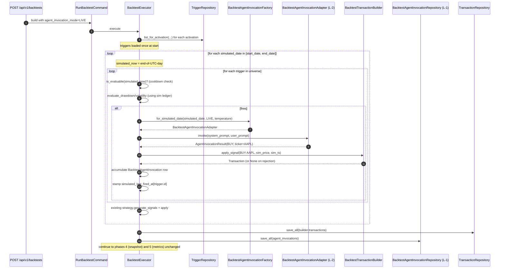

# Task 219 — BacktestExecutor integration with agent invocation (Phase L-3)

**Status**: Scoped, not started (depends on #217 + #218)
**Branch**: `feat/l-backtest-executor-agent-integration`
**Agent**: `backend-swe`
**Internal phase ID**: L-3

## Overview

Phase L-3 wires the agent-invocation path into the `BacktestExecutor`. With L-1 (entity / repo / migration / command extension) and L-2 (backtest-safe wrapper adapter + mock port) already shipped, this task makes them run: on every simulated day, evaluate any attached triggers; when one fires, invoke the agent (or the mock); record a `BacktestAgentInvocation` row; if the decision was BUY / SELL / MODIFY_STRATEGY, apply it to the simulated trade book.

The integration MUST preserve the existing strategy-signal path (`TradingStrategy.generate_signals` → `BacktestTransactionBuilder.apply_signal`). Agent decisions are layered on top — they don't replace the strategy's autonomous trades, they augment them.

Origin: `docs/planning/agent-platform-next-steps.md` §3.3 (architecture sketch) and §3.6 row J-3 (renamed L-3).

## Context (what exists today)

The existing `BacktestExecutor._run_pipeline` (`backend/src/zebu/application/services/backtest_executor.py:231-390`) has a 6-phase shape:

```text
0. Setup       — create portfolio, deposit initial cash
1. Pre-fetch   — load historical price data
2. Simulate    — loop over simulated days, generate signals, apply via builder
3. Persist     — bulk-save transactions
4. Snapshot    — generate daily portfolio snapshots
5. Metrics     — compute summary metrics, mark COMPLETED
```

The day loop (lines 303-343) is the hot path. The only side effect inside the loop is `builder.apply_signal(...)` — no I/O, no DB writes, no persistence. Phase 3 is the bulk insert.

This shape is the **canonical reference** for any new simulated-day logic. The L-3 integration extends the loop in-place; it must not change the surrounding pipeline phases.

The live counterpart is `StrategyExecutionService._run_activation` (`backend/src/zebu/application/services/strategy_execution_service.py:259-340`) — the live trigger-evaluation + orchestrator wiring lives in `TriggerEvaluationService.evaluate_all` (`backend/src/zebu/application/services/trigger_evaluation_service.py:281`). Both are worth re-reading to keep the backtest path's shape close to live.

Key differences between live and backtest that L-3 must respect:

- Backtest is **synchronous in simulation time** — the day loop is single-threaded and deterministic, no APScheduler involvement.
- Backtest has **no API-key attribution** in the simulated trades (the backtest portfolio is owned by the user; the simulated trades carry the originating `command.api_key_id` if any, same as today).
- Backtest **must persist via the L-1 port**, not the live `TriggerFireRepository`. The audit row shape is different.
- Backtest agent invocations use the L-2 wrapper, not the production `AnthropicAgentInvocationAdapter` directly.

## Architecture

### Executor constructor extension

`BacktestExecutor.__init__` (lines 71-98) gains two new dependencies:

| New parameter | Type | Notes |
|---|---|---|
| `trigger_repo` | `TriggerRepository` | Read-only access to triggers attached to the strategy's activation(s). |
| `backtest_agent_invocation_repo` | `BacktestAgentInvocationRepository` | The new L-1 port. Append-only — only the executor writes to this. |
| `agent_invocation_factory` | `BacktestAgentInvocationFactory` | A small new factory protocol (see below) the executor calls to build the per-day `AgentInvocationPort`. Injected so tests substitute a deterministic fake. |

The constructor's existing parameters remain unchanged in order and name; the new params are added at the end. Every existing caller (the API layer, integration tests) needs a constructor-update in the same PR.

#### New factory protocol: `BacktestAgentInvocationFactory`

A tiny port at `backend/src/zebu/application/ports/backtest_agent_invocation_factory.py`. Lives in application/ports because the executor (application-layer) calls it; the production implementation lives in `adapters/outbound/anthropic`.

| Method | Parameters | Returns |
|---|---|---|
| `for_simulated_date` | `simulated_date: date, mode: BacktestAgentInvocationMode, agent_temperature: float \| None` | `AgentInvocationPort` — the port the executor uses for that day's fires. |

Behaviour contract:

- `mode == LIVE` → returns a `BacktestAgentInvocationAdapter` (L-2) wrapping the production `AnthropicAgentInvocationAdapter`, pinned to `simulated_date`. Each call to `for_simulated_date` returns a fresh instance.
- `mode == MOCK` → returns the `MockBacktestAgentInvocationPort` from L-2. Construction is parameter-free; same instance may be reused (it's stateless).
- `mode == NONE` → MUST NOT be called by the executor. The factory raises if asked.

The factory is the boundary where production wiring (ANTHROPIC_API_KEY-aware adapter construction) lives. The executor stays mode-agnostic and just asks the factory for "the port for this simulated date".

### Strategy-with-triggers resolution

Today, `BacktestExecutor` runs a strategy without any awareness of triggers. To evaluate triggers in backtest mode, the executor must know which triggers are attached to the strategy.

**Decision adopted: triggers are scoped via the user's live activations of this strategy.** The executor loads the user's active triggers whose underlying activation references `command.strategy_id`, and evaluates that set across the simulated window. This means:

- If the user has no live triggers on this strategy, the backtest behaves exactly as today (no agent invocations, no rows).
- If the user has triggers, the same triggers that would fire live are evaluated against the simulated history.
- The user can preview "if I activate this trigger now, how would it have behaved over the last 2 years?" by running the backtest in `LIVE` agent mode.

Open question §1 below: alternative is to let the user attach trigger configurations to the backtest request directly. Default position: use live triggers; the simpler model is enough for L phase, and trigger-attached-to-backtest-request is a future enhancement.

#### Implementation

Inside the executor, after the strategy is resolved (line ~114 today):

1. Resolve activations for the strategy + user: `activation_repo.list_for_user_and_strategy(command.user_id, command.strategy_id)`. (A new read method may need to exist — if not, fall back to `list_active()` filtered in-Python; flag in implementation note.)
2. For each activation, load triggers: `trigger_repo.list_for_activation(activation.id)`. Filter to `status == ACTIVE` (paused / expired / disabled triggers don't evaluate in backtest, mirroring live).
3. The combined set is the **trigger universe** for this backtest. Stash on a local `triggers: list[StrategyConditionTrigger]`.

If `command.agent_invocation_mode == NONE` OR `triggers == []`, **skip all L-3 logic**: the day loop runs as today, with no agent invocations and no `BacktestAgentInvocation` rows. This means a backtest run on a strategy without triggers behaves identically to pre-L-3.

### Day-loop integration

The simulated-day loop today is:

```text
1. Skip days with no price data
2. Build holdings_dec from builder
3. trading_strategy.generate_signals(...)
4. Build trade_ts
5. For each signal: builder.apply_signal(...)
6. current_date += 1 day
```

L-3 inserts a new step between (3) and (4): **simulated trigger evaluation + agent invocation**.

The new step:

1. **Evaluate triggers for this simulated date**. For each `trigger` in the universe:
   - Confirm the trigger is "evaluable at simulated_date" — analogous to `trigger.is_evaluable(at=simulated_now)` but using the simulated date as the reference timestamp. This handles cooldown (`last_fired_at + cooldown_seconds < simulated_now`) and expiry. **The trigger's `last_fired_at` is per-simulation** — i.e., we maintain an in-memory `simulated_last_fired_at: dict[UUID, datetime]` keyed by trigger id, NOT mutating the durable `last_fired_at` on the entity. The durable column tracks **live** cooldown only.
   - Build the per-condition `evaluation_data` by running the condition evaluator against simulated state at `simulated_date`:
     - For `DRAWDOWN_THRESHOLD`: use the simulated builder's transaction ledger + `price_map` (which is already pre-fetched) to compute portfolio-value series up to `simulated_date`. Analogous to `TriggerEvaluationService._build_portfolio_total_input` but using the in-memory simulated ledger, not the DB.
     - For `VOLATILITY_SPIKE`: use the `price_map` for the relevant ticker(s) over the `over_days` window.
     - For `EARNINGS_PROXIMITY`: **deferred** — the live evaluator hits the `EarningsCalendarPort`, which is a stub. Earnings-proximity triggers in backtest are explicitly out of scope for L-3 (mark them as skipped with `evaluation_data=None`). Surface in the PR.
     - For `CUSTOM_RULE`: not supported (matches live behavior).
   - If the evaluator returns `fired=False`, continue to the next trigger.
   - If `fired=True`:
     - Acquire the per-day `AgentInvocationPort` from the factory: `port = agent_invocation_factory.for_simulated_date(simulated_date, command.agent_invocation_mode, command.agent_temperature)`.
     - Build prompts using **the same `build_system_prompt` / `build_user_prompt` functions the live orchestrator uses** (re-import from `trigger_invocation_orchestrator`). The user prompt should be parameterised with the **simulated** cash + holdings + portfolio_id and the simulated `evaluation_data`. This guarantees the backtest agent sees the same prompt shape as the live agent — apples-to-apples evaluation.
     - Call `port.invoke(...)`.
     - Handle the result:
       - On `AgentInvocationResult` returned: build a `BacktestAgentInvocation` and accumulate in-memory.
       - On `BacktestSafetyViolationError`: build an `INVOCATION_FAILED` row with the violation reason in `rationale`. No simulated trade applies.
       - On `AgentInvocationError` / `AgentResponseParseError`: same — `INVOCATION_FAILED` row, no trade.
     - Apply the decision to the simulated trade book (see "Decision application" below).
     - Stamp the trigger's `simulated_last_fired_at` so cooldown applies.

2. **Continue with the existing signal loop.** Strategy-generated signals fire as today. The agent's decision and the strategy's signals are both applied to the same `builder`; the builder's existing invariants (no double-counting cash, no over-selling) keep things consistent.

The day-loop integration is a single **synchronous block** inside the existing `while current_date <= command.end_date` loop. No new threads, no new schedulers.

### Simulated-`now` semantics

The trigger evaluation needs a "now" timestamp to test cooldown / expiry / lookback windows. **Convention**: `simulated_now = datetime(year, month, day, 23, 59, 59, tzinfo=UTC)` — end of UTC day. Reuses the convention from L-2 and from `HistoricalDataPreparer`. The simulated "now" advances day by day as the loop progresses.

`trigger.is_evaluable(at=simulated_now)` — this method already exists on the entity (used by live). Reuse it; it doesn't know it's being called with a synthetic `at`.

### Decision application

The agent's decision affects the simulated trade book differently depending on type:

| Decision | Effect on the simulated state |
|---|---|
| `BUY` | Build a `TradeSignal(action=BUY, ticker=<from payload>, signal_date=simulated_date, quantity=<from payload or 1>)`. Apply via `builder.apply_signal(...)` using the simulated-day's price from `price_map`. Set `decision_executed=True` and `simulated_trade_id` to the resulting transaction id on success. On rejection (insufficient funds, ticker not in price_map for this day): `decision_executed=False`, `simulated_trade_id=None`, append the rejection reason to the row's `rationale`. |
| `SELL` | Same as BUY but with `action=SELL`. The builder validates against current simulated holdings. |
| `HOLD` | No simulated trade. `decision_executed=False`. Row recorded for audit. |
| `MODIFY_STRATEGY` | **Out of scope for L-3.** Modifying the strategy mid-backtest changes the rest of the simulation, which is a substantial design problem (whose-strategy-is-the-result-of). For L-3, MODIFY_STRATEGY decisions are recorded as audit rows but **do not mutate the simulated strategy** — `decision_executed=False`, `rationale` appended with `"MODIFY_STRATEGY decisions not applied in backtest mode"`. Surface this clearly in the operating manual (L-5). Open question §3. |
| `NEEDS_HUMAN` | No simulated trade and **no exploration task creation**. The audit row records the escalation request with `decision_executed=False`. Real-world `NEEDS_HUMAN` requires a human, which a backtest can't provide — capturing the rationale is enough. |
| `INVOCATION_FAILED` | No simulated trade. `decision_executed=False`. |

#### Trade application via the existing builder

The `BacktestTransactionBuilder` is the canonical signal-to-transaction translator. Use it for the agent's BUY/SELL the same way the live `TriggerInvocationOrchestrator._execute_trade` uses it:

1. Validate `ticker` is in `strategy.tickers`. If not, downgrade to HOLD (matches live).
2. Resolve quantity: empty/missing → `Quantity(Decimal("1"))` (same default as live).
3. Look up `price_point = price_map[ticker][simulated_date]`. If missing, downgrade to HOLD.
4. Build `TradeSignal`, call `builder.apply_signal(signal, price_per_share=price_point.price, timestamp=simulated_now_at_noon)` where `simulated_now_at_noon` is `datetime(year, month, day, 12, 0, 0, tzinfo=UTC)` — matches the existing strategy-signal timestamp convention.
5. If the builder returns `None` (rejected by invariants), downgrade to HOLD.
6. Otherwise the trade lands in `builder.transactions`. Its id is the `simulated_trade_id` on the audit row.

#### Strategy-signal interaction order

A subtle question: when both an agent-fired trade AND a strategy signal apply on the same simulated date, which goes first?

**Decision adopted**: agent fires **before** strategy signals on the same day. Rationale:

- The strategy signal represents "what the strategy would normally do today"; the agent's decision is conditional on the strategy state at the moment the trigger fired (which is end-of-prior-day, effectively start-of-today).
- Applying agent fires first means the strategy then sees the post-agent cash + holdings and can react.
- This matches the live timing: the trigger evaluator runs on its own schedule; the strategy executor runs separately. In live, the agent can run before or after the strategy depending on the tick schedule. For backtest determinism, we pick one ordering — agent first.

Implementation: the new block lives **before** the existing signal-application loop in the day iteration.

### Persistence

Two collections accumulate in memory during the loop:

- `builder.transactions` — existing. Bulk-saved in phase 3.
- `agent_invocations: list[BacktestAgentInvocation]` — new. Bulk-saved in **a new phase 3a, immediately after phase 3**, via `backtest_agent_invocation_repo.save_all(agent_invocations)`.

Phase 3a is a single round-trip per the L-1 port contract. For a 2-year daily-fire backtest with one always-firing trigger, that's ~500 rows in one INSERT. Performance is fine.

If `command.agent_invocation_mode == NONE` OR the trigger universe is empty, `agent_invocations` is empty and phase 3a is skipped (no DB call).

### Error handling within the day loop

Per the existing executor pattern: a per-fire failure inside the day loop must NOT crash the backtest. The new logic wraps the trigger-evaluation + agent-invocation block in its own `try/except` per-trigger-per-day. On any unhandled exception:

- Log via `logger.exception(...)`.
- Build an `INVOCATION_FAILED` `BacktestAgentInvocation` with the exception message in `rationale`.
- Append to the accumulator. Continue to next trigger.

A batch-level failure in the trigger universe resolution (e.g. the repo raises) **does** halt the backtest — same convention as the existing executor's hard-failure cases.

### Migration / schema changes

None. L-1 already added the column / table. L-3 is pure code wiring.

### API layer touchpoint

The existing `POST /api/v1/backtests` route already accepts `agent_invocation_mode` (added in L-1). L-3 confirms it's plumbed through to the command:

- API request schema: `agent_invocation_mode: Literal["none", "mock", "live"] = "none"`.
- Optional `agent_temperature: float | None = None`.
- Both copy onto the `RunBacktestCommand` in the route handler.

The route handler also needs the new ports injected in the executor constructor: the FastAPI `Depends`-wired construction at `backend/src/zebu/adapters/inbound/api/backtests.py` (or wherever the executor is built) gets `trigger_repo`, `backtest_agent_invocation_repo`, and `agent_invocation_factory`.

The `agent_invocation_factory` factory itself needs a production wiring file — a small module that instantiates the L-2 wrapper given a `simulated_date` + the `AnthropicAgentInvocationAdapter` (built from env). This is the only new piece of production wiring in L-3 beyond plumbing.

## Data flow



## Decisions and rationale

| Decision | Rationale |
|---|---|
| Trigger universe = live triggers on the user's activations of this strategy | Lets the user preview "would my trigger have fired historically" without modelling a separate backtest-trigger config. Matches the proposal's "evaluate agent judgment before paying for it in live execution" intent precisely. |
| Per-trigger simulated `last_fired_at` is in-memory, not persisted to the trigger entity | The durable `last_fired_at` belongs to the live cooldown. A backtest mutating it would break the live cooldown semantics. Per-backtest cooldown lives in a local dict. |
| Agent fires BEFORE strategy signals on the same day | Determinism. The agent's decision should be applied first so the strategy reacts to post-agent state, matching the most natural live timing. |
| MODIFY_STRATEGY is recorded but NOT applied in L-3 | Mid-simulation strategy mutation opens a can of worms (which-strategy-was-the-result-of). Out of scope. |
| NEEDS_HUMAN is recorded but no `ExplorationTask` row is written | A backtest can't recruit a human. Capture the agent's escalation rationale; that's the analytically-useful artefact. |
| Earnings-proximity triggers explicitly skipped in L-3 | The live calendar port is a stub; a backtest using it would test nothing. Re-enable when the calendar port is real (separate proposal). |
| CUSTOM_RULE not supported in backtest | Matches live behaviour. |
| Backtests with no triggers OR `agent_invocation_mode=NONE` behave identically to pre-L-3 | Backwards compatibility. The default end-to-end shape doesn't change unless the user opts in. |
| Re-use `build_system_prompt` / `build_user_prompt` from `trigger_invocation_orchestrator` | Apples-to-apples agent prompts between live and backtest. If the prompt changes, both modes change together. |
| Per-day fresh `BacktestAgentInvocationAdapter` instances | The wrapper is short-lived (one or a few `invoke` calls per simulated day, depending on trigger count). Sharing across days would couple `simulated_date` to instance lifecycle in a confusing way. |
| Bulk persistence of audit rows via L-1's `save_all` | 500-row backtests must complete with a single audit-table INSERT. |
| New `BacktestAgentInvocationFactory` port at the application layer | The executor (application-layer) needs to construct the right port per day without importing the L-2 adapter directly (which lives in adapters/outbound). The factory protocol keeps the dependency direction clean. |
| Per-trigger / per-day try/except | One bad agent fire must not crash the backtest. Matches the existing executor's resilience pattern. |

## Implementation plan

Single PR. Order within branch:

1. **Application port** — `BacktestAgentInvocationFactory` (Protocol) at `backend/src/zebu/application/ports/backtest_agent_invocation_factory.py`. Unit test that asserts the protocol shape.
2. **Production factory adapter** — `AnthropicBacktestAgentInvocationFactory` at `backend/src/zebu/adapters/outbound/anthropic/backtest_agent_invocation_factory.py`. Constructor takes the production `AnthropicAgentInvocationAdapter` plus the market_data, balances handler, exploration_task_repo. Builds the L-2 wrapper on `for_simulated_date(LIVE, ...)`; returns the MOCK port on MOCK; raises on NONE. Unit tests for each mode.
3. **In-memory factory** — `InMemoryBacktestAgentInvocationFactory` at `backend/src/zebu/application/ports/in_memory_backtest_agent_invocation_factory.py`. Returns a configurable test fake (e.g. accepts a `StaticAgentInvocationPort` or `ScriptedAgentInvocationPort` to drive deterministic behaviour). The MOCK case still returns the real `MockBacktestAgentInvocationPort`.
4. **Trigger universe resolution helper** — small private method on the executor: `_resolve_trigger_universe(command) -> list[StrategyConditionTrigger]`. Confirms the existing `activation_repo` + `trigger_repo` read methods are sufficient; adds new read paths only if necessary (flag in PR).
5. **Simulated trigger evaluator** — small private method on the executor: `_evaluate_simulated_trigger(trigger, simulated_now, builder, price_map, strategy) -> (fired: bool, evaluation_data: Mapping[str, object] | None)`. Dispatches on `trigger.condition_type` to drawdown / volatility / earnings (skipped) / custom (skipped). Re-uses the pure evaluator functions from `application/services/trigger_evaluators/{drawdown,volatility_spike,earnings_proximity}` modules (they're already pure — they take an input dataclass and return `(fired, data)`).
6. **Per-fire agent dispatch** — small private method: `_fire_simulated_trigger(trigger, simulated_now, simulated_date, evaluation_data, port, builder, strategy, command) -> BacktestAgentInvocation`. Wraps the `port.invoke` + decision application. Returns the audit-row entity (regardless of success / failure — the row is always built).
7. **Day-loop integration** — modify `_run_pipeline` to:
    - Before phase 2 (simulate): resolve trigger universe; init `agent_invocations: list[BacktestAgentInvocation] = []`; init `simulated_last_fired_at: dict[UUID, datetime] = {}`.
    - Inside the day loop, between phases 2.3 (`generate_signals`) and 2.5 (apply signals): the new block iterating triggers, calling the evaluator, invoking the agent on fires, accumulating rows, applying trades to the same builder.
    - New phase 3a: `await self._backtest_agent_invocation_repo.save_all(agent_invocations)` if non-empty.
8. **API layer wiring** — update the FastAPI Depends construction for `BacktestExecutor` to inject the new ports / factory. Update the API request schema (the L-1 schema work surfaced `agent_invocation_mode`; verify it's plumbed through).
9. **Update all tests** that construct `BacktestExecutor(...)` directly — pass the new constructor args. The default fixture should supply: an `InMemoryTriggerRepository`, an `InMemoryBacktestAgentInvocationRepository`, and an `InMemoryBacktestAgentInvocationFactory` configured to return whatever the test needs.

### Open file pointers for the implementer

- `backend/src/zebu/application/services/backtest_executor.py` — the file to edit. The `_run_pipeline` change is contained to ~50 added lines plus the new private methods.
- `backend/src/zebu/application/services/trigger_invocation_orchestrator.py:1175, 1223` — re-import `build_system_prompt` and `build_user_prompt`. They're already module-level functions.
- `backend/src/zebu/application/services/trigger_evaluators/drawdown.py` — `evaluate_drawdown` is pure. Caller supplies inputs; the L-3 executor builds the simulated-state inputs.
- `backend/src/zebu/application/services/trigger_evaluators/volatility_spike.py` — `evaluate_volatility_spike` likewise pure.
- `backend/src/zebu/application/services/backtest_transaction_builder.py` — `apply_signal` is the trade entry. Returns the resulting `Transaction` or `None` on rejection.
- `backend/src/zebu/domain/entities/strategy_condition_trigger.py` — `.is_evaluable(at)`, `.record_fire(fired_at)` etc.

## Testing strategy

**Unit (executor with in-memory adapters)**:

- Backtest with `agent_invocation_mode=NONE` and triggers attached → no `BacktestAgentInvocation` rows, no agent calls, behaves identically to pre-L-3.
- Backtest with `agent_invocation_mode=MOCK` and one drawdown trigger that always fires → N `BacktestAgentInvocation` rows with `agent_decision=HOLD` (no simulated trade), `decision_executed=False`.
- Backtest with `agent_invocation_mode=LIVE` (using a scripted `BacktestAgentInvocationFactory` returning a `StaticAgentInvocationPort` with `BUY`):
  - Trigger fires → BUY decision → simulated trade applied → row carries `simulated_trade_id`, `decision_executed=True`.
  - The BUY trade affects the builder's cash/holdings for subsequent days.
- Backtest with `LIVE` + scripted SELL on a ticker the portfolio doesn't hold → trade rejected → `decision_executed=False`, rationale carries the rejection reason.
- Backtest with `LIVE` + scripted MODIFY_STRATEGY → row recorded, no strategy mutation, `decision_executed=False`.
- Backtest with `LIVE` + scripted NEEDS_HUMAN → row recorded, no exploration task created.
- Backtest with `LIVE` + agent raises `BacktestSafetyViolationError` → row recorded with `INVOCATION_FAILED`, rationale includes violation reason.
- Backtest with `LIVE` + agent raises `AgentInvocationError` (e.g. transport failure) → row recorded with `INVOCATION_FAILED`.
- Cooldown semantics: trigger fires on simulated day 1, cooldown=86400. On simulated day 2 the trigger is in cooldown — does NOT fire. On simulated day 3 the trigger is evaluable again. The per-simulation `simulated_last_fired_at` dict drives this; the durable `trigger.last_fired_at` is unchanged.
- Strategy signal ordering: on a day where both the agent fires (BUY AAPL) and the strategy generates a signal (BUY MSFT), the agent's BUY is applied first; cash deducted; strategy's BUY MSFT applies against the post-agent cash. Assert via the order of resulting transactions.
- Empty trigger universe: backtest on a strategy with no active triggers, `agent_invocation_mode=LIVE` → no agent calls (the factory's `for_simulated_date` is never called), no rows.
- Backtest end-to-end: full pipeline (phases 0-5) completes; metrics computed; the `BacktestRun` row is `COMPLETED`; the audit rows are queryable via `list_for_backtest_run`.

**Integration (real SQLite + in-memory ports for adapters)**:

- End-to-end backtest with one trigger, `LIVE` mode using a scripted port that fires once mid-window with BUY. Verify: a `BacktestAgentInvocation` row lands in the DB; deleting the parent `BacktestRun` cascades and removes the row; deleting the parent trigger sets `trigger_id` to NULL on the row.

**Hot-path performance check (sanity)**:

- 500 simulated days × 1 always-firing trigger × MOCK mode → completes in well under 10s. (The MOCK port is in-memory; the bottleneck is the builder.) Not a strict gate, but flag in the PR if it gets worse.

## Quality bar (non-negotiable)

- No `Any` / `any`; no Pyright suppressions.
- Behavior-focused tests; mock only at port boundaries.
- Conventional commits.
- `task quality:backend` + `task ci` green.
- The pre-L-3 happy-path backtest test (a strategy with no triggers, completing successfully) must still pass with zero behavior change.

## Open design questions

Surface these in the PR body for Tim:

1. **Trigger universe scoping — live triggers vs backtest-attached triggers.** This spec uses live triggers on the user's activations of the strategy. Alternative: the backtest request body grows an optional `triggers: list[TriggerSpec]` allowing the user to specify a custom trigger config for this run only (no live activation needed). **Default position adopted**: live triggers. Simpler; enough for L phase. Future enhancement is its own task.

2. **Per-simulation cooldown OR per-trigger-durable?** This spec keeps cooldown in an in-memory dict (`simulated_last_fired_at[trigger.id]`). Alternative: build a backtest-local `StrategyConditionTrigger` clone with mutated `last_fired_at`, evaluate against that clone. **Default position adopted**: in-memory dict. Avoids cloning the entity per-backtest; cooldown is just "minimum gap between fires" which a dict handles cleanly.

3. **MODIFY_STRATEGY in backtest.** This spec records but does NOT apply. Alternative: apply, log the strategy mutation, and continue the simulation with the new params. The complication is whether the resulting backtest is "the strategy as configured" or "the strategy as the agent evolved it" — a meaningful distinction for the result interpretation. **Default position adopted**: record-only. The activity log captures what the agent wanted; the run continues with the original strategy. Tim may want this expanded post-L.

4. **Agent firing order vs strategy signal order.** This spec: agent first, then strategy. Alternative: strategy first, then agent (agent reacts to today's strategy moves). Both have merits; agent-first matches the "trigger evaluated end-of-prior-day" semantic that the live trigger system implies. **Default position adopted**: agent first.

5. **Where does `EarningsCalendarPort` actually get its data in backtest mode?** Today's adapter is a stub. A useful backtest of earnings-proximity triggers requires a historical earnings-date dataset. **Default position adopted**: skip earnings-proximity triggers entirely in L-3 with a logged warning. Re-enable when a real calendar source ships (out of scope of agent-platform-next-steps.md; separate proposal).

6. **Backtest determinism with `MOCK` mode.** Should MOCK mode produce a fully deterministic byte-stable backtest result? Currently the executor's other phases (snapshot computation, metrics) are deterministic. MOCK adds zero non-determinism. **Default position adopted**: yes, MOCK backtests are byte-stable. Documented in L-5 operating manual.

7. **Should the executor cap the total number of agent invocations per backtest as a runaway-cost guardrail?** L-6 is the proper home for cost caps, but L-3 might want a defensive sanity check (e.g. "no more than 10,000 invocations per run, regardless of mode"). **Default position adopted**: no L-3 cap. Trust the trigger evaluator's cooldown. The total fire count is bounded by `(simulated_days × triggers_in_universe) / min_cooldown_days`. L-6 owns budget enforcement.

8. **`api_key_id` on simulated trades.** The existing executor stamps `command.api_key_id` on simulated trades. Should the L-3 agent-fired trades use a different key (the trigger's `default_api_key_id` per live convention) or the same `command.api_key_id`? **Default position adopted**: same `command.api_key_id`. The backtest is owned by the human who initiated it; the simulated trade attribution should reflect that, not a synthetic mapping to the trigger's key. Tim may prefer the live convention; flagging.

## Out of scope

- L-4 (UI) — backtest config form's "Agent mode" toggle; result page rendering of the invocation log.
- L-5 (operating manual) — backtest-mode prompt + tool surface documentation.
- L-6 (cost guardrails) — per-user-per-backtest budget cap, halt-on-exceed.
- L-7 (sample report) — comparing strategy with/without agent intervention.
- Earnings-proximity triggers in backtest (requires real calendar source).
- MODIFY_STRATEGY application in backtest (separate design).
- Multi-provider (Gemini) backtest invocations.

## Success criteria

- `task ci` green.
- A backtest with `agent_invocation_mode=NONE` (default) produces identical results to pre-L-3 — verified by running an existing backtest fixture twice (pre-PR + post-PR) and diffing.
- A backtest with `agent_invocation_mode=MOCK` and one always-firing drawdown trigger produces N `BacktestAgentInvocation` rows (one per fire), each with `agent_decision=HOLD`, `decision_executed=False`. No real Anthropic calls happen (verified by injecting a `FailingAgentInvocationPort` as the "inner" of the wrapper — should never be invoked in MOCK).
- A backtest with `agent_invocation_mode=LIVE` and a scripted port emitting BUY produces a simulated trade with the right ticker / quantity / price, and the corresponding audit row carries `decision_executed=True` + `simulated_trade_id` pointing at the trade.
- A `BacktestSafetyViolationError` raised by the L-2 wrapper results in an `INVOCATION_FAILED` audit row and does not abort the backtest.
- Cooldown respected across simulated days.
- `list_for_backtest_run(backtest_run.id)` returns the rows in `simulated_date` ascending order.

## References

- `docs/planning/agent-platform-next-steps.md` §3.3 (architecture sketch), §3.6 row J-3 (renamed L-3), §3.7 (what NOT to build)
- `backend/src/zebu/application/services/backtest_executor.py` — file to edit
- `backend/src/zebu/application/services/strategy_execution_service.py` — live counterpart, canonical iterate→signal→execute reference
- `backend/src/zebu/application/services/trigger_invocation_orchestrator.py` — re-imports for `build_system_prompt` / `build_user_prompt`; reference for live `_execute_trade` implementation
- `backend/src/zebu/application/services/trigger_evaluation_service.py` — live trigger evaluator; reference for `_build_portfolio_total_input` (the pattern the simulated drawdown evaluator follows)
- `backend/src/zebu/application/services/trigger_evaluators/{drawdown,volatility_spike,earnings_proximity}.py` — pure evaluator functions
- `backend/src/zebu/application/services/backtest_transaction_builder.py` — `apply_signal` contract
- Sibling task specs: #217 (L-1), #218 (L-2)
