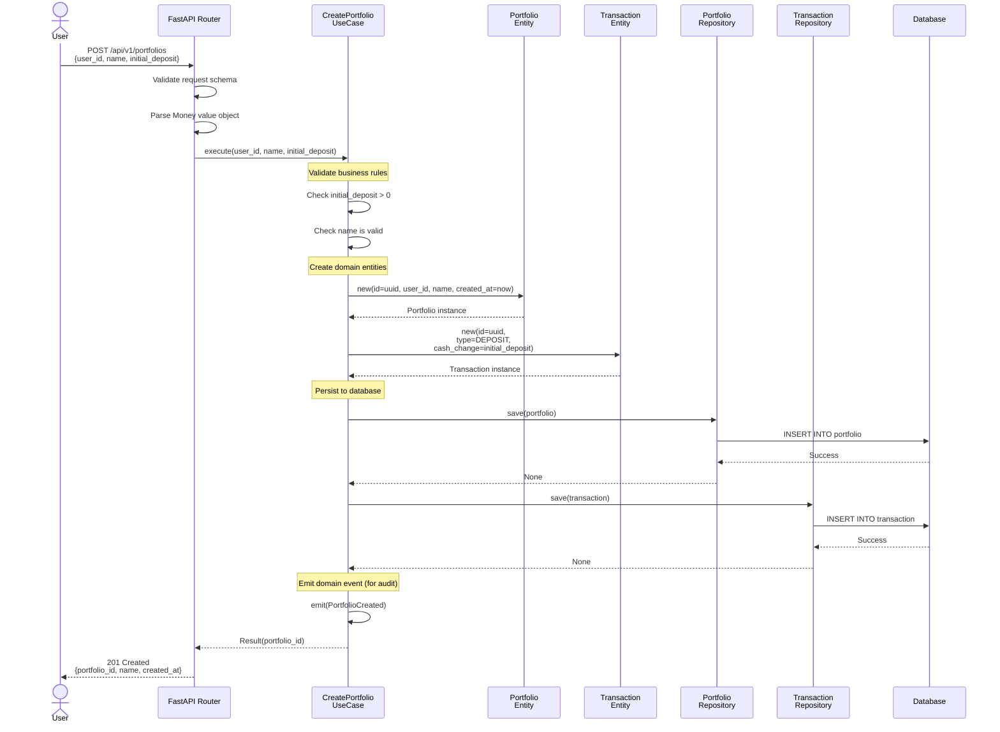
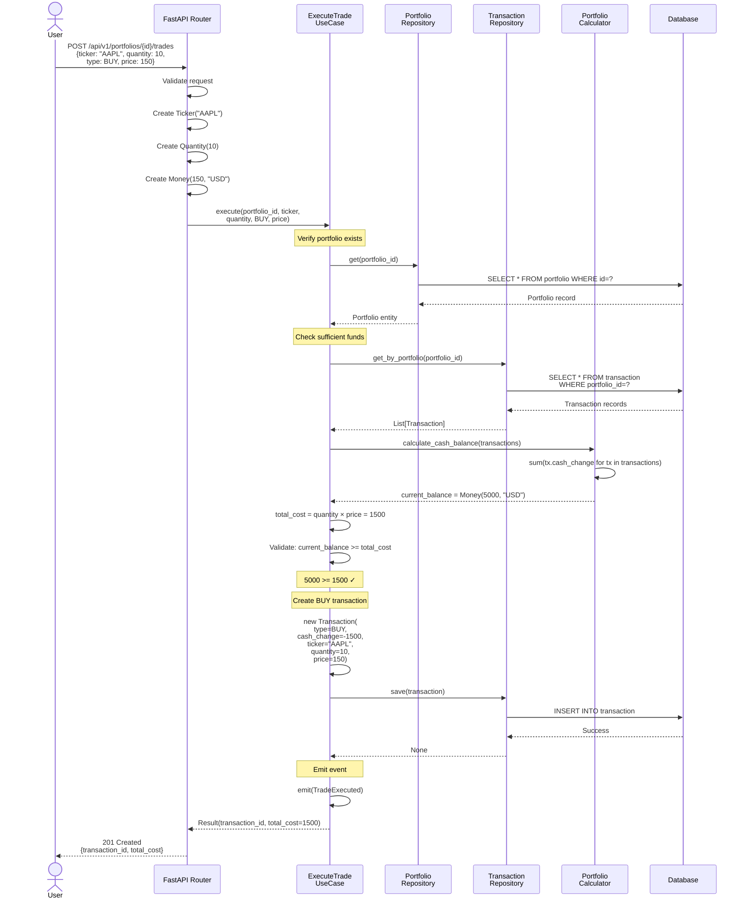
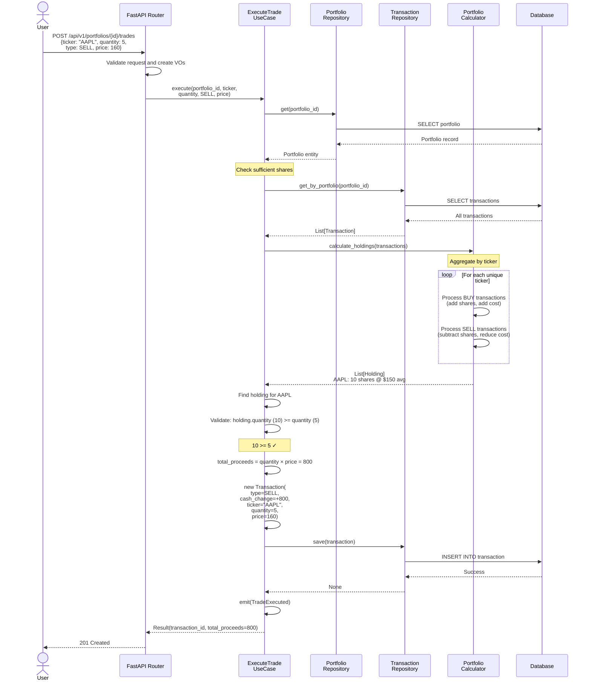
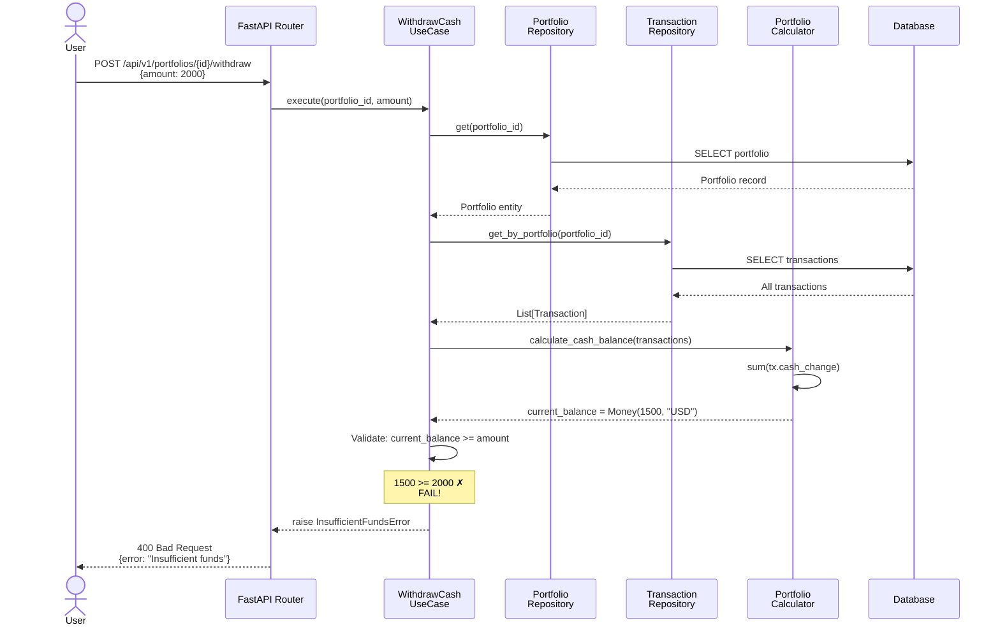
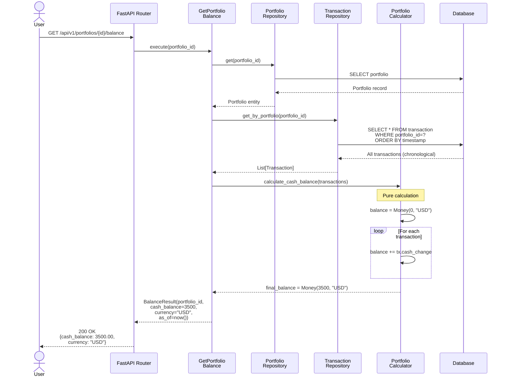
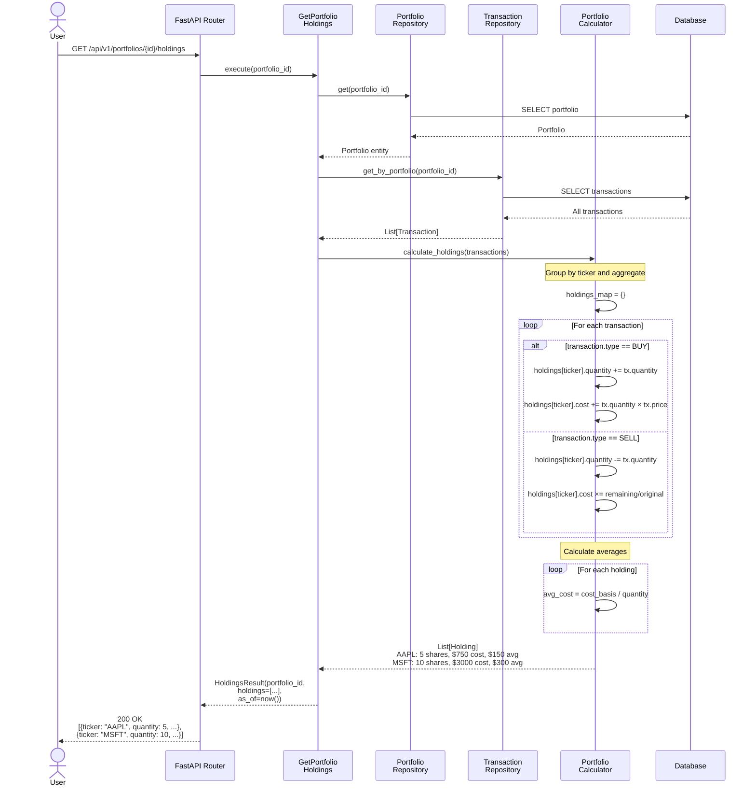
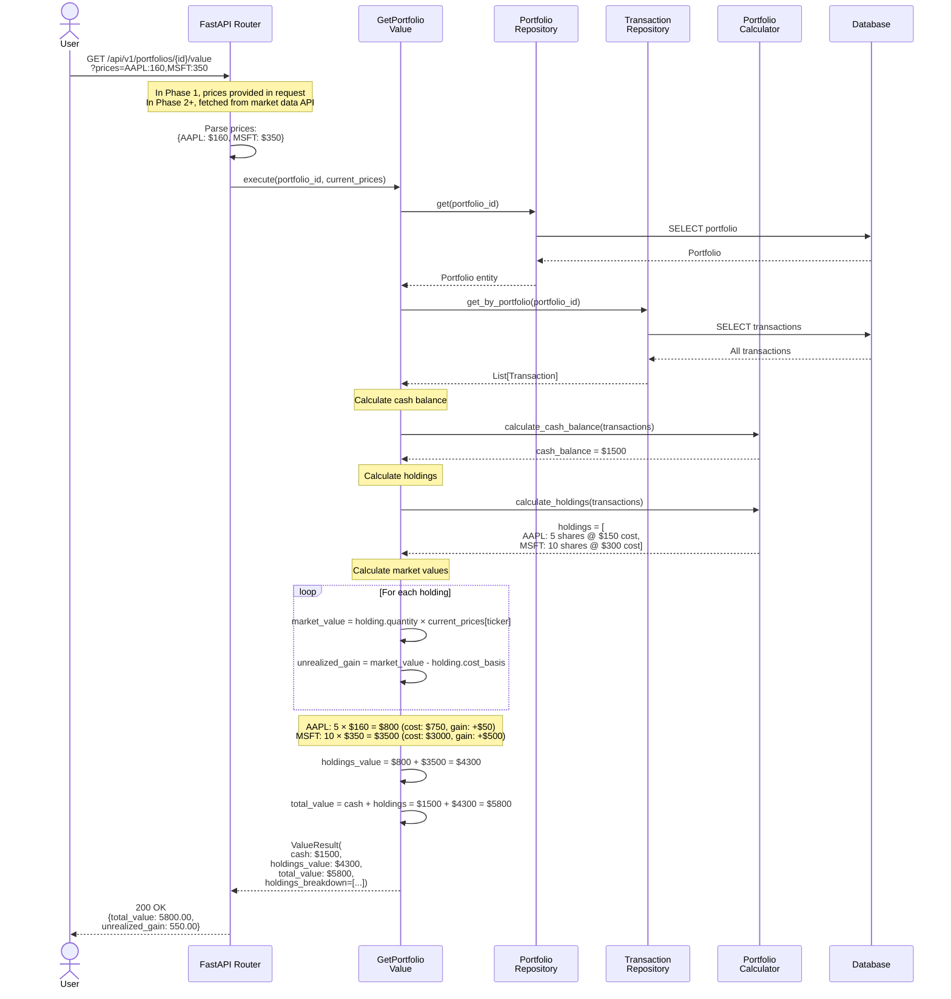
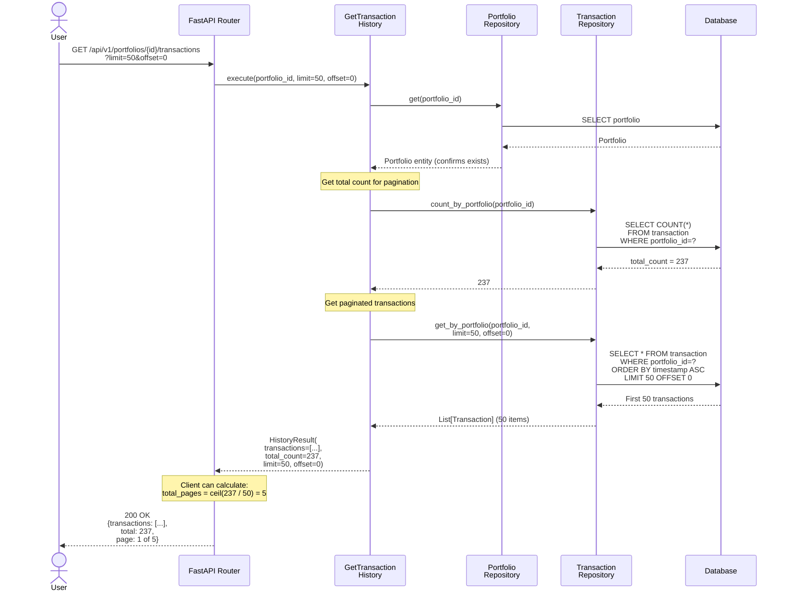
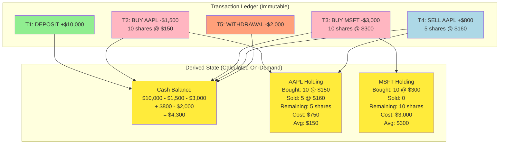
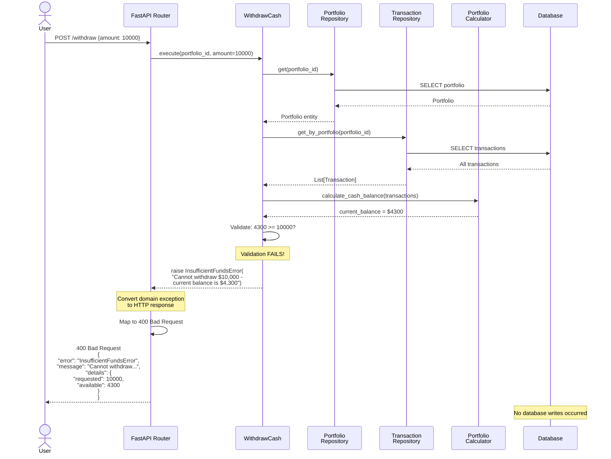

# Phase 1 Backend MVP - Data Flow Specification

## Overview

This document illustrates the detailed data flows through the system using sequence diagrams. It shows how requests flow from the API layer through use cases to the domain and repositories, and how responses flow back.

## Key Architectural Patterns

### 1. The Ledger Pattern
All state changes are recorded as immutable transactions. Current state is **derived** by aggregating the transaction history.

### 2. Command-Query Separation
- **Commands** modify state (create transactions)
- **Queries** read state (aggregate transactions)

### 3. Dependency Inversion
- Application layer defines repository interfaces (ports)
- Adapters layer implements those interfaces
- Domain layer knows nothing about persistence

---

## Data Flow 1: Create Portfolio with Initial Deposit

This is the entry point - how a user creates a new portfolio.

### Key Points
1. **Atomic Operation**: Portfolio and initial transaction saved in same database transaction
2. **Initial Deposit Required**: Cannot create portfolio without cash
3. **UUID Generation**: IDs generated in use case, not database
4. **Timestamp Control**: Use case controls timestamp (important for Phase 3 backtesting)

---

## Data Flow 2: Execute Buy Trade

Shows validation of sufficient funds and creation of BUY transaction.

### Key Points
1. **Balance Check**: Current balance calculated from all transactions
2. **Validation Before Save**: Insufficient funds detected before database write
3. **Negative Cash Change**: BUY reduces cash (negative value)
4. **No Holding Update**: Holdings not stored - derived from transactions

---

## Data Flow 3: Execute Sell Trade

Shows validation of sufficient shares and creation of SELL transaction.

### Key Points
1. **Share Check**: Current holdings calculated from transactions
2. **Cost Basis**: Holding includes average cost (for unrealized gain calculation)
3. **Positive Cash Change**: SELL increases cash (positive value)
4. **Partial Sale**: Can sell part of holding (5 of 10 shares)

---

## Data Flow 4: Withdraw Cash (With Validation)

Shows how withdrawal validates sufficient balance before proceeding.

### Key Points
1. **Validation Prevents Invalid State**: No transaction created if insufficient funds
2. **Balance Derived**: Real-time balance calculated from all transactions
3. **Clear Error**: User gets descriptive error message
4. **No Database Write**: Failed validation means no database modification

---

## Data Flow 5: Get Portfolio Balance (Query)

Shows how queries derive state from the ledger without modifying it.

### Key Points
1. **Read-Only**: No database writes
2. **Derived State**: Balance calculated from sum of cash_change
3. **Always Current**: Reflects all transactions up to query time
4. **Pure Function**: Calculator has no side effects

---

## Data Flow 6: Get Portfolio Holdings (Query)

Shows how holdings are derived by aggregating buy/sell transactions per ticker.

### Key Points
1. **Aggregation Logic**: Holdings calculated by replaying all trades
2. **Cost Basis Tracking**: Maintains average cost through buy/sell cycles
3. **Proportional Reduction**: SELL reduces cost basis proportionally
4. **No Storage**: Holdings never written to database

---

## Data Flow 7: Get Portfolio Value (With Current Prices)

Shows how total portfolio value is calculated from cash + holdings × prices.

### Key Points
1. **Composite Calculation**: Cash + Holdings value
2. **Current Prices Required**: Must provide price for each held ticker
3. **Unrealized Gain**: Difference between market value and cost basis
4. **Per-Holding Breakdown**: Detailed gain/loss for each position

---

## Data Flow 8: Get Transaction History (With Pagination)

Shows how transaction history is retrieved with pagination support.

### Key Points
1. **Pagination**: Limits memory usage for large histories
2. **Total Count**: Allows client to calculate total pages
3. **Chronological Order**: Always oldest-first (timestamp ASC)
4. **Immutable History**: Transactions never change after creation

---

## Ledger Accumulation Pattern

This diagram shows how the ledger accumulates over time and how state is derived.

### Legend
- **Green**: DEPOSIT (adds cash)
- **Pink**: BUY (reduces cash, adds shares)
- **Blue**: SELL (adds cash, reduces shares)
- **Orange**: WITHDRAWAL (reduces cash)
- **Yellow**: Derived state (calculated from transactions)

---

## Error Flow: Insufficient Funds

Shows what happens when a command violates business rules.

### Key Points
1. **Early Validation**: Business rules checked before database write
2. **No Side Effects**: Failed validation means no state change
3. **Descriptive Errors**: User gets clear explanation
4. **Exception Translation**: Domain exceptions mapped to HTTP status codes

---

## Performance Considerations

### Query Optimization

**Problem**: Calculating holdings requires processing all transactions

**Solutions**:
1. **Phase 1**: Acceptable for MVP (< 1000 transactions)
2. **Phase 2**: Add caching layer (Redis) for frequently accessed portfolios
3. **Phase 3**: Materialized views for holdings (updated on transaction save)

### Pagination Strategy

Large transaction histories use cursor-based pagination:
- First page: `GET /transactions?limit=50`
- Next page: `GET /transactions?limit=50&offset=50`

### Index Strategy

Critical indexes for performance:
- `transaction(portfolio_id, timestamp)` - chronological queries
- `transaction(portfolio_id, transaction_type)` - filtered queries
- `portfolio(user_id)` - user's portfolios

---

## Phase 1 Data Flow Completeness

### Covered Flows
✅ Create portfolio with initial deposit
✅ Execute buy trade (with validation)
✅ Execute sell trade (with validation)
✅ Deposit cash
✅ Withdraw cash (with validation)
✅ Get portfolio balance
✅ Get portfolio holdings
✅ Get portfolio value
✅ Get transaction history
✅ Error handling (insufficient funds/shares)

### Future Flows (Phase 2+)
- Real-time price updates via WebSocket
- Market data API integration
- Cache invalidation on transaction save
- Backtest mode (query at historical timestamp)
