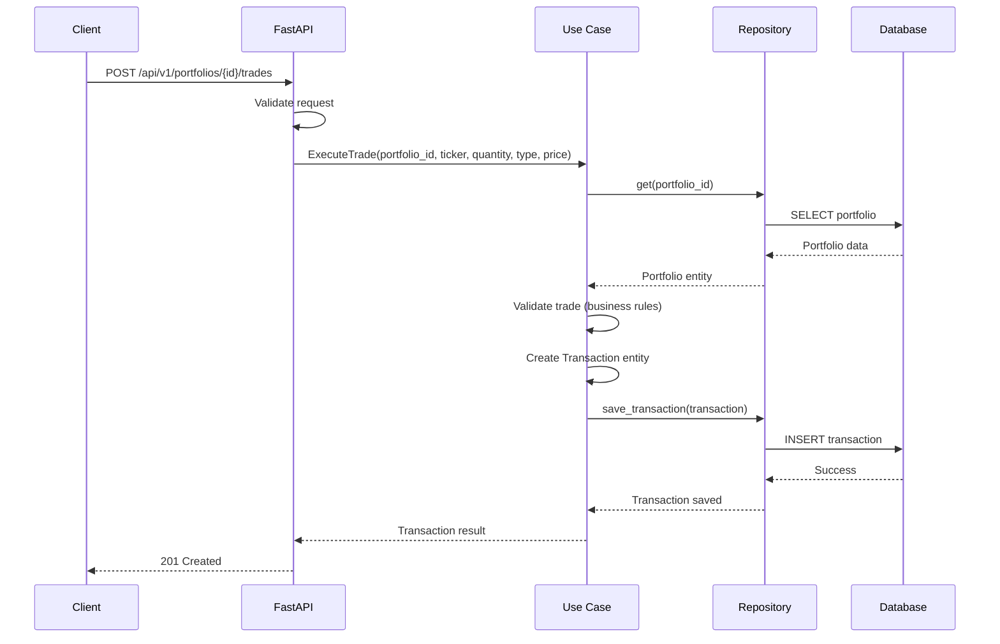
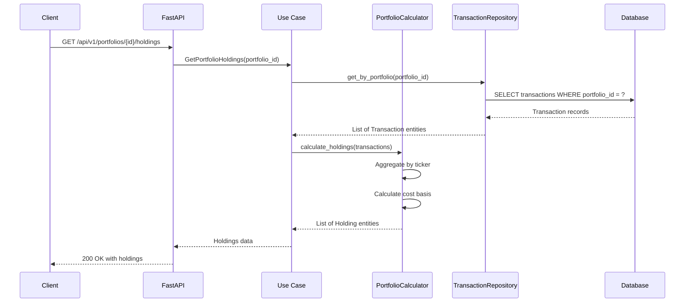

# Phase 1 Backend MVP - Architecture Overview

## System Context

Phase 1 (The Ledger) establishes the foundational backend for PaperTrade, enabling users to manage virtual portfolios, execute trades, and track transaction history. This MVP uses an **immutable ledger pattern** where all state is derived from an append-only transaction log.

### Goals

1. **Portfolio Management**: Users can create portfolios with virtual cash
2. **Trade Execution**: Buy and sell stocks using mock prices
3. **Balance Calculation**: All balances derived from transaction history (not stored)
4. **Immutable Audit Trail**: Complete transaction ledger for transparency
5. **Clean Architecture**: Pure domain logic, testable use cases, swappable adapters

### Non-Goals for Phase 1

- Real market data integration (Phase 2)
- Historical backtesting (Phase 3)
- Transaction fees or slippage (Phase 4)
- Trading automation (Phase 5)
- User authentication (simplified for MVP)

## High-Level Architecture

### Clean Architecture Layers

```
┌──────────────────────────────────────────────────────────────┐
│                      INFRASTRUCTURE                          │
│          Database Config • Logging • External Config         │
├──────────────────────────────────────────────────────────────┤
│                         ADAPTERS                             │
│  ┌──────────────────────────┐  ┌──────────────────────────┐  │
│  │    Inbound Adapters      │  │   Outbound Adapters      │  │
│  │  • FastAPI REST API      │  │  • SQLModel Repositories │  │
│  │  • Request/Response DTOs │  │  • InMemory Repositories │  │
│  │  • API Validation        │  │    (for testing)         │  │
│  └──────────────────────────┘  └──────────────────────────┘  │
├──────────────────────────────────────────────────────────────┤
│                      APPLICATION LAYER                       │
│                                                              │
│  Commands (Write Operations):                               │
│  • CreatePortfolio                                           │
│  • DepositCash                                               │
│  • WithdrawCash                                              │
│  • ExecuteTrade                                              │
│                                                              │
│  Queries (Read Operations):                                 │
│  • GetPortfolioBalance                                       │
│  • GetPortfolioHoldings                                      │
│  • GetPortfolioValue                                         │
│  • GetTransactionHistory                                     │
│                                                              │
│  Repository Ports (Interfaces):                             │
│  • PortfolioRepository                                       │
│  • TransactionRepository                                     │
├──────────────────────────────────────────────────────────────┤
│                       DOMAIN LAYER                           │
│                                                              │
│  Value Objects:                                              │
│  • Money (amount, currency)                                  │
│  • Ticker (symbol validation)                                │
│  • Quantity (shares, non-negative)                           │
│                                                              │
│  Entities:                                                   │
│  • Portfolio (identity, ownership, lifecycle)                │
│  • Transaction (immutable ledger entry)                      │
│  • Holding (derived, not persisted)                          │
│                                                              │
│  Domain Services:                                            │
│  • PortfolioCalculator (pure state calculations)            │
│                                                              │
│  Domain Events:                                              │
│  • PortfolioCreated                                          │
│  • CashDeposited                                             │
│  • CashWithdrawn                                             │
│  • TradeExecuted                                             │
└──────────────────────────────────────────────────────────────┘

         ▲ Dependencies point INWARD only ▲
```

## Component Diagram

```mermaid
graph TB
    subgraph "Adapters Layer"
        API[FastAPI Routes]
        SQLRepo[SQLModel Repositories]
        MemRepo[InMemory Repositories]
    end
    
    subgraph "Application Layer"
        CreatePort[CreatePortfolio]
        DepositCmd[DepositCash]
        WithdrawCmd[WithdrawCash]
        TradeCmd[ExecuteTrade]
        
        BalanceQuery[GetPortfolioBalance]
        HoldingsQuery[GetPortfolioHoldings]
        ValueQuery[GetPortfolioValue]
        TxQuery[GetTransactionHistory]
        
        PortRepo[PortfolioRepository Port]
        TxRepo[TransactionRepository Port]
    end
    
    subgraph "Domain Layer"
        Portfolio[Portfolio Entity]
        Transaction[Transaction Entity]
        Holding[Holding Entity]
        
        Money[Money VO]
        Ticker[Ticker VO]
        Qty[Quantity VO]
        
        Calc[PortfolioCalculator Service]
    end
    
    API --> CreatePort
    API --> DepositCmd
    API --> WithdrawCmd
    API --> TradeCmd
    API --> BalanceQuery
    API --> HoldingsQuery
    API --> ValueQuery
    API --> TxQuery
    
    CreatePort --> PortRepo
    CreatePort --> Portfolio
    
    DepositCmd --> TxRepo
    DepositCmd --> PortRepo
    DepositCmd --> Transaction
    
    WithdrawCmd --> TxRepo
    WithdrawCmd --> PortRepo
    WithdrawCmd --> Transaction
    
    TradeCmd --> TxRepo
    TradeCmd --> PortRepo
    TradeCmd --> Transaction
    
    BalanceQuery --> TxRepo
    BalanceQuery --> Calc
    
    HoldingsQuery --> TxRepo
    HoldingsQuery --> Calc
    
    ValueQuery --> TxRepo
    ValueQuery --> Calc
    
    TxQuery --> TxRepo
    
    SQLRepo -.implements.-> PortRepo
    SQLRepo -.implements.-> TxRepo
    MemRepo -.implements.-> PortRepo
    MemRepo -.implements.-> TxRepo
    
    Portfolio --> Money
    Transaction --> Money
    Transaction --> Ticker
    Transaction --> Qty
    Holding --> Ticker
    Holding --> Qty
    Holding --> Money
    
    Calc --> Transaction
    Calc --> Holding
```



## Data Flow Overview

### Write Path (Commands)
Commands modify state by creating new transactions in the ledger:



### Read Path (Queries)
Queries derive current state from the transaction ledger:



## Key Architectural Decisions

### 1. Immutable Ledger Pattern
**Decision**: All portfolio state changes are recorded as immutable Transaction entities. Current state is derived by replaying the ledger.

**Benefits**:
- Complete audit trail automatically maintained
- Point-in-time queries naturally supported (needed for Phase 3 backtesting)
- No update anomalies or lost data
- Simplified concurrency model

**Trade-offs**:
- Query performance requires aggregation (mitigated by caching in Phase 2+)
- Cannot directly "update" a balance (must create compensating transaction)

### 2. Derived Holdings (Not Persisted)
**Decision**: Holdings are calculated on-demand from transactions, not stored separately.

**Benefits**:
- Single source of truth (transactions)
- No synchronization issues between holdings and transactions
- Simplified data model
- Easier to implement new aggregation logic

**Trade-offs**:
- Must recalculate on each query (acceptable for MVP, optimize later with caching)

### 3. Clean Architecture Dependency Rule
**Decision**: Strict layering with dependencies pointing inward only.

**Benefits**:
- Domain logic is pure and testable without external dependencies
- Easy to swap implementations (InMemory vs SQLModel repositories)
- Clear boundaries for testing
- Future-proof for extracting services

### 4. Repository Pattern
**Decision**: Application layer defines repository interfaces (ports), adapters implement them.

**Benefits**:
- Domain and application layers don't depend on database
- Easy to test with in-memory implementations
- Can swap databases without touching business logic
- Supports Test-Driven Development

### 5. Value Objects for Type Safety
**Decision**: Use strongly-typed value objects (Money, Ticker, Quantity) instead of primitives.

**Benefits**:
- Compile-time type safety prevents errors
- Encapsulates validation logic
- Makes code more readable and self-documenting
- Prevents mixing incompatible types (e.g., ticker symbol and portfolio ID)

### 6. CQRS-Light Pattern
**Decision**: Separate commands (writes) from queries (reads) in the application layer.

**Benefits**:
- Clear separation of concerns
- Different optimization strategies for reads vs writes
- Easier to reason about side effects
- Prepares for event sourcing if needed later

## Technology Choices

### Backend Framework
- **FastAPI**: Async support, auto-generated OpenAPI docs, excellent type integration
- **SQLModel**: Combines Pydantic (validation) and SQLAlchemy (ORM)
- **Python 3.12+**: Modern type hints, match statements, performance improvements

### Data Storage
- **PostgreSQL**: ACID guarantees essential for financial transactions
- **SQLite**: For local development and testing (same SQL dialect)

### Testing
- **Pytest**: Standard Python testing framework
- **InMemory Repositories**: Fast unit testing without database
- **Test Containers**: Integration testing with real PostgreSQL (future)

## Phase 1 Scope Boundaries

### In Scope
✅ Portfolio CRUD operations
✅ Cash deposits and withdrawals
✅ Buy/sell trade execution
✅ Transaction ledger persistence
✅ Balance and holdings calculations
✅ Mock price data (hardcoded for trades)

### Out of Scope (Future Phases)
❌ Real market data integration
❌ User authentication system
❌ WebSocket live updates
❌ Historical backtesting
❌ Transaction fees
❌ Market hours validation
❌ Trading automation

## Success Criteria

### Functional Requirements
1. User can create a portfolio with initial cash deposit
2. User can deposit additional cash to portfolio
3. User can withdraw cash from portfolio (with sufficient balance validation)
4. User can execute buy trades (reduces cash, increases holdings)
5. User can execute sell trades (increases cash, reduces holdings)
6. User can query current cash balance (derived from transactions)
7. User can query current holdings with cost basis (derived from transactions)
8. User can query total portfolio value with mock prices
9. User can view complete transaction history

### Non-Functional Requirements
1. All transactions are immutable once created
2. No direct balance storage - always derived from ledger
3. Domain layer has zero external dependencies
4. 80%+ test coverage on domain and application layers
5. All use cases have both InMemory and SQLModel repository tests
6. API follows RESTful conventions
7. Complete OpenAPI documentation auto-generated
8. Type checking passes with strict mode (Pyright)

## Next Steps

After this architecture is implemented:

1. **Phase 1.5 (Polish)**: Add proper error responses, logging, observability
2. **Phase 2 (Reality Injection)**: Integrate real market data API
3. **Phase 3 (Time Machine)**: Add historical backtesting capabilities

## Related Documentation

- **project_plan.md**: Full project roadmap across all phases
- **project_strategy.md**: Technical philosophy and principles
- **domain-layer.md**: Detailed domain entity specifications
- **application-layer.md**: Use case specifications
- **repository-ports.md**: Repository interface specifications
- **data-flow.md**: Detailed sequence diagrams
- **implementation-sequence.md**: Step-by-step implementation guide
- **design-decisions.md**: Architectural decision records
