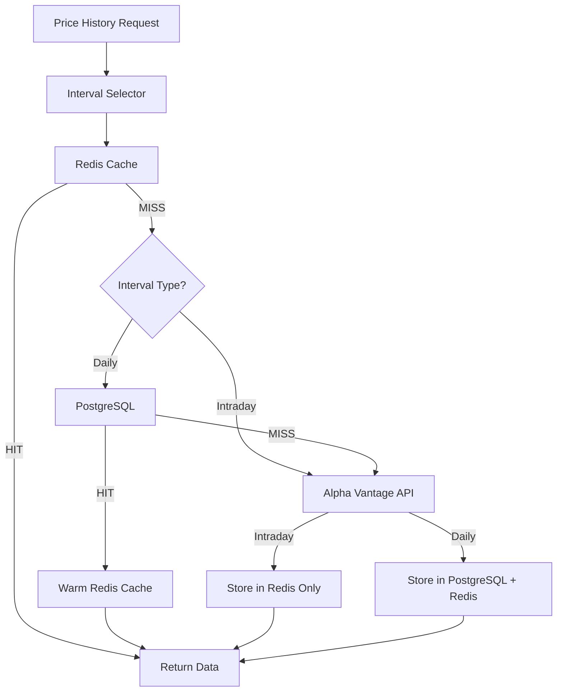

# Caching Strategy for Multiple Intervals

This document defines how different data intervals are cached in the 3-tier caching system.

## Overview

The existing 3-tier cache (Redis → PostgreSQL → Alpha Vantage) must be extended to handle multiple intervals efficiently. Key requirements:
- Different intervals have different lifetimes (ephemeral vs. permanent)
- Different intervals have different freshness requirements
- Cache keys must prevent collisions between intervals
- Storage costs must be contained

## Cache Architecture



## Cache Key Structure

### Format

```
papertrade:price:{ticker}:{interval}:{date}
```

### Examples

| Interval | Ticker | Date | Cache Key |
|----------|--------|------|-----------|
| 15min | AAPL | 2026-01-25 | `papertrade:price:AAPL:15min:2026-01-25` |
| 1hour | MSFT | 2026-01-25 | `papertrade:price:MSFT:1hour:2026-01-25` |
| 1day | GOOGL | 2026-01-25 | `papertrade:price:GOOGL:1day:2026-01-25` |
| 1day | AAPL | 2026-01-20 | `papertrade:price:AAPL:1day:2026-01-20` |

### Benefits of Date-Specific Keys

1. **No collisions** between same ticker but different dates
2. **Granular expiration** - can TTL individual days
3. **Historical immutability** - old dates never change, can cache forever
4. **Easy invalidation** - delete specific dates if needed

### Alternatives Considered

**Alternative 1: Single key per ticker+interval**
```
papertrade:price:AAPL:15min  # Contains all data
```

**Rejected because**:
- ❌ Large values (all historical data in one key)
- ❌ Difficult to partially update
- ❌ Memory pressure on Redis

**Alternative 2: Range-based keys**
```
papertrade:price:AAPL:15min:2026-01-20:2026-01-25
```

**Rejected because**:
- ❌ Harder to lookup (must know exact range)
- ❌ Overlapping ranges create duplicates
- ❌ Partial cache hits difficult

## Cache Tiers by Interval Type

### Intraday Intervals (15min, 30min, 1hour)

#### Redis (Tier 1)

| Property | Value | Rationale |
|----------|-------|-----------|
| **Storage** | Yes, current day only | Fast access for active trading day |
| **TTL (market hours)** | 15 minutes | Data freshness during trading |
| **TTL (after-hours)** | 1 hour | Less frequent updates after close |
| **TTL (historical)** | Not cached | No value caching old intraday |
| **Key pattern** | `papertrade:price:{ticker}:{interval}:{date}` | Date-specific for granular TTL |
| **Eviction** | TTL-based | Automatic cleanup |

**Market Hours Detection**:
```
Market hours: 9:30 AM - 4:00 PM ET (Monday-Friday)
If current_time in market_hours:
    TTL = 15 minutes
Else:
    TTL = 1 hour
```

#### PostgreSQL (Tier 2)

| Property | Value | Rationale |
|----------|-------|-----------|
| **Storage** | ❌ NO | Too much data, ephemeral value |
| **Reason** | Intraday data only useful for current day | Historical intraday not needed for backtesting |

**Cost Analysis**:
- 1000 tickers × 26 points/day × 365 days = 9.5M rows/year
- Storage: ~1GB/year (OHLCV + metadata)
- Value: Low (backtesting uses daily data)
- **Decision**: Not worth storage cost

#### Alpha Vantage (Tier 3)

| Property | Value |
|----------|-------|
| **Endpoint** | `TIME_SERIES_INTRADAY` |
| **Parameters** | `interval=15min`, `outputsize=full` |
| **Rate limit** | 75 calls/min (premium tier) |
| **Response size** | ~3-10 KB (26-100 points) |

### Daily Interval (1day)

#### Redis (Tier 1)

| Property | Value | Rationale |
|----------|-------|-----------|
| **Storage** | Yes, recent 30 days | Hot data for frequent access |
| **TTL (market hours)** | 1 hour | Balance freshness vs. API usage |
| **TTL (after-hours)** | 4 hours | Prices stable after market close |
| **TTL (historical)** | 24 hours | Historical data immutable |
| **Key pattern** | `papertrade:price:{ticker}:1day:{date}` | Date-specific |
| **Eviction** | TTL-based + LRU | Automatic cleanup |

**TTL Logic**:
```
IF date < today:
    TTL = 24 hours  # Historical (immutable)
ELSE IF current_time in market_hours:
    TTL = 1 hour    # Today, market open
ELSE:
    TTL = 4 hours   # Today, market closed
```

#### PostgreSQL (Tier 2)

| Property | Value | Rationale |
|----------|-------|-----------|
| **Storage** | ✅ YES, all historical data | Required for backtesting |
| **Retention** | Unlimited (never delete) | Historical prices immutable |
| **Indexing** | (ticker, timestamp), (ticker, interval) | Fast time-range queries |
| **Table** | `price_history` (existing) | Already designed for this |

**Schema** (existing):
```
price_history:
  - ticker: VARCHAR (indexed)
  - timestamp: TIMESTAMP (indexed)
  - interval: VARCHAR (indexed)
  - price: DECIMAL
  - open: DECIMAL (nullable)
  - high: DECIMAL (nullable)
  - low: DECIMAL (nullable)
  - close: DECIMAL (nullable)
  - volume: BIGINT (nullable)
  - source: VARCHAR
  - created_at: TIMESTAMP
```

**Query Pattern**:
```sql
SELECT * FROM price_history
WHERE ticker = 'AAPL'
  AND interval = '1day'
  AND timestamp BETWEEN '2025-01-01' AND '2026-01-01'
ORDER BY timestamp ASC;
```

#### Alpha Vantage (Tier 3)

| Property | Value |
|----------|-------|
| **Endpoint** | `TIME_SERIES_DAILY` |
| **Parameters** | `outputsize=full` (5000 days) |
| **Rate limit** | 75 calls/min (premium), 5 calls/min (free) |
| **Response size** | ~50-200 KB (100-5000 points) |

## Cache Flow Diagrams

### Flow 1: Intraday Request (15min, 1D time range)

```
┌─────────────────────────────────────────────────────────┐
│ Request: AAPL, 2026-01-25, interval=15min               │
└─────────────────────────────────────────────────────────┘
                        ↓
┌─────────────────────────────────────────────────────────┐
│ Check Redis: papertrade:price:AAPL:15min:2026-01-25    │
└─────────────────────────────────────────────────────────┘
           ↓ HIT                              ↓ MISS
┌──────────────────────┐         ┌───────────────────────┐
│ Return from Redis    │         │ Skip PostgreSQL       │
│ (~10ms)              │         │ (intraday not stored) │
└──────────────────────┘         └───────────────────────┘
                                             ↓
                         ┌──────────────────────────────┐
                         │ Check Rate Limiter           │
                         └──────────────────────────────┘
                                  ↓ Tokens available
                         ┌──────────────────────────────┐
                         │ Call Alpha Vantage           │
                         │ TIME_SERIES_INTRADAY (15min) │
                         └──────────────────────────────┘
                                  ↓ Success
                         ┌──────────────────────────────┐
                         │ Store in Redis only          │
                         │ TTL = 15min (market hours)   │
                         │ NOT stored in PostgreSQL     │
                         └──────────────────────────────┘
                                  ↓
                         ┌──────────────────────────────┐
                         │ Return to client (~2s)       │
                         └──────────────────────────────┘
```

### Flow 2: Daily Request (1day, 1Y time range)

```
┌─────────────────────────────────────────────────────────┐
│ Request: AAPL, 2025-01-25 to 2026-01-25, interval=1day │
└─────────────────────────────────────────────────────────┘
                        ↓
┌─────────────────────────────────────────────────────────┐
│ Check Redis for date range                              │
│ (multiple keys, one per day)                            │
└─────────────────────────────────────────────────────────┘
           ↓ Full HIT                        ↓ Partial/MISS
┌──────────────────────┐         ┌───────────────────────┐
│ Return from Redis    │         │ Check PostgreSQL      │
│ (~50ms)              │         │ for missing dates     │
└──────────────────────┘         └───────────────────────┘
                                  ↓ HIT (some dates)
                         ┌──────────────────────────────┐
                         │ Warm Redis with PG data      │
                         │ Return combined Redis + PG   │
                         │ (~500ms)                     │
                         └──────────────────────────────┘
                                  ↓ MISS (some dates)
                         ┌──────────────────────────────┐
                         │ Call Alpha Vantage           │
                         │ TIME_SERIES_DAILY            │
                         └──────────────────────────────┘
                                  ↓ Success
                         ┌──────────────────────────────┐
                         │ Store in PostgreSQL          │
                         │ Store in Redis (TTL varies)  │
                         └──────────────────────────────┘
                                  ↓
                         ┌──────────────────────────────┐
                         │ Return to client (~2s)       │
                         └──────────────────────────────┘
```

## Cache Invalidation

### Automatic Invalidation

| Interval | Trigger | Action |
|----------|---------|--------|
| Intraday (all) | TTL expires | Redis evicts key |
| 1day (today) | Market close | Update TTL to 4 hours |
| 1day (historical) | Never | Immutable, 24-hour TTL |

### Manual Invalidation

**Scenario 1: Stock Split**
```
# Must update historical daily data
DELETE FROM price_history WHERE ticker = 'AAPL' AND interval = '1day';
DELETE Redis keys: papertrade:price:AAPL:1day:*
Refetch from API with adjusted prices
```

**Scenario 2: Data Correction**
```
# Alpha Vantage corrects historical price
DELETE Redis key for specific date
Keep PostgreSQL (will be overwritten on next fetch)
```

**Scenario 3: User-Requested Refresh**
```
# User clicks "Refresh Prices" button
DELETE Redis keys for ticker (all intervals)
Keep PostgreSQL (source of truth for historical)
Refetch from API
```

## Cache Warming Strategy

### On Application Startup

Warm Redis with popular tickers (daily data only):

| Ticker | Interval | Date Range | Priority |
|--------|----------|------------|----------|
| AAPL, MSFT, GOOGL, AMZN, TSLA | 1day | Last 30 days | HIGH |
| Top 20 tickers by volume | 1day | Last 30 days | MEDIUM |

**Rationale**: 
- Reduce first-request latency for popular stocks
- Only daily data (intraday too ephemeral)
- Last 30 days covers most common queries

### Background Refresh

Daily job (midnight ET):

1. Refresh all tickers in database (interval=1day)
2. Pre-fetch popular tickers for next trading day
3. Cleanup stale Redis keys (> 7 days old)

**Rationale**:
- Keep PostgreSQL up-to-date
- Warm cache before market open
- Prevent Redis memory bloat

## Storage Estimates

### Redis Memory Usage

**Assumptions**:
- 1000 tickers actively traded
- 30 days of daily data cached
- 1 day of intraday data cached (15min interval)
- Average 500 bytes per price point (with metadata)

**Calculation**:
```
Daily data:
  1000 tickers × 30 days × 1 point/day × 500 bytes = 15 MB

Intraday data:
  100 active tickers × 1 day × 26 points × 500 bytes = 1.3 MB

Total: ~20 MB
```

**Conclusion**: Redis memory usage is negligible (even with 10x scale)

### PostgreSQL Storage

**Assumptions**:
- 1000 tickers
- 5 years of historical data
- 252 trading days/year
- ~100 bytes per row (OHLCV + metadata)

**Calculation**:
```
Daily data:
  1000 tickers × 5 years × 252 days × 100 bytes = 126 MB

Index overhead: ~50%
Total: ~190 MB
```

**Conclusion**: PostgreSQL storage is minimal (scales linearly with tickers)

## Performance Targets

### Cache Hit Rates

| Scenario | Target Hit Rate | Actual (expected) |
|----------|-----------------|-------------------|
| Portfolio value (1day) | >90% | ~95% (daily refresh) |
| 1D chart (15min) | >70% | ~80% (15min TTL) |
| 1W chart (1hour) | >60% | ~70% (1hour TTL) |
| Historical (1Y, 1day) | >95% | ~99% (PostgreSQL) |

### Response Times

| Scenario | Target | Breakdown |
|----------|--------|-----------|
| Redis hit (1day) | <100ms | 10ms Redis + 50ms app + 40ms network |
| PostgreSQL hit (1day) | <500ms | 200ms DB + 100ms app + 200ms network |
| API call (1day) | <2s | 1s API + 500ms DB write + 500ms overhead |
| Redis hit (15min) | <100ms | Same as daily |
| API call (15min) | <3s | 2s API + 500ms cache + 500ms overhead |

## Monitoring Metrics

### Cache Performance

| Metric | Target | Alert Threshold |
|--------|--------|-----------------|
| Redis hit rate (1day) | >90% | <80% |
| Redis hit rate (intraday) | >70% | <50% |
| PostgreSQL hit rate (1day) | >95% | <90% |
| Redis memory usage | <100 MB | >500 MB |
| API calls per hour | <50 | >100 |

### Data Quality

| Metric | Target | Alert Threshold |
|--------|--------|-----------------|
| Stale data served (%) | <5% | >10% |
| Cache invalidation errors | 0 | >1/hour |
| PostgreSQL write failures | 0 | >1/day |

## Future Enhancements

### Phase 4: Selective Intraday Persistence

If historical intraday backtesting becomes a requirement:

**Option 1**: Store last 90 days of 1hour data
- Benefit: Short-term intraday backtesting
- Cost: ~3GB storage per 1000 tickers
- Use case: Day trading strategies

**Option 2**: Store aggregated intraday (market open, close, high, low)
- Benefit: Candlestick charts for any time range
- Cost: Same as daily data (4 points per day)
- Use case: Technical analysis

### Phase 5: Distributed Redis

When scaling beyond single Redis instance:

**Redis Cluster**:
- Shard by ticker prefix (A-M, N-Z)
- Replication factor: 2
- Automatic failover

**Redis Sentinel**:
- Monitor primary/replica health
- Automatic promotion on failure

## References

- [Redis Caching Best Practices](https://redis.io/docs/manual/patterns/caching/)
- [PostgreSQL Indexing for Time-Series](https://www.timescale.com/blog/time-series-data-postgresql-10-vs-timescaledb/)
- [ADR-001: Tiered Caching Strategy](../20251228_phase2-market-data/adr-001-caching-strategy.md)
- [ADR-174-002: Differential Caching for Intervals](./decisions.md#adr-174-002-differential-caching-for-intervals)
