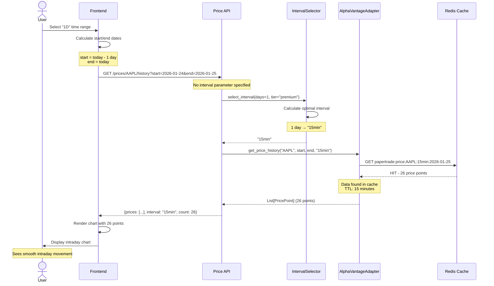
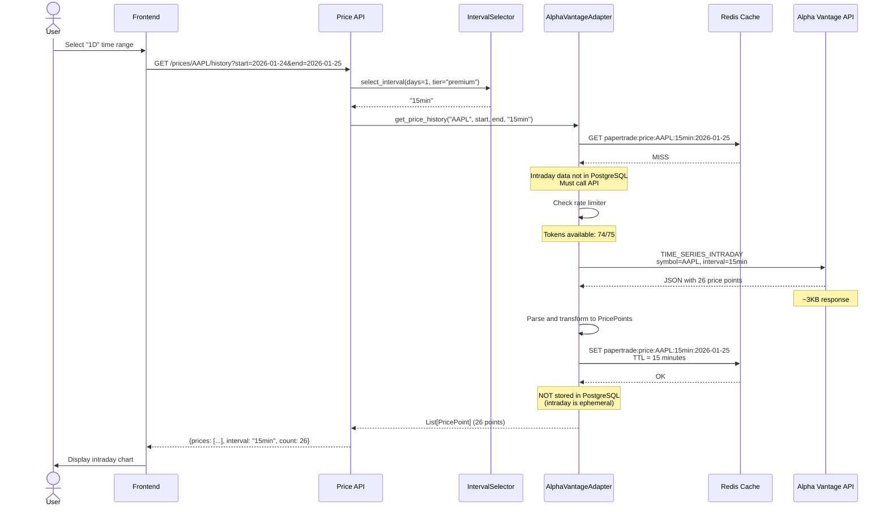
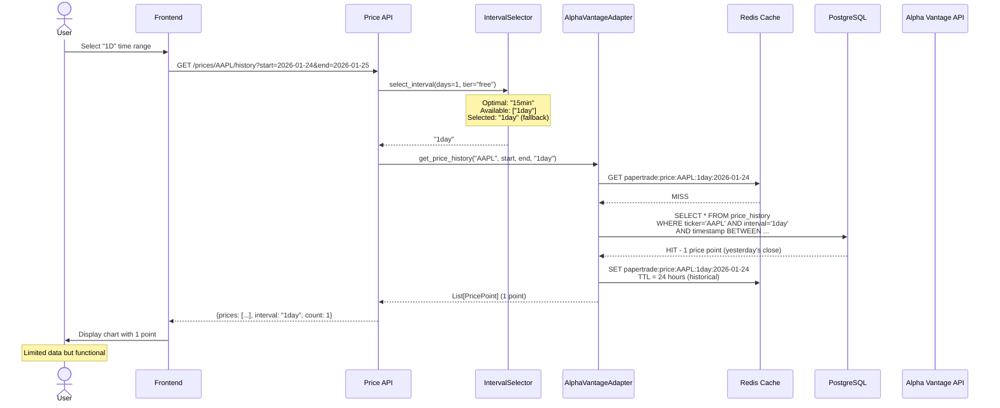
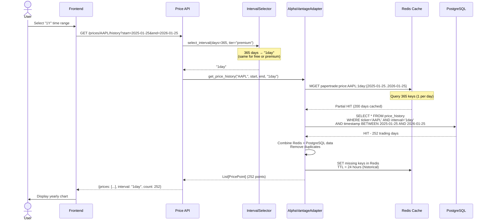
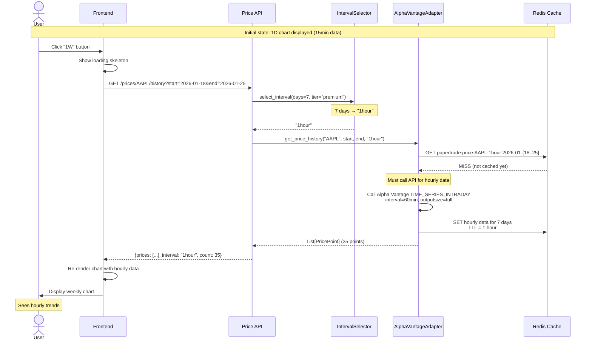
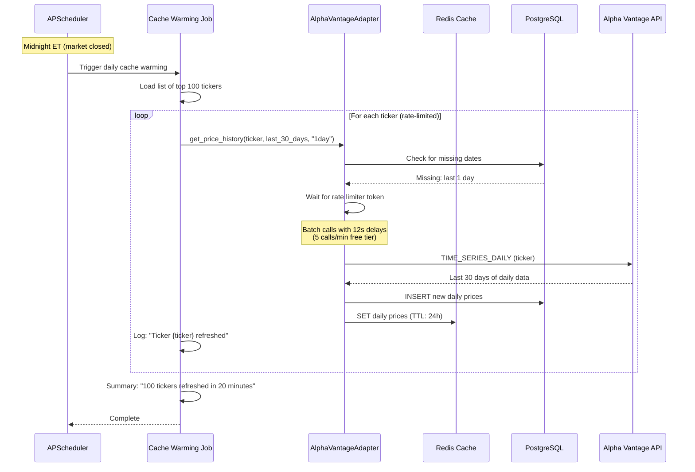
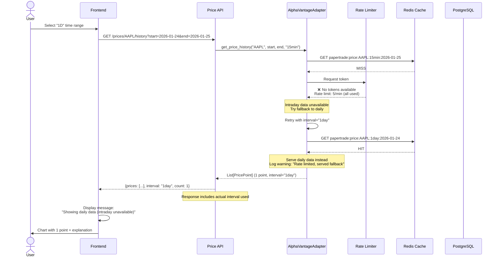
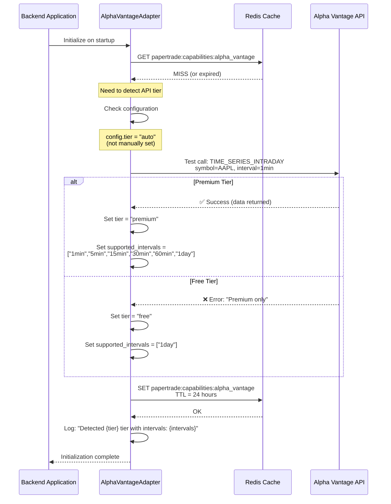
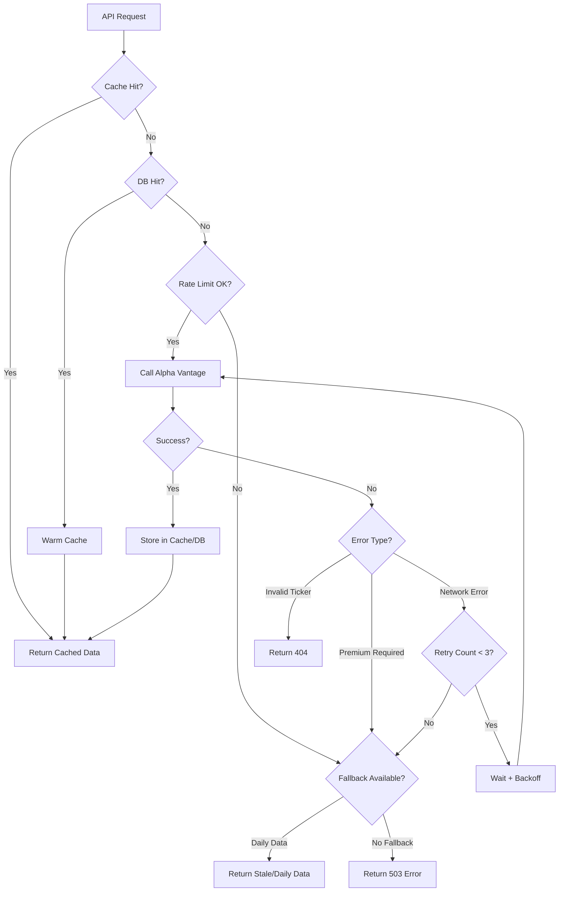
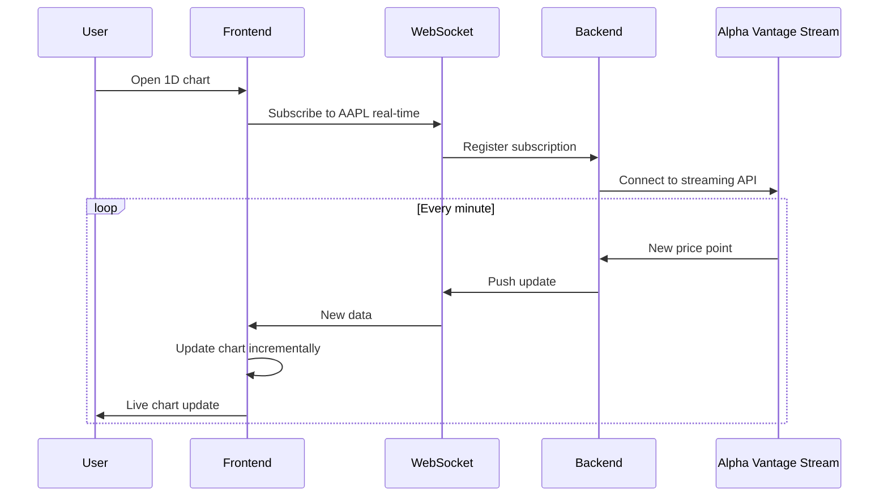

# Data Flow Diagrams

This document illustrates how data flows through the system for different scenarios.

## Overview

The price data granularity system involves multiple components:
- **Frontend**: TimeRangeSelector, PriceChart
- **API Layer**: Price history endpoint
- **Application Layer**: IntervalSelector service
- **Adapter Layer**: AlphaVantageAdapter, PriceCache, PriceRepository
- **External**: Alpha Vantage API

## Scenario 1: User Views 1D Chart (Premium Tier, Cache Hit)



**Performance**: <100ms total (Redis cache hit)

---

## Scenario 2: User Views 1D Chart (Premium Tier, Cache Miss)



**Performance**: ~2-3 seconds (API call + caching)

---

## Scenario 3: User Views 1D Chart (Free Tier, Graceful Fallback)



**Performance**: ~500ms (PostgreSQL query)

---

## Scenario 4: User Views 1Y Chart (Any Tier)



**Performance**: ~1 second (PostgreSQL query + cache warming)

---

## Scenario 5: User Switches from 1D to 1W (Premium Tier)



**Performance**: ~3 seconds first time (API call), <100ms on repeat

---

## Scenario 6: Background Cache Warming (Daily Job)



**Duration**: ~20 minutes (100 tickers × 12 seconds with rate limiting)
**Benefit**: All popular tickers cached before market open

---

## Scenario 7: Rate Limit Exceeded (Graceful Degradation)



**Graceful Degradation**: System continues working with reduced granularity

---

## Scenario 8: Capability Detection on Startup



**Frequency**: Once per day (or on cache miss)
**Cost**: 1 API call per day

---

## Component Interaction Summary

### Component Responsibilities

| Component | Responsibility | Key Decisions |
|-----------|----------------|---------------|
| **Frontend** | User interaction, time range selection | Display appropriate chart for interval |
| **API Layer** | Request validation, interval selection | Choose optimal interval when not specified |
| **IntervalSelector** | Interval selection logic | Map time ranges to intervals with fallback |
| **AlphaVantageAdapter** | Data fetching, caching | Route to correct endpoint, store appropriately |
| **Redis Cache** | Fast data access | TTL management, key generation |
| **PostgreSQL** | Historical data storage | Store daily data permanently |
| **Rate Limiter** | API quota management | Allow/deny API calls based on token bucket |

### Data Flow Patterns

| Pattern | When Used | Performance |
|---------|-----------|-------------|
| **Direct Cache Hit** | Recent data, high traffic ticker | <100ms |
| **Database Fallback** | Historical daily data | <500ms |
| **API Call (Intraday)** | Cache miss, premium tier | 2-3s |
| **API Call (Daily)** | Cache miss, any tier | 2-3s |
| **Graceful Fallback** | Rate limited, tier downgrade | <500ms |

### Cache Invalidation Triggers

| Trigger | Action | Frequency |
|---------|--------|-----------|
| **TTL Expiration** | Redis evicts key automatically | Continuous |
| **Market Close** | Update today's TTL from 1h → 4h | Daily at 4PM ET |
| **Manual Refresh** | Clear Redis keys, refetch | On-demand |
| **Stock Split** | Clear all keys, update PostgreSQL | Rare |

---

## Performance Optimization Strategies

### 1. Parallel Cache Lookups

For date range queries (e.g., 1Y), lookup all dates in parallel:

```
Instead of:
  FOR each date:
      Redis.GET(key)

Do:
  Redis.MGET(all_keys)  # Single round-trip
```

**Benefit**: 10x faster for multi-day queries

### 2. Cache Warming Before Market Open

Pre-fetch popular tickers before 9:30 AM ET:

```
At 8:00 AM ET:
  FOR top_100_tickers:
      Fetch daily data for yesterday
      Cache in Redis
```

**Benefit**: Zero API calls during market open rush

### 3. Interval Downgrade on Rate Limit

Instead of error, try coarser interval:

```
Request 15min → Rate limited
Try 1hour → Rate limited
Try 1day → Success (served from cache)
```

**Benefit**: Better user experience than error page

### 4. Smart TTL Adjustment

Extend TTL during low volatility periods:

```
IF after_hours AND low_volume:
    TTL = 4 hours
ELSE IF market_hours:
    TTL = 15 minutes
```

**Benefit**: Fewer API calls without stale data

---

## Error Handling Flow



---

## Future Enhancements

### Real-Time Streaming (Phase 5)

Instead of polling, use WebSocket for real-time updates:



**Benefit**: No polling, instant updates, lower API usage

---

## References

- [Mermaid Sequence Diagram Syntax](https://mermaid.js.org/syntax/sequenceDiagram.html)
- [Alpha Vantage API Documentation](https://www.alphavantage.co/documentation/)
- [ADR-174-001: Backend-Determined Interval Selection](./decisions.md#adr-174-001)
- [Caching Strategy](./caching-strategy.md)
