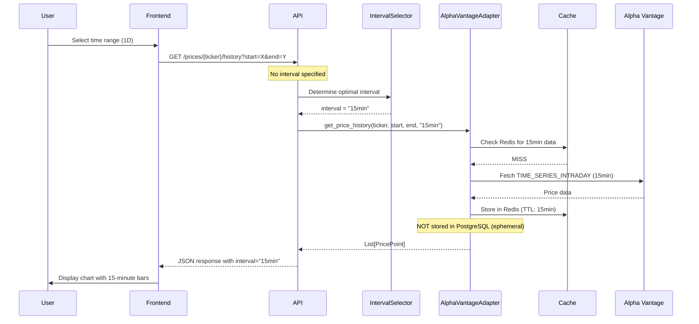

# Price Data Granularity System - Architecture Overview

**Created**: 2026-01-25
**Status**: Proposed
**Type**: Enhancement - Data Strategy
**Related**: Task 174

## Executive Summary

This architecture plan defines how Zebu will serve appropriate price data granularity based on viewing context. Currently, all time ranges (1D, 1W, 1M, 3M, 1Y, ALL) display daily closing prices. This design enables showing intraday data for short ranges and daily data for longer ranges, while maintaining good user experience and API cost efficiency.

The design supports both the current free-tier Alpha Vantage API (daily only) and the upcoming premium tier (intraday at multiple intervals), ensuring graceful degradation and progressive enhancement.

## Problem Statement

### Current Limitations

1. **Poor granularity for short time ranges**: Viewing a 1-day chart shows only 1 data point (previous day's close)
2. **Wasted granularity for long time ranges**: Could benefit from weekly/monthly aggregation for ALL time range
3. **No intraday support**: Infrastructure exists but not utilized
4. **User experience gaps**: No loading states for interval transitions, no indication of available vs. unavailable granularity

### Context

- **Frontend**: TimeRangeSelector offers 1D, 1W, 1M, 3M, 1Y, ALL
- **API**: Accepts `interval` parameter but currently only processes `1day`
- **Backend**: Full interval support exists in the stack but Alpha Vantage adapter only fetches daily data
- **Data Provider**: Alpha Vantage free tier = daily only; premium tier = 1min/5min/15min/30min/60min intraday
- **Caching**: 3-tier system (Redis → PostgreSQL → API) with interval-aware storage

### Upcoming Change

Premium Alpha Vantage API key will be deployed within weeks, unlocking:
- Intraday intervals: 1min, 5min, 15min, 30min, 60min
- Higher rate limits (75 calls/min vs. 5 calls/min)

## Design Goals

| Goal | Priority | Rationale |
|------|----------|-----------|
| **Appropriate granularity for context** | CRITICAL | Users viewing 1D should see intraday movement, not 1 data point |
| **Fast load times** | HIGH | Charts must load <1s for good UX |
| **API cost efficiency** | HIGH | Respect rate limits, minimize redundant fetches |
| **Graceful degradation** | CRITICAL | Must work well with free tier, enhance with premium |
| **Maintainability** | MEDIUM | Clean separation, easy to add new intervals/providers |
| **Handle edge cases** | MEDIUM | Market hours, weekends, holidays, gaps, timezones |

## Key Design Decisions Summary

### 1. Interval Selection Strategy
**Decision**: Backend-determined adaptive interval based on time range

**Rationale**: 
- Frontend specifies intent (time range), backend selects optimal data granularity
- Allows backend to adapt based on available data (free vs. premium tier)
- Reduces frontend complexity and API coupling

### 2. Transition Strategy
**Decision**: Three-phase rollout (prepare → test → activate)

**Rationale**:
- Phase 1: Infrastructure ready, no behavior change
- Phase 2: Premium key deployed, selective activation
- Phase 3: Full activation with monitoring

### 3. Caching Strategy
**Decision**: Interval-aware storage with differential TTLs

**Rationale**:
- Intraday data is ephemeral (short TTL in Redis, not persisted to PostgreSQL)
- Daily data is permanent (stored in PostgreSQL forever)
- Different intervals can coexist in cache without conflicts

## Architecture Principles

This design follows Zebu's core principles:

1. **Clean Architecture**: No business logic in controllers, domain-driven intervals
2. **Composition over Inheritance**: Reuse existing MarketDataPort and caching infrastructure
3. **Progressive Enhancement**: Works perfectly with free tier, gets better with premium
4. **Testability**: Can test all scenarios without premium API key

## Success Criteria

The architecture design is successful if:

- ✅ Can implement incrementally without breaking existing functionality
- ✅ Frontend doesn't need to know about API tier or availability
- ✅ Backend adapts to available data sources transparently
- ✅ Caching strategy prevents excessive API usage
- ✅ Architecture scales to support candlestick charts and technical indicators
- ✅ No major refactoring needed when adding new intervals or providers
- ✅ Clear migration path from free to premium tier

## High-Level Component Interactions

## Document Structure

This architecture plan is organized into the following documents:

1. **overview.md** (this file) - High-level summary and context
2. **decisions.md** - Architecture Decision Records (ADRs) for key choices
3. **interval-strategy.md** - Detailed interval selection logic and rules
4. **api-contracts.md** - API changes and backwards compatibility
5. **caching-strategy.md** - How different intervals are cached
6. **data-flow.md** - Sequence diagrams and data flows
7. **frontend-integration.md** - Frontend state management and UX
8. **implementation-guide.md** - Step-by-step implementation roadmap

## Terminology

| Term | Definition |
|------|------------|
| **Time Range** | User-selected viewing window (1D, 1W, 1M, 3M, 1Y, ALL) |
| **Interval** | Data granularity (1min, 5min, 15min, 30min, 1hour, 1day) |
| **Granularity** | Same as interval - how often price points occur |
| **Intraday Data** | Price points within a single trading day (intervals < 1day) |
| **Daily Data** | One price point per trading day (interval = 1day) |
| **Ephemeral Data** | Intraday data not stored permanently (Redis only) |
| **Historical Data** | Daily data stored permanently (PostgreSQL) |
| **API Tier** | Free (daily only) vs. Premium (intraday available) |

## Next Steps

1. Read **decisions.md** for detailed ADRs on each design choice
2. Read **interval-strategy.md** for the interval selection algorithm
3. Read **api-contracts.md** for API changes (backward compatible)
4. Read **caching-strategy.md** for storage and TTL rules
5. Read **implementation-guide.md** for phased rollout plan

## References

- [Current Architecture: Phase 2 Market Data](../20251228_phase2-market-data/overview.md)
- [Alpha Vantage Intraday Documentation](https://www.alphavantage.co/documentation/#intraday)
- [Frontend: usePriceHistory Hook](../../frontend/src/hooks/usePriceHistory.ts)
- [Backend: Alpha Vantage Adapter](../../backend/src/zebu/adapters/outbound/market_data/alpha_vantage_adapter.py)
- [API: Price History Endpoint](../../backend/src/zebu/adapters/inbound/api/prices.py)
