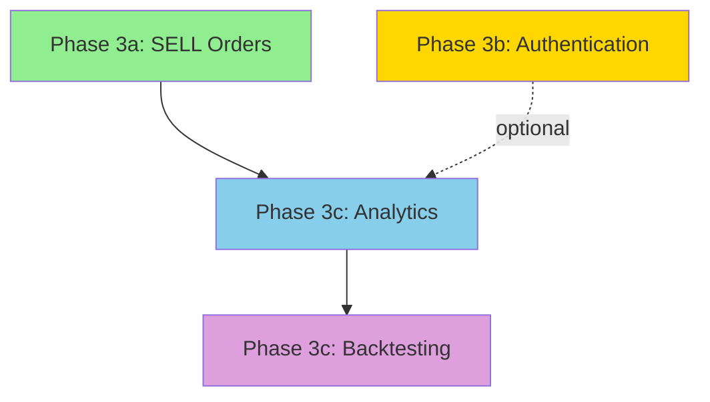

# Phase 3 Refined: Production-Ready Trading Platform

**Status**: Planned
**Target**: Q1-Q2 2026
**Last Updated**: 2026-01-04

## Executive Summary

Phase 3 transforms PaperTrade from a development prototype into a production-ready trading platform. Based on comprehensive analysis of Phase 1-2 implementation learnings and user needs, we're breaking Phase 3 into focused increments that deliver maximum user value.

### Key Insight from Phase 1-2

**What Worked Well**:
- Clean Architecture enabled rapid feature development (499 tests, 2 phases in 2 weeks)
- Domain-driven design made complex logic testable and maintainable
- Alpha Vantage integration with caching worked smoothly
- Docker infrastructure accelerated development velocity
- E2E tests caught critical bugs before production

**What Was Harder Than Expected**:
- E2E test setup complexity (Docker services, API integration)
- Frontend state management required careful cache invalidation
- Rate limiting required sophisticated retry logic
- Type safety enforcement needed iteration

**Critical User Needs** (from documentation analysis):
1. **SELL orders** - Users can't exit positions (HIGH impact)
2. **User authentication** - Blocks production deployment (CRITICAL)
3. **Portfolio analytics** - Users want to see performance (MEDIUM)
4. **Better UX** - Browser alerts need replacement (LOW-MEDIUM)

## Phase 3 Restructuring: Incremental Value Delivery

After analyzing user needs, implementation velocity, and technical dependencies, **Phase 3 is split into 3 sub-phases**:

### Phase 3a: Complete Trading Loop (2-3 weeks)
**Goal**: Users can buy AND sell stocks - complete basic trading functionality

**Features**:
- SELL order implementation
- Sufficient holdings validation
- Updated holdings calculation
- Cost basis tracking for P&L

**Value**: Unlocks portfolio rebalancing, users can realize gains/losses

### Phase 3b: Production-Ready Foundation (2-3 days)
**Goal**: Platform ready for multi-user production deployment

**Features**:
- User authentication (Clerk-based, third-party)
- Pre-built login/signup UI components
- Portfolio ownership model
- Protected API endpoints
- Session management

**Value**: Enables public deployment, data privacy, audit trail. Saves 3-4 weeks vs custom JWT implementation.

### Phase 3c: Analytics & Insights (3-4 weeks)
**Goal**: Users can visualize performance and make data-driven decisions

**Features**:
- Portfolio performance charts (line charts, candlesticks)
- Gain/loss calculations with percentages
- Holdings composition (pie charts)
- Simple backtesting (select past start date, execute trades)

**Value**: Users see actionable insights, test strategies

## Why This Sequencing?

### Dependency Analysis

**Phase 3a → 3b → 3c reasoning**:

1. **SELL First** (3a):
   - No dependencies on other features
   - High user value (complete trading loop)
   - Fast to implement (~2 weeks based on BUY complexity)
   - Users can start testing realistic strategies

2. **Auth Second** (3b):
   - Independent of SELL implementation
   - CRITICAL for production deployment
   - Enables multi-user scenarios
   - Can be developed in parallel with 3a if needed

3. **Analytics Third** (3c):
   - Requires SELL to show complete P&L
   - Benefits from auth (user-specific views)
   - More complex (4+ weeks for charts + backtesting)
   - Can leverage existing historical price infrastructure

### Alternative Considered: Auth First

**Pros**:
- Establishes foundation for everything
- Production-ready sooner
- Multi-user testing available

**Cons**:
- Delays user value (still can't SELL)
- Auth complexity could block other work
- Users want trading features over accounts

**Decision**: SELL first delivers immediate value; auth second enables production

## Success Metrics

### Phase 3a Completion Criteria
- [ ] Users can execute SELL orders for owned stocks
- [ ] Insufficient holdings validation prevents invalid sells
- [ ] Holdings update correctly after sells
- [ ] P&L calculations show realized gains/losses
- [ ] All existing BUY functionality unchanged
- [ ] 90%+ test coverage on SELL logic
- [ ] E2E tests verify sell workflow

### Phase 3b Completion Criteria
- [ ] Users can register with email/password
- [ ] Users can login via Clerk UI
- [ ] API endpoints validate Clerk tokens
- [ ] Portfolios have owner_id (foreign key to users)
- [ ] Users can only see/modify their own portfolios
- [ ] Logout clears session
- [ ] E2E tests verify auth workflow
- [ ] Migration path for existing portfolios

### Phase 3c Completion Criteria
- [ ] Portfolio value chart (line chart over time)
- [ ] Holdings composition chart (pie chart)
- [ ] Gain/loss calculations (absolute + percentage)
- [ ] Backtesting: Select past date, execute trades
- [ ] Backtesting: View portfolio value at any point
- [ ] Chart library integrated (Recharts)
- [ ] Historical data sufficient for charts
- [ ] E2E tests verify chart rendering

## Estimated Timeline

Based on Phase 1-2 velocity (2 phases in ~2 weeks with parallel agents):

| Sub-Phase | Duration | Calendar Target | Confidence |
|-----------|----------|-----------------|------------|
| **Phase 3a** | 2-3 weeks | Jan 5 - Jan 25 | High |
| **Phase 3b** | 2-3 days | Jan 26 - Jan 28 | High (using Clerk) |
| **Phase 3c** | 3-4 weeks | Jan 29 - Feb 25 | Medium |

**Total Phase 3**: 5-7 weeks (Jan - Feb 2026)

**Note**: Phase 3b timeline reduced from 2-3 weeks to 2-3 days by using Clerk instead of custom JWT authentication.

**Assumptions**:
- Single agent working sequentially
- No major architectural surprises
- Existing clean architecture accelerates work
- E2E test infrastructure already robust

**Risks**:
- Auth complexity may extend Phase 3b
- Chart library integration may be tricky
- Backtesting may reveal performance issues

## What's NOT in Phase 3

The following are explicitly deferred to Phase 4 or later:

❌ **Advanced Order Types** (limit, stop, stop-limit) - Phase 4
❌ **WebSocket Real-Time Updates** - Phase 4
❌ **Multi-Currency Support** - Phase 4+
❌ **Short Selling** - Phase 4+
❌ **Fractional Shares** - Future
❌ **Transaction Fees** - Phase 4
❌ **Algorithmic Trading** - Phase 5
❌ **Social Features** (portfolio sharing, leagues) - Future

**Rationale**: These features are either:
- Complex and distract from core value
- Low user priority based on documentation
- Can be added incrementally after Phase 3

## Quality Standards

Phase 3 maintains Phase 1-2 quality bar:

- **Test Coverage**: 85%+ (current: 82%)
- **Type Safety**: Zero pyright errors (enforced in pre-commit)
- **Linting**: All ruff/ESLint rules passing
- **E2E Tests**: Critical workflows validated
- **Documentation**: User guide and technical docs updated
- **Performance**: <500ms API response time
- **Security**: No vulnerabilities in dependencies

## Next Steps

1. Review and approve this refined architecture plan
2. Create detailed specifications for Phase 3a (SELL orders)
3. Begin Phase 3a implementation
4. Update project_plan.md and PROGRESS.md

## Related Documentation

- **Phase 3a Details**: `./phase3a-sell-orders.md`
- **Phase 3b Details**: `./phase3b-authentication.md`
- **Phase 3c Details**: `./phase3c-analytics.md`
- **User Needs**: `../../docs/TECHNICAL_BOUNDARIES.md`
- **Implementation Learnings**: `../../agent_progress_docs/`
