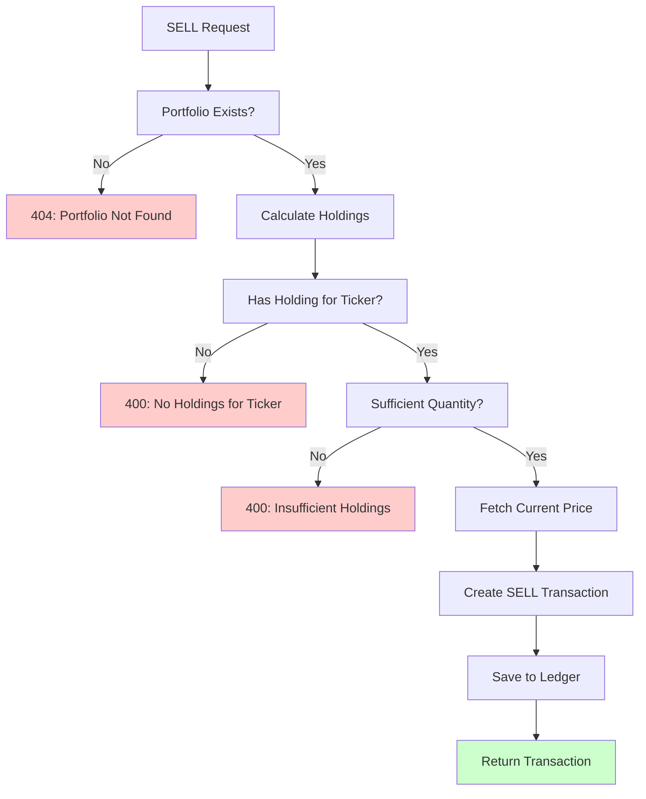

# Phase 3a: SELL Order Functionality

**Duration**: 2-3 weeks
**Priority**: HIGH
**Dependencies**: None (builds on Phase 2)

## Objective

Enable users to sell stocks they own, completing the basic buy/sell trading loop. This is the #1 user need from documentation analysis.

## Current State

**What Exists**:
- ✅ BUY orders fully implemented
- ✅ Transaction ledger with BUY type
- ✅ Holdings calculation from transactions
- ✅ Portfolio value calculation
- ✅ Market data integration for current prices

**What's Missing**:
- ❌ SELL transaction type implementation
- ❌ Holdings validation (sufficient quantity check)
- ❌ Holdings reduction logic
- ❌ Realized gain/loss calculation
- ❌ SELL UI in trade form

## Domain Model Changes

### Transaction Entity Enhancement

**Current Structure**:
```
Transaction
├── id: UUID
├── portfolio_id: UUID
├── type: TransactionType (DEPOSIT, BUY)
├── ticker: Ticker | None
├── quantity: int | None
├── price: Money | None
├── total: Money
└── timestamp: datetime
```

**Changes Needed**:

| Property | Change | Description |
|----------|--------|-------------|
| type | Add SELL enum value | `TransactionType.SELL` |
| No code changes needed | Just enum extension | Domain model already supports SELL structure |

### Holdings Calculation Update

**Current Logic** (simplified):
1. Filter transactions by ticker
2. Sum BUY quantities
3. Calculate average cost basis
4. Return Holding(ticker, quantity, avg_cost)

**New Logic**:

| Step | Operation | Formula |
|------|-----------|---------|
| 1 | Filter transactions by ticker | `txs = filter(ticker=X)` |
| 2 | Separate BUYs and SELLs | `buys = filter(type=BUY)`, `sells = filter(type=SELL)` |
| 3 | Calculate net quantity | `quantity = sum(buys.quantity) - sum(sells.quantity)` |
| 4 | Calculate total cost | `total_cost = sum(buys.total) - sum(sells.total)` |
| 5 | Calculate average cost | `avg_cost = total_cost / quantity` (if quantity > 0) |
| 6 | Return holding or None | If quantity > 0, return Holding; else None |

**Edge Cases to Handle**:
- Selling ALL shares → Holding disappears
- Multiple buys at different prices → Weighted average cost
- Selling before buying same ticker again → Cost basis resets

### Realized Gain/Loss Tracking

**New Value Object**: `RealizedGainLoss`

| Property | Type | Description | Constraints |
|----------|------|-------------|-------------|
| ticker | Ticker | Stock symbol | Valid ticker |
| quantity_sold | int | Number of shares sold | Positive integer |
| cost_basis | Money | Average cost per share | Positive amount |
| sell_price | Money | Price sold at | Positive amount |
| gain_loss | Money | Total profit/loss | Can be negative |
| percentage | Decimal | Gain/loss as % | Can be negative |
| timestamp | datetime | When sold | Not in future |

**Calculation**:
- `gain_loss = (sell_price - cost_basis) * quantity_sold`
- `percentage = (sell_price / cost_basis - 1) * 100`

## Use Case Specification

### ExecuteTrade Use Case Enhancement

**Current Behavior**: Only handles BUY orders

**New Behavior**: Handle both BUY and SELL orders

**Method Signature** (unchanged):
```
execute_trade(
    portfolio_id: UUID,
    ticker: Ticker,
    quantity: int,
    trade_type: TradeType  # BUY or SELL
) -> Transaction
```

**Validation Rules**:

| Rule | BUY Logic | SELL Logic |
|------|-----------|------------|
| Sufficient funds | cash >= price * quantity | N/A |
| Sufficient holdings | N/A | holdings[ticker].quantity >= quantity |
| Valid quantity | quantity > 0 | quantity > 0 |
| Valid ticker | Ticker exists in market data | Ticker exists in holdings |
| Portfolio exists | Portfolio found | Portfolio found |

**SELL-Specific Validation Flow**:



**Algorithm** (structured specification):

**For SELL Orders**:

1. **Validate Portfolio**
   - Retrieve portfolio by ID
   - If not found: Raise PortfolioNotFoundError

2. **Calculate Current Holdings**
   - Get all transactions for portfolio
   - Calculate holdings using new logic
   - Store holdings map: `{ticker: Holding}`

3. **Validate Holding Exists**
   - Check if `holdings[ticker]` exists
   - If not: Raise InsufficientHoldingsError("No holdings for {ticker}")

4. **Validate Sufficient Quantity**
   - Check if `holdings[ticker].quantity >= quantity`
   - If not: Raise InsufficientHoldingsError("Need {quantity}, have {holdings.quantity}")

5. **Fetch Current Price**
   - Call market data adapter for current price
   - If unavailable: Raise MarketDataUnavailableError

6. **Create SELL Transaction**
   - type: TransactionType.SELL
   - ticker: requested ticker
   - quantity: requested quantity (stored as negative for ledger clarity)
   - price: current market price
   - total: price * quantity (positive, represents cash received)
   - timestamp: current time

7. **Persist Transaction**
   - Save to transaction repository
   - Return created transaction

## API Changes

### Trade Endpoint Enhancement

**Endpoint**: `POST /api/v1/portfolios/{portfolio_id}/trades`

**Current Request Body**:
```json
{
  "ticker": "IBM",
  "quantity": 10,
  "action": "BUY"
}
```

**Updated Request Body** (add SELL support):
```json
{
  "ticker": "IBM",
  "quantity": 10,
  "action": "SELL"  // Now supports "BUY" or "SELL"
}
```

**Response (Success)**:
```json
{
  "id": "uuid",
  "portfolio_id": "uuid",
  "type": "SELL",
  "ticker": "IBM",
  "quantity": 10,
  "price": 185.50,
  "total": 1855.00,
  "timestamp": "2026-01-04T12:34:56Z"
}
```

**Error Responses** (new for SELL):

| Status | Error Code | Message | When |
|--------|-----------|---------|------|
| 400 | INSUFFICIENT_HOLDINGS | "Insufficient holdings for {ticker}" | Not enough shares |
| 400 | NO_HOLDINGS | "No holdings found for {ticker}" | Never owned ticker |
| 400 | INVALID_QUANTITY | "Quantity must be positive" | quantity <= 0 |

## Frontend Changes

### Trade Form Component

**Current State**:
- Dropdown shows only "BUY" option
- Form submits BUY trades

**Updates Needed**:

1. **Action Dropdown**:
   - Options: ["BUY", "SELL"]
   - Default: "BUY"

2. **Dynamic Validation**:
   - BUY: Validate sufficient cash
   - SELL: Validate sufficient holdings (client-side hint, server is authoritative)

3. **Visual Feedback**:
   - Show current holdings quantity below ticker input
   - Example: "You own 10 shares of IBM"

4. **Error Handling**:
   - Display insufficient holdings error clearly
   - Suggest correct maximum quantity to sell

### Holdings Table Enhancement

**Add Action Column**:

| Current Columns | New Column |
|----------------|------------|
| Symbol, Quantity, Avg Cost, Current Price, Value, Gain/Loss | **Quick Sell** (button) |

**Quick Sell Button**:
- Pre-fills trade form with ticker and owned quantity
- Sets action to "SELL"
- Focuses form for user confirmation

## Data Migration

**Database Schema**: No changes needed!
- `transactions` table already has `type` column (ENUM)
- SELL is just a new enum value
- Existing data unaffected

**Migration Script**: None required (just deploy)

## Testing Strategy

### Unit Tests (Domain Layer)

**New Test Cases**:

1. **Holdings Calculation**:
   - `test_holdings_after_buy_then_sell` - Reduces quantity correctly
   - `test_holdings_sell_all_shares` - Holding disappears
   - `test_holdings_multiple_buys_then_sell` - Weighted average cost
   - `test_holdings_sell_more_than_owned` - Validation error

2. **Transaction Creation**:
   - `test_create_sell_transaction` - SELL type persists
   - `test_sell_transaction_total_is_positive` - Cash received > 0

### Integration Tests (Use Cases)

**New Test Cases**:

1. **Execute SELL Trade**:
   - `test_execute_sell_with_sufficient_holdings` - Success path
   - `test_execute_sell_insufficient_holdings` - Raises error
   - `test_execute_sell_no_holdings` - Raises error
   - `test_execute_sell_updates_cash_balance` - Cash increases
   - `test_execute_sell_reduces_holdings` - Quantity decreases

2. **Edge Cases**:
   - `test_sell_all_shares_then_buy_again` - Cost basis resets
   - `test_concurrent_sells_same_ticker` - Race condition handling

### API Tests

**New Test Cases**:

1. **SELL Endpoint**:
   - `test_post_sell_trade_success` - 201 Created
   - `test_post_sell_insufficient_holdings` - 400 Bad Request
   - `test_post_sell_no_holdings` - 400 Bad Request
   - `test_post_sell_invalid_ticker` - 400 Bad Request

### E2E Tests

**New Test Scenarios**:

1. **Complete Trading Loop**:
   - Create portfolio
   - BUY 10 shares of IBM
   - SELL 5 shares of IBM
   - Verify cash balance increases
   - Verify holdings shows 5 shares remaining

2. **Error Scenarios**:
   - Attempt to SELL without holdings
   - Attempt to SELL more than owned
   - Verify error messages display correctly

## Implementation Sequence

**Recommended Order** (minimize dependencies):

1. **Domain Layer** (~2 days)
   - Add SELL to TransactionType enum
   - Update holdings calculation logic
   - Unit tests for new logic

2. **Application Layer** (~2 days)
   - Update ExecuteTrade use case
   - Add SELL-specific validation
   - Integration tests

3. **API Layer** (~1 day)
   - Update trade endpoint to accept SELL
   - Error response mapping
   - API tests

4. **Frontend** (~3 days)
   - Update trade form dropdown
   - Add SELL action handling
   - Holdings table quick-sell button
   - Error display
   - E2E tests

5. **Documentation** (~1 day)
   - Update USER_GUIDE.md
   - Update FEATURE_STATUS.md
   - Update API documentation

**Total Estimate**: 9-12 days (2 weeks with buffer)

## Risk Assessment

| Risk | Impact | Probability | Mitigation |
|------|--------|-------------|------------|
| Holdings calculation bug | HIGH | MEDIUM | Comprehensive unit tests, property-based tests |
| Race condition on concurrent sells | MEDIUM | LOW | Database transactions, optimistic locking |
| Cost basis calculation wrong | HIGH | LOW | Extensive test cases, manual verification |
| Frontend state inconsistency | MEDIUM | MEDIUM | React Query cache invalidation |

## Success Criteria

- [ ] Users can execute SELL orders via UI
- [ ] Insufficient holdings prevented (server validation)
- [ ] Holdings update correctly after SELL
- [ ] Cash balance increases after SELL
- [ ] Average cost basis calculated correctly
- [ ] All 499+ existing tests still pass
- [ ] 20+ new tests for SELL functionality
- [ ] E2E test covers buy-sell workflow
- [ ] Documentation updated
- [ ] No regressions in BUY functionality

## Dependencies

**Requires**:
- Phase 2 (market data) - complete ✅
- Transaction ledger - complete ✅

**Blocks**:
- Phase 3c (analytics) - needs realized P&L
- Phase 3c (backtesting) - needs full trading

**Parallel Work Opportunities**:
- Phase 3b (auth) can be developed simultaneously

## Notes

**Design Decisions**:
- SELL quantity stored as positive (easier to read)
- Holdings disappear when quantity = 0 (cleaner than zero holdings)
- Cost basis is weighted average (simpler than FIFO/LIFO)
- Server-side validation is authoritative (client-side is UX hint)

**Alternatives Considered**:
- FIFO/LIFO cost basis → Rejected (complex, overkill for MVP)
- Separate realized gains table → Deferred to Phase 3c
- Require price parameter → Rejected (security issue, like BUY)

## References

- **Original Plan**: `../../project_plan.md` - Phase 3 description
- **User Needs**: `../../docs/TECHNICAL_BOUNDARIES.md` - #1 limitation
- **BUY Implementation**: `../../backend/src/papertrade/application/use_cases/execute_trade.py`
- **Holdings Calculation**: `../../backend/src/papertrade/domain/services/portfolio_calculator.py`
