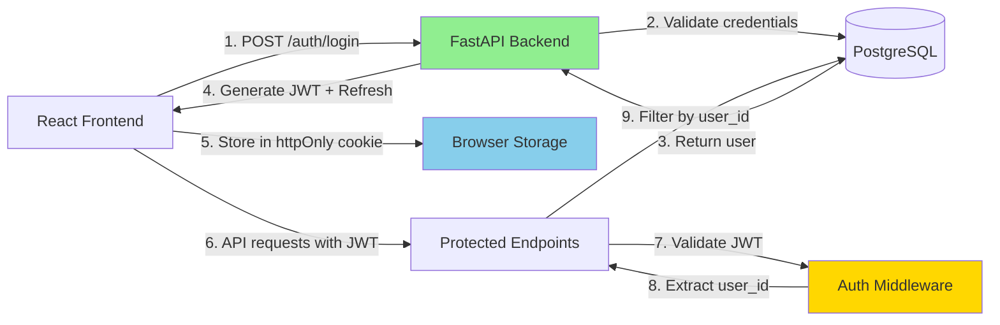

# Phase 3b: User Authentication & Authorization

**Duration**: 2-3 weeks
**Priority**: CRITICAL (blocks production deployment)
**Dependencies**: None (can parallel with 3a)

## Objective

Implement user authentication and authorization to enable multi-user production deployment with data privacy and security.

## Current State

**Security Status**:
- ❌ No authentication - all portfolios public
- ❌ No authorization - anyone can modify any portfolio
- ⚠️ User ID in localStorage - easily spoofed
- ❌ No audit trail of user actions
- 🔒 **NOT production-ready** - development/single-user only

**What This Blocks**:
- Public deployment (data privacy violation)
- Multi-user scenarios
- Compliance requirements
- User-specific features
- Portfolio sharing features (future)

## Authentication Strategy

### Approach: JWT-Based Authentication

**Decision Rationale**:

| Approach | Pros | Cons | Decision |
|----------|------|------|----------|
| **JWT Tokens** | Stateless, scales horizontally, standard | Harder to revoke, must handle expiry | ✅ **SELECTED** |
| Session-based | Easy to revoke, simple | Requires server-side storage, harder to scale | ❌ Not chosen |
| OAuth2 only | Industry standard, social login | Complex, requires provider setup | ⏳ Future enhancement |

**Selected: JWT with refresh tokens**

**Reasoning**:
- Stateless authentication scales well
- Standard approach (many libraries)
- Refresh tokens solve revocation issue
- Can add OAuth2 later without changing JWT infrastructure
- FastAPI has excellent JWT support

### Security Architecture



## Domain Model Changes

### New Entity: User

| Property | Type | Description | Constraints |
|----------|------|-------------|-------------|
| id | UUID | Primary key | Auto-generated |
| email | EmailStr | User email (login) | Unique, valid email format |
| hashed_password | str | Bcrypt hashed password | Never store plaintext |
| full_name | str | User's display name | Optional, max 100 chars |
| is_active | bool | Account enabled | Default: True |
| created_at | datetime | Registration timestamp | Auto-set |
| updated_at | datetime | Last profile update | Auto-update |

**Invariants**:
- Email must be unique across all users
- Password must be hashed (never store plaintext)
- Email must be valid format (Pydantic EmailStr)
- Inactive users cannot log in

**Operations**:

| Operation | Parameters | Returns | Description |
|-----------|-----------|---------|-------------|
| create | email, password, full_name | User | Register new user |
| verify_password | password | bool | Check password matches hash |
| update_password | new_password | None | Hash and update password |
| deactivate | None | None | Set is_active = False |

### Portfolio Entity Update

**Current Structure**:
```
Portfolio
├── id: UUID
├── name: str
└── created_at: datetime
```

**Updated Structure**:

| Property | Type | Change | Description |
|----------|------|--------|-------------|
| id | UUID | Unchanged | Primary key |
| **owner_id** | UUID | **NEW** | Foreign key to users.id |
| name | str | Unchanged | Portfolio name |
| created_at | datetime | Unchanged | Creation timestamp |

**Invariants**:
- owner_id must reference existing user
- User can have multiple portfolios
- Orphaned portfolios not allowed (FK constraint)

## Authentication Flow

### Registration Flow

**Endpoint**: `POST /api/v1/auth/register`

**Request Body**:
```json
{
  "email": "user@example.com",
  "password": "SecurePass123!",
  "full_name": "John Doe"
}
```

**Validation Rules**:

| Field | Rule | Error Message |
|-------|------|---------------|
| email | Valid email format | "Invalid email address" |
| email | Not already registered | "Email already registered" |
| password | Min 8 characters | "Password too short (min 8 characters)" |
| password | Contains letter + number | "Password must contain letters and numbers" |
| full_name | Max 100 characters | "Name too long (max 100 characters)" |

**Process**:
1. Validate email format and uniqueness
2. Hash password using bcrypt (cost factor: 12)
3. Create user record in database
4. Generate JWT access token (15 min expiry)
5. Generate refresh token (7 day expiry)
6. Return tokens + user info

**Response (Success)**:
```json
{
  "access_token": "eyJ...",
  "refresh_token": "eyJ...",
  "token_type": "Bearer",
  "user": {
    "id": "uuid",
    "email": "user@example.com",
    "full_name": "John Doe"
  }
}
```

### Login Flow

**Endpoint**: `POST /api/v1/auth/login`

**Request Body**:
```json
{
  "email": "user@example.com",
  "password": "SecurePass123!"
}
```

**Process**:
1. Lookup user by email
2. If not found: Return 401 Unauthorized
3. Verify password against hash
4. If incorrect: Return 401 Unauthorized
5. Check is_active flag
6. If inactive: Return 403 Forbidden
7. Generate JWT tokens
8. Return tokens + user info

**Response (Success)**:
```json
{
  "access_token": "eyJ...",
  "refresh_token": "eyJ...",
  "token_type": "Bearer",
  "user": {
    "id": "uuid",
    "email": "user@example.com",
    "full_name": "John Doe"
  }
}
```

### Token Refresh Flow

**Endpoint**: `POST /api/v1/auth/refresh`

**Request Body**:
```json
{
  "refresh_token": "eyJ..."
}
```

**Process**:
1. Validate refresh token signature
2. Check token not expired
3. Extract user_id from token
4. Verify user still exists and active
5. Generate new access token
6. Return new access token

**Response**:
```json
{
  "access_token": "eyJ...",
  "token_type": "Bearer"
}
```

## Authorization Implementation

### JWT Token Structure

**Access Token Payload**:
```json
{
  "sub": "user-uuid",           // Subject (user ID)
  "email": "user@example.com",
  "type": "access",
  "exp": 1704380400,            // Expiry (15 minutes from issue)
  "iat": 1704379500             // Issued at
}
```

**Refresh Token Payload**:
```json
{
  "sub": "user-uuid",
  "type": "refresh",
  "exp": 1704984300,            // Expiry (7 days from issue)
  "iat": 1704379500
}
```

### Protected Endpoint Pattern

**Dependency Injection**:

All portfolio endpoints require authenticated user:

```
Endpoint: GET /api/v1/portfolios
Dependency: current_user = Depends(get_current_user)

get_current_user:
  1. Extract Authorization header
  2. Validate "Bearer <token>" format
  3. Decode JWT token
  4. Verify signature and expiry
  5. Extract user_id from token
  6. Fetch user from database
  7. Return user object

  Errors:
  - No header: 401 Unauthorized
  - Invalid format: 401 Unauthorized
  - Expired token: 401 Unauthorized
  - User not found: 401 Unauthorized
  - User inactive: 403 Forbidden
```

### Portfolio Ownership Enforcement

**Query Filter Pattern**:

All portfolio queries filtered by owner_id:

**Before (Phase 2)**:
```python
# Get all portfolios (INSECURE)
portfolios = session.exec(select(Portfolio)).all()
```

**After (Phase 3b)**:
```python
# Get only user's portfolios (SECURE)
portfolios = session.exec(
    select(Portfolio).where(Portfolio.owner_id == current_user.id)
).all()
```

**Authorization Matrix**:

| Operation | Ownership Check | Error if Not Owner |
|-----------|----------------|-------------------|
| List portfolios | Filter by owner_id | N/A (only shows owned) |
| Get portfolio | Verify owner_id == user.id | 404 Not Found |
| Create portfolio | Set owner_id = user.id | N/A (auto-set) |
| Update portfolio | Verify owner_id == user.id | 404 Not Found |
| Delete portfolio | Verify owner_id == user.id | 404 Not Found |
| Execute trade | Verify portfolio.owner_id == user.id | 404 Not Found |

**Why 404 instead of 403?**
- Security: Don't leak existence of other users' portfolios
- Consistent UX: "Not found" whether missing or unauthorized

## API Changes

### New Auth Endpoints

| Endpoint | Method | Purpose | Auth Required |
|----------|--------|---------|---------------|
| `/api/v1/auth/register` | POST | Create new user | No |
| `/api/v1/auth/login` | POST | Get JWT tokens | No |
| `/api/v1/auth/refresh` | POST | Refresh access token | No (uses refresh token) |
| `/api/v1/auth/me` | GET | Get current user info | Yes |
| `/api/v1/auth/logout` | POST | Invalidate tokens (future) | Yes |
| `/api/v1/auth/change-password` | POST | Update password | Yes |

### Existing Endpoints Updated

**All portfolio endpoints now require authentication**:

| Endpoint | Change | New Behavior |
|----------|--------|--------------|
| `GET /api/v1/portfolios` | Add auth | Returns only user's portfolios |
| `POST /api/v1/portfolios` | Add auth | Sets owner_id to current user |
| `GET /api/v1/portfolios/{id}` | Add auth | 404 if not owner |
| `POST /api/v1/portfolios/{id}/trades` | Add auth | 404 if not owner |
| All price endpoints | No change | Public (market data) |

## Frontend Changes

### New Components

**AuthContext** (React Context):
- Store: access_token, refresh_token, user
- Methods: login(), register(), logout(), refreshToken()
- Persist tokens in httpOnly cookies (secure)

**LoginForm Component**:
- Email and password inputs
- Submit calls `/auth/login`
- Stores tokens in AuthContext
- Redirects to dashboard on success

**RegisterForm Component**:
- Email, password, full name inputs
- Password strength indicator
- Submit calls `/auth/register`
- Auto-login on successful registration

**ProtectedRoute Component**:
- Wraps routes requiring auth
- Checks for valid access token
- Redirects to login if not authenticated
- Automatically refreshes expired tokens

### Route Protection

**Public Routes**:
- `/login`
- `/register`
- `/` (landing page, future)

**Protected Routes**:
- `/dashboard` - Portfolio list
- `/portfolio/:id` - Portfolio detail
- `/profile` - User profile (future)

### API Client Updates

**Axios Interceptor**:
```
Request Interceptor:
  1. Get access_token from AuthContext
  2. Add "Authorization: Bearer <token>" header
  3. Send request

Response Interceptor (401 handling):
  1. If 401 error
  2. Try refresh token
  3. If refresh succeeds: Retry original request
  4. If refresh fails: Logout and redirect to login
```

## Data Migration

### Database Schema Changes

**New Table: users**

```sql
CREATE TABLE users (
    id UUID PRIMARY KEY DEFAULT gen_random_uuid(),
    email VARCHAR(255) UNIQUE NOT NULL,
    hashed_password VARCHAR(255) NOT NULL,
    full_name VARCHAR(100),
    is_active BOOLEAN DEFAULT TRUE,
    created_at TIMESTAMP DEFAULT CURRENT_TIMESTAMP,
    updated_at TIMESTAMP DEFAULT CURRENT_TIMESTAMP
);

CREATE INDEX idx_users_email ON users(email);
```

**Update Table: portfolios**

```sql
ALTER TABLE portfolios
ADD COLUMN owner_id UUID REFERENCES users(id) ON DELETE CASCADE;

CREATE INDEX idx_portfolios_owner_id ON portfolios(owner_id);
```

### Migration Strategy for Existing Portfolios

**Problem**: Existing portfolios have no owner_id

**Solution Options**:

| Option | Approach | Pros | Cons |
|--------|----------|------|------|
| **A: Assign to default user** | Create "system" user, assign all | Simple migration | All portfolios owned by one user |
| **B: Delete existing data** | Fresh start | Clean slate | Lose test data |
| **C: Make owner_id nullable** | Temporary null allowed | Gradual migration | Complex logic |

**Selected: Option A (Default User)**

**Migration Script**:
```python
# Step 1: Create default user
default_user = User(
    email="system@papertrade.local",
    hashed_password="<random>",  # Cannot log in
    full_name="System User",
    is_active=False
)
session.add(default_user)
session.commit()

# Step 2: Assign all portfolios to default user
session.exec(
    update(Portfolio).values(owner_id=default_user.id)
)
session.commit()
```

**Post-Migration**:
- Existing portfolios owned by system user
- New users start with zero portfolios
- Admins can reassign portfolios manually if needed

## Security Considerations

### Password Security

**Hashing Algorithm**: Bcrypt
- Cost factor: 12 (good balance of security vs performance)
- Salted automatically
- Industry standard for password hashing

**Password Requirements**:
- Minimum 8 characters
- Must contain letters and numbers
- Optional: Special characters encouraged

**Storage**:
- Never store plaintext passwords
- Never log passwords
- Hash on server side (not client)

### Token Security

**Access Token**:
- Short-lived (15 minutes)
- Stored in memory (React state)
- Sent in Authorization header
- Not in localStorage (XSS risk)

**Refresh Token**:
- Longer-lived (7 days)
- Stored in httpOnly cookie (XSS-safe)
- Not accessible to JavaScript
- Secure flag in production (HTTPS only)

**Token Revocation** (future enhancement):
- Maintain blacklist of revoked tokens
- Check against blacklist on each request
- Expire tokens on password change

### CORS Configuration

**Current**: Permissive (development)

**Production**:
```python
CORS_ORIGINS = [
    "https://papertrade.com",
    "https://www.papertrade.com"
]

CORS_ALLOW_CREDENTIALS = True  # For httpOnly cookies
```

## Testing Strategy

### Unit Tests (Domain Layer)

**User Entity Tests**:
- `test_create_user_hashes_password` - Password never plaintext
- `test_verify_password_correct` - Accepts correct password
- `test_verify_password_incorrect` - Rejects wrong password
- `test_email_must_be_unique` - Duplicate email raises error

### Integration Tests (Use Cases)

**Authentication Tests**:
- `test_register_user_success` - Creates user and returns tokens
- `test_register_duplicate_email` - Raises error
- `test_login_correct_credentials` - Returns tokens
- `test_login_incorrect_password` - Returns 401
- `test_login_inactive_user` - Returns 403
- `test_refresh_token_valid` - Returns new access token
- `test_refresh_token_expired` - Returns 401

**Authorization Tests**:
- `test_list_portfolios_only_owned` - User sees only their portfolios
- `test_get_other_users_portfolio` - Returns 404
- `test_create_portfolio_sets_owner` - owner_id = current_user.id
- `test_trade_other_users_portfolio` - Returns 404

### API Tests

**Auth Endpoint Tests**:
- `test_post_register_success` - 201 Created
- `test_post_register_weak_password` - 400 Bad Request
- `test_post_login_success` - 200 OK with tokens
- `test_post_login_wrong_password` - 401 Unauthorized
- `test_get_me_with_valid_token` - 200 OK with user
- `test_get_me_without_token` - 401 Unauthorized

### E2E Tests

**Complete Auth Flow**:
1. Register new user
2. Login with credentials
3. Create portfolio (auto-assigned to user)
4. Logout
5. Login as different user
6. Verify cannot see first user's portfolio

## Implementation Sequence

**Recommended Order**:

1. **Domain Layer** (~2 days)
   - User entity
   - Password hashing utilities
   - Unit tests

2. **Infrastructure** (~1 day)
   - JWT token generation/validation
   - Password hashing (bcrypt)
   - Configuration (secrets)

3. **Database Migration** (~1 day)
   - Create users table
   - Add owner_id to portfolios
   - Migration script for existing data

4. **API Layer** (~3 days)
   - Auth endpoints (register, login, refresh)
   - Auth middleware (get_current_user)
   - Update portfolio endpoints with auth
   - API tests

5. **Frontend** (~4 days)
   - Auth context
   - Login/register forms
   - Protected routes
   - API client interceptors
   - E2E tests

6. **Documentation** (~1 day)
   - Update USER_GUIDE.md (login/register)
   - Update API docs
   - Update TECHNICAL_BOUNDARIES.md (remove auth limitation)

**Total Estimate**: 12-15 days (2-3 weeks with buffer)

## Risk Assessment

| Risk | Impact | Probability | Mitigation |
|------|--------|-------------|------------|
| JWT library complexity | MEDIUM | LOW | Use well-tested library (python-jose) |
| Token expiry handling | MEDIUM | MEDIUM | Comprehensive E2E tests |
| Migration breaks existing data | HIGH | LOW | Test migration on copy first |
| Password requirements too strict | LOW | MEDIUM | Start lenient, can tighten later |
| CORS issues in production | MEDIUM | MEDIUM | Test with production URLs early |

## Success Criteria

- [ ] Users can register with email/password
- [ ] Users can login and receive JWT tokens
- [ ] All portfolio endpoints require authentication
- [ ] Users can only see/modify their own portfolios
- [ ] Tokens refresh automatically before expiry
- [ ] Logout clears tokens
- [ ] Migration preserves existing portfolio data
- [ ] All 499+ existing tests still pass
- [ ] 30+ new tests for auth functionality
- [ ] E2E test covers register-login-create-portfolio flow
- [ ] Documentation updated
- [ ] Ready for production deployment

## Dependencies

**Requires**:
- None (independent feature)

**Blocks**:
- Production deployment
- Multi-user features
- User-specific analytics (future)

**Parallel Work Opportunities**:
- Can develop simultaneously with Phase 3a (SELL)
- Can deploy auth before or after SELL

## Notes

**Design Decisions**:
- JWT over sessions (stateless, scalable)
- Bcrypt over Argon2 (widely supported, sufficient)
- httpOnly cookies for refresh tokens (XSS protection)
- 404 instead of 403 for unauthorized access (security through obscurity)

**Alternatives Considered**:
- OAuth2 only → Deferred (can add as option later)
- Session-based auth → Rejected (harder to scale)
- Magic link login → Deferred (future enhancement)

**Future Enhancements**:
- Social login (Google, GitHub OAuth)
- Two-factor authentication (TOTP)
- Email verification
- Password reset flow
- Account deletion

## References

- **JWT Best Practices**: https://tools.ietf.org/html/rfc8725
- **FastAPI Auth**: https://fastapi.tiangolo.com/tutorial/security/
- **Bcrypt**: https://github.com/pyca/bcrypt
- **OWASP Auth Guide**: https://cheatsheetseries.owasp.org/cheatsheets/Authentication_Cheat_Sheet.html
