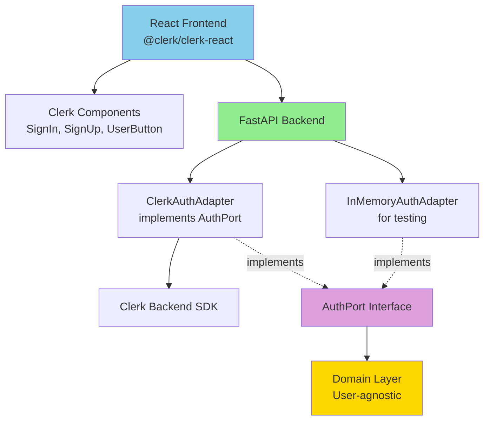

# Phase 3b: User Authentication with Clerk

**Duration**: 2-3 days
**Priority**: CRITICAL (blocks production deployment)
**Approach**: Third-party authentication (Clerk)
**Last Updated**: 2026-01-04

## Decision Summary

**Why Clerk instead of custom JWT authentication:**

User authentication is **commodity infrastructure**, not core product value. Using Clerk instead of custom JWT implementation delivers:

- ✅ **Save 3-4 weeks of development time**
  - Pre-built login/signup UI components
  - User profile pages included
  - Password reset flows handled
  - Email verification built-in
  - Social login ready (Google, GitHub, etc.)

- ✅ **Better security guarantees**
  - Managed by authentication experts
  - Automatic security updates
  - Industry-standard token handling
  - Built-in rate limiting

- ✅ **Focus on core value**
  - Our product value is trading simulation and backtesting
  - Not building authentication systems
  - Development time spent on features users care about

- ✅ **Clean Architecture preserved**
  - `AuthPort` adapter pattern wraps Clerk
  - Easy to swap implementations
  - Domain layer remains auth-agnostic

**Cost**: Free tier (10,000 MAU) covers early development. Scaling costs are acceptable for the time saved.

### Why Clerk Over Alternatives

| Factor | Clerk | Supabase | Custom JWT |
|--------|-------|----------|------------|
| React integration | ✅ Best-in-class | ⚠️ Good | ⚠️ Build yourself |
| Python SDK | ✅ Official SDK | ⚠️ Community SDK | ✅ Full control |
| Pre-built UI components | ✅ Complete | ❌ Basic only | ❌ Build everything |
| User profile pages | ✅ Included | ❌ Build yourself | ❌ Build yourself |
| Social login | ✅ Included | ✅ Included | ⏳ Later feature |
| Architecture coupling | ⚠️ Frontend dependency | ❌ DB schema lock-in | ✅ None |
| Time to implement | ✅ 2-3 days | ⚠️ 1 week | ❌ 3-4 weeks |
| Email verification | ✅ Built-in | ⚠️ Configure | ❌ Build yourself |
| Password reset | ✅ Built-in | ⚠️ Configure | ❌ Build yourself |

**Decision**: Clerk provides the best developer experience and fastest time-to-production while maintaining clean architecture principles.

## Architecture Overview

### Clean Architecture with Clerk



### Key Principle: Auth is Infrastructure, Not Domain

**Domain Layer** remains pure and auth-agnostic:
- No knowledge of Clerk, JWT, or tokens
- Works with `AuthenticatedUser` abstraction
- Time-travel and backtesting logic stays in domain

**Application Layer** uses `AuthPort` interface:
- Verifies tokens via port
- Gets user information via port
- No direct Clerk dependency

**Adapters Layer** implements `AuthPort`:
- `ClerkAuthAdapter`: Production implementation using Clerk SDK
- `InMemoryAuthAdapter`: Testing implementation with no external dependencies

## Backend Integration

### AuthPort Interface

**Specification**:

| Method | Parameters | Returns | Description | Error Cases |
|--------|-----------|---------|-------------|-------------|
| `verify_token` | `token: str` | `AuthenticatedUser` | Validates token and returns user | Invalid/expired token raises `AuthenticationError` |
| `get_user` | `user_id: str` | `AuthenticatedUser \| None` | Retrieves user by ID | Returns None if not found |

**Authenticated User Structure**:

| Property | Type | Description |
|----------|------|-------------|
| `id` | str | Unique user identifier from Clerk |
| `email` | str | User's email address |
| `full_name` | str \| None | User's display name (optional) |

### ClerkAuthAdapter Implementation

**Dependencies**:
- `clerk-backend-api` (official Python SDK)
- Environment variables: `CLERK_SECRET_KEY`

**Responsibilities**:
1. Verify Clerk session tokens from Authorization header
2. Decode and validate token signature
3. Extract user information from token claims
4. Return `AuthenticatedUser` for application layer

**Token Flow**:
```
1. Frontend: User signs in via Clerk UI
2. Frontend: Clerk provides session token
3. Frontend: Token sent in Authorization header ("Bearer <token>")
4. Backend: ClerkAuthAdapter.verify_token() validates token
5. Backend: Returns AuthenticatedUser to Use Case
6. Use Case: Filters queries by user.id
```

### InMemoryAuthAdapter Implementation

**Purpose**: Testing without Clerk dependency

**Features**:
- Pre-configured test users
- No network calls
- Deterministic behavior
- Fast test execution

**Usage in Tests**:
```
Test creates InMemoryAuthAdapter with test users
→ Use Cases receive same AuthPort interface
→ Tests run without Clerk service
→ 90%+ of tests remain infrastructure-free
```

### API Endpoint Protection

**All Portfolio Endpoints Require Authentication**:

| Endpoint | Method | Auth Required | Behavior |
|----------|--------|---------------|----------|
| `GET /api/v1/portfolios` | GET | ✅ Yes | Returns only user's portfolios |
| `POST /api/v1/portfolios` | POST | ✅ Yes | Sets owner_id to current user |
| `GET /api/v1/portfolios/{id}` | GET | ✅ Yes | Returns 404 if not owner |
| `POST /api/v1/portfolios/{id}/trades` | POST | ✅ Yes | Returns 404 if not owner |
| `GET /api/v1/market/*` | GET | ❌ No | Public market data |

**Authorization Pattern**:
- List operations: Filter by `owner_id == current_user.id`
- Single resource operations: Verify ownership, return 404 if not owner
- Create operations: Auto-set `owner_id = current_user.id`

**Why 404 instead of 403?**
- Security: Don't leak existence of other users' portfolios
- UX: Consistent "not found" message for missing/unauthorized

## Frontend Integration

### Clerk Provider Setup

**Required Package**: `@clerk/clerk-react`

**App Wrapping**:
```
App wrapped in <ClerkProvider publishableKey={...}>
→ All components have access to Clerk hooks
→ Automatic token management
→ Session persistence
```

### Pre-Built Components

**Clerk provides ready-to-use components**:

| Component | Purpose | Included Features |
|-----------|---------|-------------------|
| `<SignIn />` | Login page | Email/password, social login, "forgot password" |
| `<SignUp />` | Registration page | Email verification, password strength, social signup |
| `<UserButton />` | User menu | Profile, settings, sign out |
| `<UserProfile />` | Profile management | Edit name/email, change password, sessions |

**No custom auth UI needed** - all forms, validation, and error handling included.

### Token Management

**Automatic Token Injection**:
- Clerk SDK automatically adds Authorization header to API requests
- Tokens refresh automatically before expiry
- No manual token storage or management needed

**API Client Configuration**:
```
Frontend configures API client with Clerk session
→ All requests automatically include valid token
→ Token refresh handled transparently
→ Expired sessions redirect to login
```

### Protected Routes

**Route Protection Pattern**:

| Route | Protection | Behavior |
|-------|-----------|----------|
| `/sign-in` | Public | Shows Clerk SignIn component |
| `/sign-up` | Public | Shows Clerk SignUp component |
| `/dashboard` | Protected | Redirects to /sign-in if not authenticated |
| `/portfolio/:id` | Protected | Redirects to /sign-in if not authenticated |

**Implementation**: Clerk's `<SignedIn>` and `<SignedOut>` components handle conditional rendering.

## Database Schema Changes

### New Table: users

**Clerk manages user data**, but we store minimal user references:

| Column | Type | Description | Constraints |
|--------|------|-------------|-------------|
| `id` | VARCHAR(255) | Clerk user ID (e.g., "user_2abc123xyz") | PRIMARY KEY |
| `created_at` | TIMESTAMP | When user first accessed system | NOT NULL, DEFAULT NOW() |

**Note**: We store only Clerk's user ID for foreign key relationships. Email, name, and password are managed by Clerk.

### Updated Table: portfolios

**Add owner_id column**:

| Column | Type | Change | Description |
|--------|------|--------|-------------|
| `id` | UUID | Unchanged | Portfolio primary key |
| `name` | VARCHAR(255) | Unchanged | Portfolio name |
| `owner_id` | VARCHAR(255) | **NEW** | Foreign key to users.id (Clerk ID) |
| `created_at` | TIMESTAMP | Unchanged | Creation timestamp |

**Constraints**:
- `owner_id` references `users.id` ON DELETE CASCADE
- Index on `owner_id` for fast lookups
- `owner_id` NOT NULL (every portfolio must have an owner)

### Migration Strategy

**Existing Portfolios** (development data):

**Option A: Assign to Test User** (RECOMMENDED)
1. Create test user in Clerk (e.g., "test@papertrade.local")
2. Add test user ID to users table
3. Update all existing portfolios: `SET owner_id = '<test_user_clerk_id>'`
4. Benefit: Preserves test data for development

**Option B: Delete Existing Data**
1. Truncate portfolios table
2. Fresh start with authenticated users
3. Benefit: Clean slate, no migration complexity

**Decision**: Use Option A for development, Option B for production (no existing data).

## Security Considerations

### Token Security

**Clerk Handles**:
- Token generation and signing
- Token expiration and refresh
- Secure token storage (httpOnly cookies)
- CSRF protection
- Session management

**Our Responsibility**:
- Validate tokens on every protected endpoint
- Use HTTPS in production
- Configure CORS appropriately
- Rate limit authentication endpoints (Clerk provides this)

### Password Security

**Clerk Handles**:
- Password hashing (bcrypt/Argon2)
- Password strength requirements
- Breach detection
- Password reset flows
- Email verification

**We Don't Store Passwords**: All password management delegated to Clerk.

### Authorization Security

**Our Responsibility**:
- Verify portfolio ownership on every request
- Filter queries by authenticated user ID
- Return 404 for unauthorized access (not 403)
- Audit log all trade executions with user ID

## Testing Strategy

### Unit Tests (Domain Layer)

**No Auth Dependencies**:
- Domain logic remains pure
- Tests pass `user_id` as parameter
- No Clerk mocking needed

### Integration Tests (Use Cases)

**Use InMemoryAuthAdapter**:
- Create test users in adapter
- No Clerk service dependency
- Fast, deterministic tests

**Example Test**:
```
Test: User can only see their own portfolios
1. Create InMemoryAuthAdapter with users A and B
2. Create portfolio for user A
3. Call GetPortfolios use case with user A
   → Assert portfolio returned
4. Call GetPortfolios use case with user B
   → Assert empty list (cannot see A's portfolio)
```

### API Tests

**Mock Clerk Token Validation**:
- Use test tokens with known user IDs
- Mock ClerkAuthAdapter.verify_token()
- Test authorization logic without Clerk service

### E2E Tests

**Use Clerk Test Environment**:
- Clerk provides test environment for E2E
- Create test users programmatically
- Full authentication flow tested
- Clean up test users after tests

## Implementation Sequence

**Recommended Order** (2-3 days total):

### Day 1: Backend Foundation
1. Add `clerk-backend-api` dependency
2. Define `AuthPort` interface
3. Implement `ClerkAuthAdapter`
4. Implement `InMemoryAuthAdapter`
5. Update Use Cases to accept authenticated user
6. Add unit tests for adapters

### Day 2: Database & API
1. Create database migration (users table, portfolios.owner_id)
2. Run migration on development database
3. Update API endpoints with auth middleware
4. Update repository queries to filter by owner_id
5. Add API integration tests

### Day 3: Frontend Integration
1. Add `@clerk/clerk-react` dependency
2. Wrap app in ClerkProvider
3. Add SignIn and SignUp routes
4. Add UserButton to navigation
5. Protect dashboard and portfolio routes
6. Add E2E test for auth flow

## Success Criteria

**Backend**:
- [ ] ClerkAuthAdapter validates tokens from Clerk
- [ ] InMemoryAuthAdapter works without Clerk dependency
- [ ] All portfolio endpoints require authentication
- [ ] Portfolios filtered by owner_id
- [ ] Users table created with Clerk user IDs
- [ ] Migration assigns existing portfolios to test user

**Frontend**:
- [ ] Users can sign up with email/password
- [ ] Users can sign in with email/password
- [ ] User button shows profile/sign out
- [ ] Dashboard shows only user's portfolios
- [ ] Cannot access other users' portfolios (404)
- [ ] Token automatically included in API requests

**Testing**:
- [ ] 90%+ of tests use InMemoryAuthAdapter (no Clerk)
- [ ] API tests verify authorization logic
- [ ] E2E test covers sign up → create portfolio → sign out → sign in flow

**Documentation**:
- [ ] API docs updated with authentication requirements
- [ ] Environment variables documented (CLERK_SECRET_KEY, etc.)
- [ ] Migration guide for existing data

## Configuration

### Environment Variables

**Backend**:
```
CLERK_SECRET_KEY=sk_test_...  # From Clerk dashboard
CLERK_PUBLISHABLE_KEY=pk_test_...  # For API responses (optional)
```

**Frontend**:
```
VITE_CLERK_PUBLISHABLE_KEY=pk_test_...  # From Clerk dashboard
```

### Clerk Dashboard Setup

1. Create Clerk account and application
2. Enable email/password authentication
3. Configure email templates (optional)
4. Add redirect URLs (http://localhost:5173 for dev)
5. Copy API keys to environment variables

## Dependencies

**Requires**:
- None (independent feature)

**Blocks**:
- Production deployment (cannot deploy without auth)
- Multi-user features
- User-specific analytics (future)

**Parallel Work**:
- Can develop simultaneously with Phase 3a (SELL orders)
- Can deploy before or after SELL implementation

## Notes

**Design Decisions**:
- Clerk over custom JWT: Saves time, not core value
- Adapter pattern: Preserves Clean Architecture
- InMemory adapter: 90% of tests infrastructure-free
- 404 over 403: Security through obscurity

**What We Lose vs Custom Auth**:
- Full control over authentication logic
- Zero vendor dependency
- No recurring costs

**What We Gain**:
- 3-4 weeks of development time saved
- Professional auth UI out-of-the-box
- Better security (managed by experts)
- Automatic updates and improvements
- Focus on core product features

**Future Enhancements**:
- Social login (Google, GitHub) - Already supported by Clerk
- Two-factor authentication - Clerk supports this
- Email verification - Clerk handles this
- Password reset - Clerk provides this
- If we outgrow Clerk: Adapter pattern makes switching easier

## References

- **Clerk React Quickstart**: https://clerk.com/docs/quickstart/react
- **Clerk Backend API (Python)**: https://clerk.com/docs/reference/backend-api
- **Clerk Authentication Components**: https://clerk.com/docs/components/overview
- **Clean Architecture with Third-Party Services**: Adapter pattern isolates vendor dependencies
