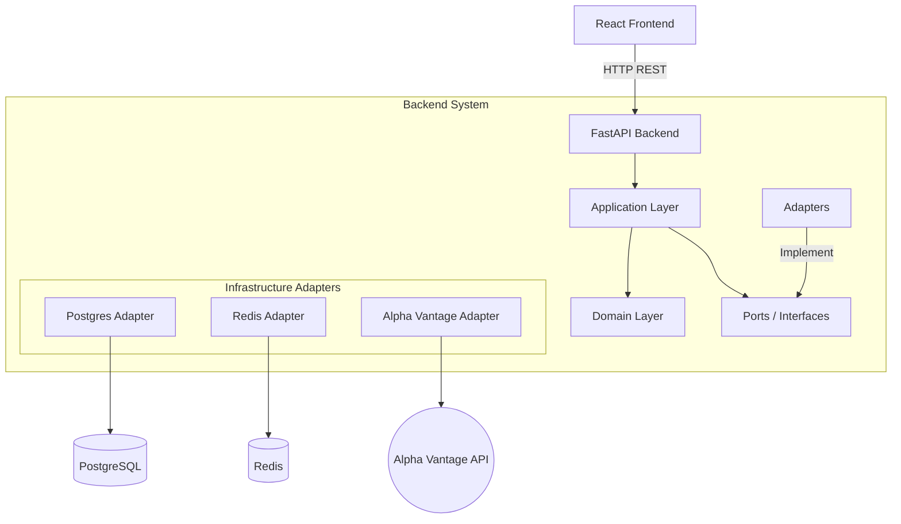

# System Architecture

Zebu follows **Clean Architecture** (Hexagonal Architecture) principles to ensure testability, maintainability, and loose coupling.

## High-Level Structure



## Architectural Layers

The backend is strictly layered. **Dependencies point inward only**.

```
┌─────────────────────────────────────────┐
│           Infrastructure                │
│  (Docker, DB Config, System)            │
├─────────────────────────────────────────┤
│              Adapters                   │
│  ┌─────────────┐    ┌─────────────┐     │
│  │   Inbound   │    │  Outbound   │     │
│  │  (FastAPI)  │    │ (Postgres,  │     │
│  │             │    │  Redis)     │     │
│  └─────────────┘    └─────────────┘     │
├─────────────────────────────────────────┤
│           Application                   │
│  (Use Cases: ExecuteTrade,              │
│   GetPortfolioValue)                    │
├─────────────────────────────────────────┤
│              Domain                     │
│  (Entities: Portfolio, Asset, Order)    │
│  (Value Objects: Money, Ticker)         │
└─────────────────────────────────────────┘
```

1.  **Domain**: Pure Python logic. No libraries, no I/O, no Frameworks.
2.  **Application**: Orchestrates use cases. Depends only on Domain. Defines Interfaces (Ports) for external tools.
3.  **Adapters**: Implements the Interfaces. Contains SQL, HTTP calls, API logic.
4.  **Infrastructure**: Configuration, Docker, Framework setup (FastAPI app).

## Documentation

- **[Technical Boundaries & Limitations](technical-boundaries.md)**: Current system constraints and known edge cases (e.g., No Limit Orders, Rate Limits).
- **[Authentication Architecture](authentication.md)**: Details on Clerk integration and JWT validation.
- **[Archived Designs](archived/)**: Historical design documents and superseded plans.

## Key Decisions

- **Framework**: FastAPI (Async Python) + SQLModel (Pydantic/SQLAlchemy).
- **Database**: PostgreSQL (primary store).
- **Caching**: Redis (market data caching).
- **State Management**: React Query (Frontend), Stateless Backend (REST).
