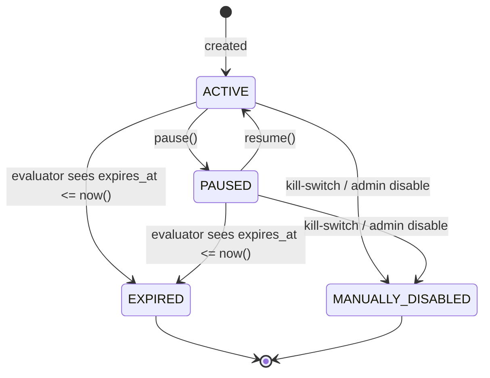
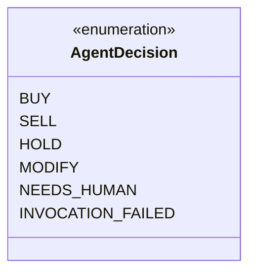
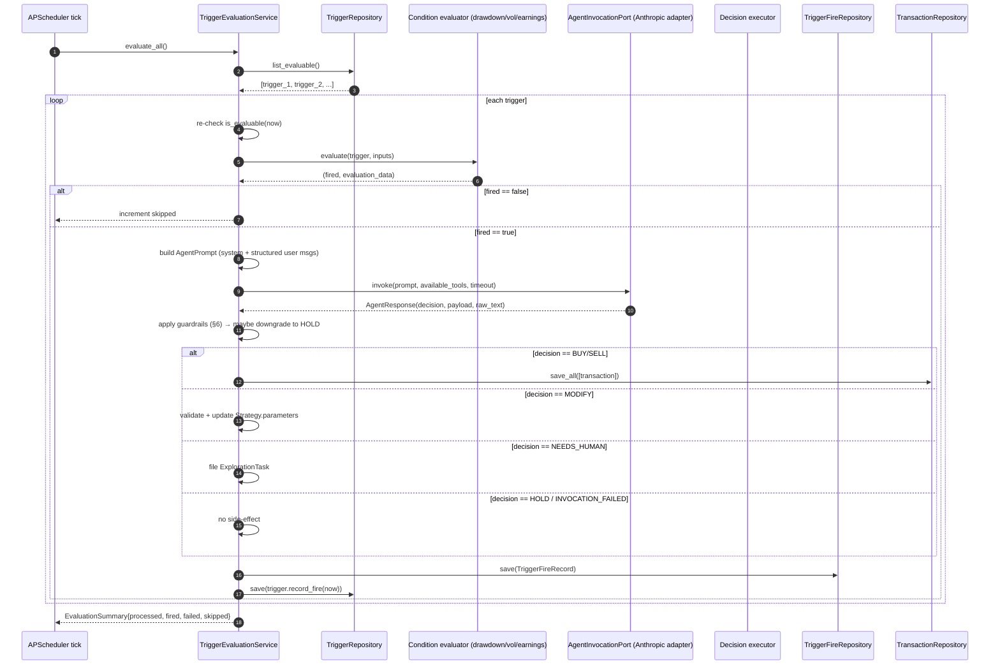
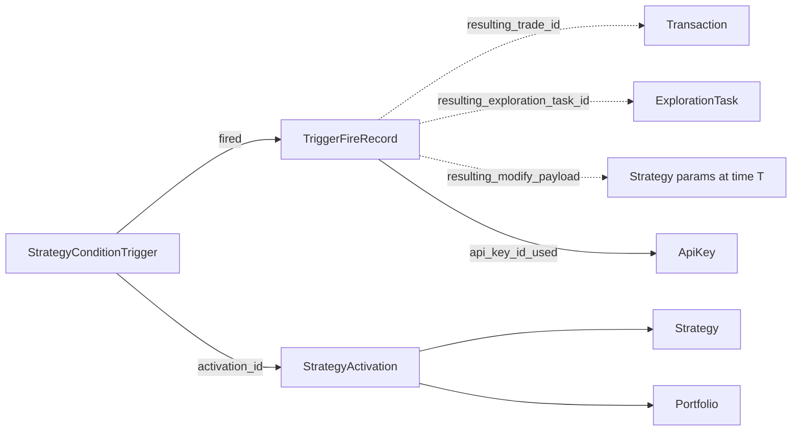

# Phase F — Agent-in-the-Loop Strategies (Design)

**Status**: Proposed (design)  
**Author**: `architect` agent (design only — implementation handed to `backend-swe`)  
**Created**: 2026-05-10  
**Forward plan**: [`docs/planning/agent-platform-proposal.md`](../planning/agent-platform-proposal.md) §3 Phase F  
**Operating manual**: [`docs/agents/operating-manual.md`](../agents/operating-manual.md) — referenced for the woken-agent guardrails (§4)

---

## TL;DR

Phase F evolves Zebu from "human triggers the agent manually" to "scheduled agent runs daily and live triggers wake an agent on conditional events." The substantive new domain concept is the `StrategyConditionTrigger` — attached to a `StrategyActivation`, evaluated each scheduler tick, and on fire it calls the Anthropic Messages API with the strategy state plus the configured `agent_prompt`. The agent returns a structured decision (`BUY`, `SELL`, `HOLD`, `MODIFY`, `NEEDS_HUMAN`) which is executed as a paper trade or escalated.

The design ships across seven landable PRs (F-1 to F-7), starts with the easiest condition type (`DRAWDOWN_THRESHOLD`), and defers `CUSTOM_RULE` to a follow-up because safe predicate evaluation is its own design problem.

---

## 1. Domain model

### 1.1 `StrategyConditionTrigger` (entity)

A trigger attaches to exactly one `StrategyActivation`. The trigger lifecycle is independent from the activation's — pausing a trigger does not deactivate the underlying activation, and an activation can carry zero or more triggers.

#### Properties

| Property | Type | Constraints |
|---|---|---|
| `id` | `UUID` | Primary key |
| `activation_id` | `UUID` | FK to `strategy_activations.id`, ON DELETE CASCADE |
| `user_id` | `UUID` | Owner; matches `activation.user_id` (validated at creation) |
| `condition_type` | `ConditionType` (enum) | One of `DRAWDOWN_THRESHOLD`, `VOLATILITY_SPIKE`, `EARNINGS_PROXIMITY`, `CUSTOM_RULE` |
| `condition_params` | `ConditionParams` (typed sum) | Discriminated union; concrete shape depends on `condition_type`. See §1.2. |
| `agent_prompt` | `str` | Free-form instruction the agent receives. 10–4000 chars. Trimmed of whitespace. |
| `cooldown_seconds` | `int` | Minimum seconds between successive fires. `>= 0`. Default 21600 (6 h). |
| `last_fired_at` | `datetime \| None` | UTC. `None` until the first fire. |
| `status` | `TriggerStatus` (enum) | `ACTIVE` / `PAUSED` / `EXPIRED` / `MANUALLY_DISABLED`. See §1.3. |
| `priority` | `int` | Tie-breaker when many triggers are eligible in the same tick. Higher first. Default 0. Range -100..100. |
| `default_api_key_id` | `UUID \| None` | FK to `api_keys.id`, ON DELETE SET NULL. The key the woken agent should act under. When `None`, the activation owner's most-recently-used `trade`-scoped key is used (see §4). |
| `expires_at` | `datetime \| None` | If set, trigger transitions to `EXPIRED` automatically when evaluator runs after this time. |
| `created_at` | `datetime` | UTC; not in future |
| `created_by` | `UUID` | User or API-key-derived UUID that created the trigger. |
| `updated_at` | `datetime` | UTC; `>= created_at` |

#### Invariants

- `cooldown_seconds >= 0`.
- `agent_prompt` non-empty and `<= 4000` characters.
- `last_fired_at`, if set, must be `>= created_at` and `<= now()`.
- `expires_at`, if set, must be `> created_at`.
- `priority` in `[-100, 100]`.
- `condition_params` must validate against the chosen `condition_type` (see §1.2 below — a `DRAWDOWN_THRESHOLD` trigger with `EarningsParams` is rejected at construction).
- When `status == EXPIRED`, `expires_at` must be non-null and `<= now()`.

#### Operations (entity-level state transitions)

| Operation | Parameters | Returns | Notes |
|---|---|---|---|
| `pause` | `at: datetime` | `StrategyConditionTrigger` | Allowed from `ACTIVE`. Sets `status=PAUSED`, `updated_at=at`. |
| `resume` | `at: datetime` | `StrategyConditionTrigger` | Allowed from `PAUSED`. Sets `status=ACTIVE`. Disallowed from `EXPIRED` / `MANUALLY_DISABLED`. |
| `disable` | `at: datetime` | `StrategyConditionTrigger` | Sets `status=MANUALLY_DISABLED`. Terminal — only kill-switch / admin can leave this state, and the entity does not expose that transition. |
| `expire` | `at: datetime` | `StrategyConditionTrigger` | Sets `status=EXPIRED`. Used by the evaluator when `expires_at` lapses. Terminal. |
| `record_fire` | `fired_at: datetime` | `StrategyConditionTrigger` | Updates `last_fired_at` and `updated_at`. Does not change `status`. |
| `is_in_cooldown` | `at: datetime` | `bool` | `True` if `last_fired_at` is set and `(at - last_fired_at) < cooldown_seconds`. |
| `is_evaluable` | `at: datetime` | `bool` | `True` if `status == ACTIVE` and not in cooldown and not past `expires_at`. |

The entity is `frozen=True`; transitions return new instances (matches the `StrategyActivation` and `ExplorationTask` style).

### 1.2 `ConditionType` and `ConditionParams` (value objects)

`ConditionType` is a string enum. `ConditionParams` is a discriminated union of typed dataclasses, one per condition type. Persistence uses a JSON column on the trigger row; the model reconstructs the typed VO from the JSON via a `params_from_dict(condition_type, params)` factory analogous to `parameters_from_dict` in `strategy_parameters.py`.

#### `DRAWDOWN_THRESHOLD` → `DrawdownParams`

| Property | Type | Constraints |
|---|---|---|
| `threshold_pct` | `Decimal` | `> 0` and `<= 100`. Drawdown percentage that fires the trigger. |
| `lookback_days` | `int` | `>= 1` and `<= 365`. Window over which drawdown is measured. |
| `metric` | `DrawdownMetric` (enum) | `PORTFOLIO_TOTAL` (default — fires on portfolio-level drawdown) or `PER_TICKER` (fires when any single ticker's drawdown crosses the threshold). |

Fires when the activation's portfolio (or any ticker, depending on `metric`) is down `>= threshold_pct` from its `lookback_days`-window peak.

#### `VOLATILITY_SPIKE` → `VolatilityParams`

| Property | Type | Constraints |
|---|---|---|
| `threshold_pct` | `Decimal` | `> 0` and `<= 100`. Annualised realised-volatility threshold. |
| `over_days` | `int` | `>= 5` and `<= 90`. Window for realised-volatility computation. |
| `tickers` | `list[Ticker] \| None` | When `None`, applies to all of the strategy's tickers; when set, restricts evaluation to the given subset (must be a subset of the strategy's tickers — validated at creation). |

Fires when the realised volatility of any covered ticker over `over_days` exceeds `threshold_pct`.

#### `EARNINGS_PROXIMITY` → `EarningsParams`

| Property | Type | Constraints |
|---|---|---|
| `days_before` | `int` | `>= 1` and `<= 14`. Trigger fires when next earnings is within this many trading days. |
| `tickers` | `list[Ticker] \| None` | Same semantics as `VolatilityParams.tickers`. |

Fires when any covered ticker's next scheduled earnings date is within `days_before` trading days of `now()`. Earnings calendar is read from a third-party MCP (per [`agent-platform-proposal.md`](../planning/agent-platform-proposal.md) §3 Phase D Wave 3 deferred decision); the evaluator port abstracts this.

#### `CUSTOM_RULE` → `CustomRuleParams`

**Deferred to a follow-up issue (do not implement in F-1 / F-4).** A free-form predicate would either need a constrained DSL (more design than fits Phase F) or unsafe Python `eval`. Recommendation: ship the three concrete types above; file a GitHub Issue when the first user wants `CUSTOM_RULE`.

If F-4 still chooses to scaffold the enum value, the entity rejects construction with `condition_type=CUSTOM_RULE` and returns a clear "not yet supported" `InvalidTriggerError`. This keeps the `ConditionType` enum forward-compatible without committing to an evaluation implementation.

### 1.3 `TriggerStatus` (value object)

State machine:



`EXPIRED` and `MANUALLY_DISABLED` are terminal. `MANUALLY_DISABLED` exists separately so the kill-switch (§4) and an operator pause leave a different audit signal — important for "why did all my triggers stop" debugging.

### 1.4 `TriggerFireRecord` (entity)

Append-only audit row written each time the evaluator fires a trigger and dispatches the agent. The activity feed in Phase G renders this table; the trigger fire log API in §7 paginates it.

#### Properties

| Property | Type | Constraints |
|---|---|---|
| `id` | `UUID` | Primary key |
| `trigger_id` | `UUID` | FK to `strategy_condition_triggers.id`, ON DELETE CASCADE |
| `activation_id` | `UUID` | FK to `strategy_activations.id`, ON DELETE CASCADE. Denormalised for fast filtering by activation. |
| `fired_at` | `datetime` | UTC. When the evaluator decided to fire. |
| `condition_evaluation_data` | `JSON` | Snapshot of the inputs that made the condition fire (e.g. for `DRAWDOWN_THRESHOLD`: peak value, current value, drawdown_pct, lookback_window_start, lookback_window_end). The schema is per-condition; see §1.5. |
| `agent_invocation_id` | `str \| None` | Identifier from the Anthropic Messages API response (e.g. message ID). `None` if the call failed before producing an ID. |
| `agent_response` | `AgentDecision` (enum) | `BUY` / `SELL` / `HOLD` / `MODIFY` / `NEEDS_HUMAN` / `INVOCATION_FAILED`. The last value records "we tried but the call errored" rather than dropping the row. |
| `agent_response_raw` | `str` | The model's free-text response (truncated to 8000 chars; full body lives in observability). |
| `resulting_trade_id` | `UUID \| None` | FK to `transactions.id`, ON DELETE SET NULL. Set when `agent_response in {BUY, SELL}` and the trade landed. |
| `resulting_modify_payload` | `JSON \| None` | When `agent_response == MODIFY`, the parameters the agent asked us to update on the strategy / activation. |
| `resulting_exploration_task_id` | `UUID \| None` | FK to `exploration_tasks.id`, ON DELETE SET NULL. Set when `agent_response == NEEDS_HUMAN`. |
| `latency_ms` | `int` | End-to-end latency from "evaluator decided to fire" to "decision executed (or rejected)". |
| `api_key_id_used` | `UUID` | FK to `api_keys.id`, ON DELETE RESTRICT (so we never lose attribution). The key the agent acted under for the resulting trade. |

#### Invariants

- `latency_ms >= 0`.
- Exactly one of `resulting_trade_id`, `resulting_modify_payload`, `resulting_exploration_task_id` is set, OR `agent_response` is `HOLD` / `INVOCATION_FAILED` (in which case all three are null). Validated on construction.
- `fired_at >= trigger.created_at` (evaluator never fires earlier than creation).

`TriggerFireRecord` is fully immutable — there is no update path. Corrections happen by writing a new row that references the original via the `agent_response_raw` text or by manual SQL fix in pathological cases (audit-trail integrity over flexibility).

### 1.5 `condition_evaluation_data` schema (per condition type)

Examples — the JSON shape stored on `TriggerFireRecord.condition_evaluation_data`:

| `condition_type` | Schema fields |
|---|---|
| `DRAWDOWN_THRESHOLD` | `peak_value` (str/Decimal), `current_value` (str/Decimal), `drawdown_pct` (str/Decimal), `lookback_window_start` (ISO date), `lookback_window_end` (ISO date), `peak_at` (ISO datetime), `metric` (`PORTFOLIO_TOTAL` / `PER_TICKER`), `ticker` (when `PER_TICKER`). |
| `VOLATILITY_SPIKE` | `realised_vol_pct` (str/Decimal), `threshold_pct` (str/Decimal), `over_days` (int), `window_start` (ISO date), `window_end` (ISO date), `ticker` (str). |
| `EARNINGS_PROXIMITY` | `ticker` (str), `next_earnings_date` (ISO date), `days_until` (int), `source` (str — which earnings calendar). |

These shapes are documented and tested but not enforced by a Pydantic schema on the column — a typed JSON spec is a reasonable enhancement once two consumers exist (the evaluator writer, the activity feed renderer).

### 1.6 `AgentDecision` value object



Wire-format mapping: when the woken agent responds, its tool call (or structured output — see §3) names the decision. Rules of the executor:

| Decision | Required payload from agent | Executor action |
|---|---|---|
| `BUY` | `ticker: str`, `quantity: Decimal \| None` (None ⇒ "default sizing — let the strategy decide"), `notes: str` | Convert to a `TradeSignal` and route through the same path the live executor uses. Validates against `daily_agent_trade_volume_cap` (§6). |
| `SELL` | `ticker: str`, `quantity: Decimal \| None`, `notes: str` | Same as BUY but reversing direction. |
| `HOLD` | `notes: str` | No-op. Still writes a `TriggerFireRecord` with `agent_response=HOLD`. |
| `MODIFY` | `parameter_overrides: dict[str, JSON]`, `notes: str` | Update the linked `Strategy.parameters` (subject to validation against the strategy type). Forbidden fields (e.g. `tickers` — that would change the asset universe) are rejected. |
| `NEEDS_HUMAN` | `summary: str`, `urgency: str` (one of `low` / `medium` / `high`) | File an `ExplorationTask` with title prefixed `[TRIGGER FIRE]` and `[NEEDS HUMAN]`, target_portfolio_id set to the activation's portfolio, prompt includes the condition snapshot + agent reasoning. |
| `INVOCATION_FAILED` | (system-generated, not from agent) | Used by executor when the Anthropic call errors; row still recorded so the activity feed shows the failed attempt. |

---

## 2. Services and ports

### 2.1 `TriggerEvaluationService` (Application service)

Lives at `backend/src/zebu/application/services/trigger_evaluation_service.py`. Mirrors the structure of `StrategyExecutionService` (sibling reference: [`backend/src/zebu/application/services/strategy_execution_service.py`](../../backend/src/zebu/application/services/strategy_execution_service.py)).

#### Public surface

| Method | Inputs | Returns | Notes |
|---|---|---|---|
| `evaluate_all` | (none) | `EvaluationSummary` (TypedDict: `processed`, `fired`, `failed`, `skipped`) | Called each scheduler tick. Loads all `is_evaluable=True` triggers via repo, processes each independently. |
| `evaluate_one` | `trigger_id: UUID` | `TriggerEvaluationResult` (TypedDict: `trigger_id`, `fired`, `record_id?`, `error?`) | Used by an admin / debug endpoint to manually evaluate a specific trigger. |

#### Per-trigger flow (private)

1. Re-read trigger from repo; abort if no longer evaluable (race with pause/disable mid-tick).
2. Resolve `activation` (port), `strategy` (port), `portfolio` (port).
3. Pull condition inputs from the appropriate port (price history for drawdown/volatility, earnings calendar for proximity).
4. Run `_evaluate_condition(trigger, inputs)` → returns `(fired: bool, evaluation_data: dict)`.
5. If `fired == False`, return `skipped`.
6. If fired, build the agent prompt (see §3.4), call `AgentInvocationPort.invoke(...)`, receive `AgentResponse`.
7. Translate `AgentResponse` to executor action (BUY/SELL/HOLD/MODIFY/NEEDS_HUMAN — see §1.6).
8. Run guardrails (§6) — daily agent-trade volume cap, portfolio caps. If a guardrail blocks the action, downgrade the response to `HOLD` and write a `TriggerFireRecord` capturing the reason in `agent_response_raw`.
9. Persist `TriggerFireRecord`, the resulting trade (if any), and call `trigger.record_fire(now)` + save.

Each iteration is wrapped in `try/except`; one fault never blocks the others. The summary returned to the scheduler logs counts.

#### Per-condition evaluator strategies

Each condition type has its own evaluator function under `application/services/trigger_evaluators/`:

| Function | Inputs | Returns |
|---|---|---|
| `evaluate_drawdown` | `trigger`, `activation`, `portfolio_state`, `price_history` | `(fired, DrawdownEvaluationData)` |
| `evaluate_volatility` | `trigger`, `activation`, `price_history` | `(fired, VolatilityEvaluationData)` |
| `evaluate_earnings` | `trigger`, `activation`, `earnings_calendar` | `(fired, EarningsEvaluationData)` |

Pure functions — no I/O, no side effects. The service composes them with the I/O it does upstream. Maps cleanly onto the condition-type discriminator: dispatch via `match` on `trigger.condition_type`.

### 2.2 `AgentInvocationPort` (port)

Lives at `backend/src/zebu/application/ports/agent_invocation_port.py`. Abstracts the Anthropic Messages API call so the application layer doesn't import the SDK and the test fixtures can swap a deterministic stub.

#### Methods

| Method | Parameters | Returns | Errors |
|---|---|---|---|
| `invoke` | `prompt: AgentPrompt`, `available_tools: list[ToolName]`, `timeout_seconds: int` | `AgentResponse` | `AgentInvocationError` on transport / model failure; `AgentResponseParseError` if the response can't be coerced into `AgentDecision`. |

#### Implementation requirements

- Adapter at `adapters/outbound/anthropic/anthropic_agent_invocation_adapter.py`.
- Reads `ANTHROPIC_API_KEY` from environment; raises at construction time if missing in production (mirrors the Clerk fail-fast pattern in [`dependencies.py`](../../backend/src/zebu/adapters/inbound/api/dependencies.py) lines 209–224).
- Model selection from env: `ZEBU_TRIGGER_AGENT_MODEL` (default to whatever is currently the production-recommended Sonnet model). Documented in `docs/architecture/phase-f-agent-in-the-loop.md` §10 open questions; the implementing PR fixes this default.
- Caller passes `available_tools` (the MCP tool subset the woken agent is allowed to use — typically `mcp__zebu__get_portfolio_state`, `mcp__zebu__get_price_history`, `mcp__zebu__get_strategy`, `mcp__zebu__list_backtests`). The adapter is responsible for translating these into the Anthropic API's tool block configuration.
- The adapter uses Anthropic's `tool_use` / structured-output mechanism so `AgentResponse` round-trips with a typed decision rather than free-text parsing — see §3.3.
- Per-call timeout enforced via the SDK's `timeout` parameter; default 60s (configurable in the trigger entity? Decision: no — per-call timeout is operational, not a per-trigger concern. One env var.).
- Bounded retries (max 2) with exponential backoff for transient errors (network, rate limit). Non-transient errors (auth, invalid input) propagate immediately.

#### Value objects used by the port

`AgentPrompt`:

| Field | Type | Notes |
|---|---|---|
| `system` | `str` | The operating-manual-derived system prompt — bounds the agent to paper-trading-only, the guardrails of [`docs/agents/operating-manual.md`](../agents/operating-manual.md) §4. |
| `user_messages` | `list[str]` | The structured context: condition snapshot, strategy + activation state, portfolio state, `agent_prompt` from the trigger. See §3.4 below for the assembly order. |

`AgentResponse`:

| Field | Type | Notes |
|---|---|---|
| `decision` | `AgentDecision` | One of the enum values. |
| `payload` | `JSON` | Decision-specific fields per §1.6. |
| `raw_text` | `str` | Full free-text body for the audit row (truncated to 8000 chars). |
| `invocation_id` | `str \| None` | Anthropic message ID. |
| `latency_ms` | `int` | Round-trip latency. |
| `tools_used` | `list[ToolName]` | What MCP tools the agent ended up calling during reasoning. Useful for activity feed. |

### 2.3 `TriggerRepository` (port)

Lives at `backend/src/zebu/application/ports/trigger_repository.py`. Mirrors `StrategyActivationRepository` shape ([source](../../backend/src/zebu/application/ports/strategy_activation_repository.py)).

| Method | Parameters | Returns | Errors |
|---|---|---|---|
| `get` | `trigger_id: UUID` | `StrategyConditionTrigger \| None` | `None` if not found |
| `list_evaluable` | (none) | `list[StrategyConditionTrigger]` | Returns triggers with `status=ACTIVE`, ordered by `(priority DESC, created_at ASC)`. The cooldown / expiry check happens in the service since it depends on `now()`. |
| `list_for_activation` | `activation_id: UUID` | `list[StrategyConditionTrigger]` | Includes terminal-status rows so the UI can show history. |
| `list_for_user` | `user_id: UUID`, `status: TriggerStatus \| None`, `limit: int \| None`, `offset: int` | `list[StrategyConditionTrigger]` | Pagination shape matches the existing exploration-task / activation endpoints. |
| `count_for_user` | `user_id: UUID`, `status: TriggerStatus \| None` | `int` | For paginated response totals. |
| `save` | `trigger: StrategyConditionTrigger` | `None` | Idempotent upsert by `id`. |
| `delete` | `trigger_id: UUID` | `None` | Soft-delete should be done via `expire`/`disable`; this is a hard delete used by tests. |
| `disable_all_for_user` | `user_id: UUID`, `at: datetime` | `int` | Bulk operation backing the kill-switch. Returns count disabled. |
| `disable_all` | `at: datetime` | `int` | Admin-only bulk. Returns count disabled. |

### 2.4 `TriggerFireRepository` (port)

Append-only repository for the audit table. No update / delete paths exposed.

| Method | Parameters | Returns | Errors |
|---|---|---|---|
| `get` | `record_id: UUID` | `TriggerFireRecord \| None` | |
| `list_for_trigger` | `trigger_id: UUID`, `limit: int \| None`, `offset: int` | `list[TriggerFireRecord]` | Newest-first. |
| `list_for_activation` | `activation_id: UUID`, `limit: int \| None`, `offset: int` | `list[TriggerFireRecord]` | Newest-first. Used by the activity feed. |
| `count_for_trigger` | `trigger_id: UUID` | `int` | |
| `count_for_activation` | `activation_id: UUID` | `int` | |
| `save` | `record: TriggerFireRecord` | `None` | Insert-only — duplicate `id` raises. |

In-memory implementations of both repositories live in `application/ports/in_memory_*` (matches existing pattern). The SQL implementations live under `adapters/outbound/database/`.

### 2.5 Existing ports the service composes

| Port | Used for |
|---|---|
| `StrategyActivationRepository` | Resolve `activation_id` → `StrategyActivation`. |
| `StrategyRepository` | Resolve `strategy_id` → `Strategy`. |
| `PortfolioRepository` | Resolve `portfolio_id` → `Portfolio`. |
| `TransactionRepository` | Reconstruct portfolio state for drawdown evaluation; persist trades from BUY/SELL decisions (mirrors `StrategyExecutionService`). |
| `MarketDataPort` | Price history for drawdown/volatility evaluation. |
| `ExplorationTaskRepository` | Used by the executor when `agent_response == NEEDS_HUMAN`. |
| `EarningsCalendarPort` (NEW, F-4) | Read upcoming earnings dates. Adapter wraps a third-party MCP or a lightweight `httpx` call to a public earnings API. Documented separately in F-4. |

---

## 3. Agent-decision flow (sequence)



### 3.1 Tick cadence

Trigger evaluation runs as a fourth APScheduler job in [`backend/src/zebu/infrastructure/scheduler.py`](../../backend/src/zebu/infrastructure/scheduler.py) (alongside `refresh_active_stocks`, `calculate_daily_snapshots`, `execute_active_strategies`). Cron schedule:

| Window | Cron | Rationale |
|---|---|---|
| US market hours (Mon–Fri 14:30–21:00 UTC) | `*/15 14-20 * * 1-5` (every 15 min) plus `30 21 * * 1-5` (close-of-day flush) | Drawdown / volatility need timely fires during market hours; 15 min is comparable to the existing 5-minute price-cache TTL but cheap enough to skip empty ticks. |
| Off-hours / weekends | `0 */6 * * *` (every 6 h) | `EARNINGS_PROXIMITY` may need to fire pre-market on a Monday before open. |

Both job IDs are configurable via `SchedulerConfig` (mirrors the existing `strategy_execution_cron` pattern). Both are wrapped in `max_instances=1` so a slow tick can't queue up.

### 3.2 Order of evaluation within a tick

Triggers are sorted by `(priority DESC, created_at ASC)`. Inside a tick, all evaluable triggers are processed sequentially — they're independent across activations (no shared mutable state mid-tick) and the evaluator is fast for the no-fire case. If empirical evaluator latency grows, parallelising by activation with `asyncio.gather` is a follow-up.

### 3.3 Tool use vs structured response

The Anthropic Messages API's tool-use (or `response_format` if available for structured output on the chosen model) is used so the agent's decision is parsed by the SDK, not extracted from prose. The adapter exposes a `record_decision` virtual tool the agent must call to terminate the conversation:

| Tool | Description (passed to model) |
|---|---|
| `record_decision` | Final-step tool. Pass the decision (`BUY` / `SELL` / `HOLD` / `MODIFY` / `NEEDS_HUMAN`) and the per-decision payload. The adapter resolves the conversation when this is called. |
| `mcp__zebu__get_portfolio_state` | (Read tool from the woken-agent toolset.) |
| `mcp__zebu__get_price_history` | (Read tool.) |
| `mcp__zebu__get_strategy` | (Read tool.) |
| `mcp__zebu__list_backtests` | (Read tool.) |

The agent reads context using the read tools, then calls `record_decision`. The adapter rejects responses that finish without `record_decision` and surfaces an `INVOCATION_FAILED` row.

The "available tool subset" deliberately omits write tools — the agent does not get to mint trades by calling `mcp__zebu__create_strategy` or `mcp__zebu__activate_strategy`. The trigger evaluator is the single point of trade execution for this flow. This is enforced by the adapter passing only the read subset; if the woken agent attempts a write, the model itself can't (the tool isn't visible). Defence-in-depth: the API key the agent is "given" only has read scope (see §4).

### 3.4 Prompt assembly

The prompt is assembled deterministically per fire so the same inputs produce the same prompt (good for replay / debugging). Order:

1. **System message** (constant per environment): "You are a Zebu trigger-fire decision agent. Paper trading only. Read [operating-manual.md §4 guardrails]. Your tools are: <list>. Terminate the conversation by calling `record_decision`."
2. **User message — context block** (structured markdown):
   - `## Trigger`
   - Trigger metadata: id, condition_type, condition_params (rendered as a small table), cooldown, last_fired_at, priority.
   - `## Condition snapshot`
   - The `condition_evaluation_data` from the evaluator (see §1.5) — what just made this fire.
   - `## Strategy + activation`
   - Strategy id, type, parameters, tickers, name. Activation id, status, frequency, last_executed_at, last_error.
   - `## Portfolio`
   - Portfolio id, name, type, current cash balance, current holdings (ticker → quantity → market value).
3. **User message — operator instruction**: the trigger's `agent_prompt` field, verbatim. This is what the human (or earlier agent) wrote when configuring the trigger; e.g. "if drawdown > 5% on NVDA, decide whether to hold based on the news context — call NEEDS_HUMAN if there's a major catalyst pending."
4. **User message — directive**: "Use the available tools to gather any additional context you need, then call `record_decision`. Be conservative: when in doubt, prefer HOLD or NEEDS_HUMAN over forced trades."

Example prompt is rendered for tests but never committed as a fixture — it would drift; the tests should assert structural properties (specific section markers present, agent_prompt verbatim somewhere in the user messages).

### 3.5 Decision execution

The decision execution layer (the part that turns an `AgentResponse` into a side effect) lives in the same service file as the evaluator, not a separate service — keeping the "what we evaluated → what we asked → what we did" all in one transactional unit-of-work.

| Decision | Side effect | Failure mode |
|---|---|---|
| `BUY` | Build a `TradeSignal` ⇒ `BacktestTransactionBuilder.apply_signal` (the same path the live executor uses; see [`strategy_execution_service.py`](../../backend/src/zebu/application/services/strategy_execution_service.py) lines 418–485) ⇒ `transaction_repo.save_all`. | Insufficient cash → `HOLD` downgrade with `notes` capturing the reason. |
| `SELL` | Same path as BUY, signal direction reversed. | Insufficient shares → `HOLD` downgrade. |
| `HOLD` | None. | n/a |
| `MODIFY` | Validate `parameter_overrides` against the strategy type's parameter VO (`BuyAndHoldParameters` / `DcaParameters` / `MaCrossoverParameters`); reject any field not in the VO; `strategy_repo.save(updated_strategy)`. The `tickers` list is NOT modifiable via this path (security boundary — the agent never gets to redirect the strategy at a different ticker universe). | Invalid override → `INVOCATION_FAILED` with the validation error in `agent_response_raw`. |
| `NEEDS_HUMAN` | File a new `ExplorationTask` with `created_by=trigger.user_id`, prompt populated from agent reasoning + condition snapshot, title prefixed `[TRIGGER FIRE]`, `target_portfolio_id=activation.portfolio_id`. | Repository error → `INVOCATION_FAILED`. |
| `INVOCATION_FAILED` | None — emitted by the adapter / executor when the call errored. | n/a |

All decisions write a `TriggerFireRecord` regardless. The `agent_response` field captures the post-guardrail decision; `agent_response_raw` captures the agent's actual response text so an investigator can see the original BUY that got downgraded to HOLD.

---

## 4. Auth and identity

### 4.1 Default API key for the woken agent

The `StrategyConditionTrigger.default_api_key_id` field links each trigger to an API key (mintable via the existing flow at [`POST /api/v1/api-keys`](../../backend/src/zebu/adapters/inbound/api/api_keys.py)). The trade attribution rule:

1. If `default_api_key_id` is set and the key is active (not revoked / expired) and has the `trade` scope, use it.
2. Else: fall back to the activation owner's most-recently-used `trade`-scoped key (`max(last_used_at)` from `api_keys` where `user_id == activation.user_id` and `revoked_at is null` and `'trade' in scopes` and not expired).
3. If neither is available, the trigger fires but the executor downgrades to `INVOCATION_FAILED` with the message "no eligible API key for trade attribution"; trigger is auto-paused so it stops re-firing.

The `TriggerFireRecord.api_key_id_used` records the key actually used, so the audit trail and the activity feed (Phase G) attribute trades to the right machine identity.

### 4.2 Agent-side API key (read-only)

The Anthropic-side agent — when it calls `mcp__zebu__*` read tools to gather context — uses a **separate, read-only** API key, distinct from the `default_api_key_id` used for trade attribution. This is the defence-in-depth barrier:

- The agent's session uses a `read`-scoped key.
- The trigger evaluator (the trusted code path) uses the `trade`-scoped key for the resulting transaction.
- Even if the agent were prompt-injected into trying to call a write tool, the key wouldn't authorise it — and the adapter doesn't expose writes anyway (§3.3).

Where does the read-scoped key come from? Two implementation options:

| Option | Pros | Cons |
|---|---|---|
| (a) Hard-coded `ZEBU_TRIGGER_AGENT_READ_KEY_ID` env var, used for every trigger fire. | Simple. One key for ops to manage. | All trigger fires share an identity in the activity feed — can't tell which trigger's agent did what. |
| (b) Per-user dedicated read key, auto-minted at first trigger configuration. | Activity feed correctly attributes "the agent your trigger woke" to your account. | Adds a key-mint step to trigger creation. |

**Recommendation: (b).** Trigger creation auto-mints a `trigger-fire-agent-{user_id}` read-scoped key (idempotent — looks up first, mints if absent). The implementation is trivial because the API-key minting flow is already there.

### 4.3 Kill switch

Two layers:

#### 4.3.1 Per-user pause

User-facing endpoint: `POST /triggers/disable-all`. Sets every trigger owned by `current_user` to `MANUALLY_DISABLED`. Responds with the count disabled. Reversible only by per-trigger explicit `resume` (and resume is rejected from `MANUALLY_DISABLED` per the state machine — only the same admin path can lift the disable status; see open question Q3 below).

#### 4.3.2 Admin-wide pause

Admin endpoint: `POST /admin/triggers/disable-all`. Same effect but across every user's triggers. Auth: `AdminUserDep` (the existing admin dependency at [`dependencies.py`](../../backend/src/zebu/adapters/inbound/api/dependencies.py) line 420). Logged at `WARNING` level with the admin user ID.

#### 4.3.3 Lift the disable

Per the open question (§10 Q3), the lift path is intentionally not yet wired — disabling a trigger is meant to be a "stop everything, then go look at this one carefully" flag. If lifting is needed, the operator deletes the disabled trigger and recreates it. Phase G can revisit if the friction is annoying.

### 4.4 Audit trail tagging

The existing actor-binding-via-structlog pattern ([`dependencies.py`](../../backend/src/zebu/adapters/inbound/api/dependencies.py) `_bind_actor_to_log_context` at line 265) extends to:

- The trigger evaluator job binds `actor_method=trigger`, `trigger_id=<id>`, `activation_id=<id>` for the duration of one fire so every log line within the fire automatically carries those fields.
- The resulting `transactions` rows do NOT need new schema columns yet — the `TriggerFireRecord.resulting_trade_id` column is the join. (The proposal's mention of "new `trigger_id` and `exploration_task_id` columns may be useful on `transactions`" is acknowledged but deferred to Phase G when the activity feed needs the join.)

If, during F-5, the activity feed query becomes painful, F-5 can add `trigger_fire_record_id` (nullable) on `transactions` as a denormalised pointer. Architect's recommendation: ship without it first; add only on observed pain.

---

## 5. Scheduler runtime model

### 5.1 In-process trigger evaluation

Trigger evaluation runs **inside the existing APScheduler process**. No separate service. Adds one more job alongside the three existing jobs in [`backend/src/zebu/infrastructure/scheduler.py`](../../backend/src/zebu/infrastructure/scheduler.py).

| Job | Cron | Already exists? |
|---|---|---|
| `refresh_active_stocks` | `0 0 * * *` | Yes |
| `calculate_daily_snapshots` | `0 0 * * *` | Yes |
| `execute_active_strategies` | `30 0 * * 1-5` | Yes |
| `evaluate_triggers_market_hours` (NEW, F-2) | `*/15 14-20 * * 1-5`, `30 21 * * 1-5` | No |
| `evaluate_triggers_off_hours` (NEW, F-2) | `0 */6 * * *` | No |

Two separate jobs (rather than one cron with complex expression) because APScheduler's cron parser doesn't compose multiple windows in one expression cleanly. Both jobs call the same `evaluate_all()`.

### 5.2 Local `/loop dynamic` (out of scope for Phase F evaluator)

The forward plan describes "local `/loop dynamic` for ad-hoc exploration: agent reads operating manual, claims tasks, runs sweeps." That is **agent behavior on Tim's laptop** — not infrastructure work. Trigger evaluation does not depend on `/loop`. F-2 wires the in-process evaluator; the local-loop pattern is documented in the operating manual update that ships with F-3 (see §9 Phase Plan).

### 5.3 Anthropic-hosted scheduled remote agent

The forward plan also mentions an Anthropic-hosted scheduled agent for daily after-market-close runs. That is a separate channel: it runs the **explorer** workflow (claim ExplorationTasks → sweep → submit findings) on an Anthropic infrastructure cron, not the trigger evaluator. Phase F does not block on it; F-2 ships only the in-process evaluator. The scheduled remote agent is an operating-manual + `/schedule` configuration concern, not a code concern.

### 5.4 What runs where

```mermaid
flowchart TB
    subgraph Zebu_VM["Zebu VM (Proxmox)"]
        APS[APScheduler in FastAPI app]
        APS --> EvalJob[evaluate_triggers]
        APS --> ExecJob[execute_active_strategies]
        EvalJob -->|HTTPS| Anthropic
        DB[(Postgres)]
        APS --> DB
    end
    Anthropic[Anthropic Messages API]
    Anthropic -.->|tool use callbacks| ZebuMCP[Zebu MCP read tools]
    ZebuMCP -->|HTTPS read-key| Zebu_VM

    subgraph Anthropic_Schedule["Anthropic /schedule (out of band — explorer)"]
        AScheduler[Daily after-close cron]
        AScheduler --> ExplorerAgent[Claude session - explorer role]
        ExplorerAgent -->|HTTPS trade-key| Zebu_VM
    end

    subgraph Tim_Laptop["Tim's laptop (out of band — ad-hoc)"]
        Loop[/loop dynamic]
        Loop --> AdhocAgent[Claude Code session]
        AdhocAgent -->|HTTPS trade-key| Zebu_VM
    end
```

The trigger evaluator (Phase F's load-bearing new code path) is the bottom-left box. The other two are existing or operationally configured channels — they don't need code in F.

---

## 6. Concurrency and safety guardrails

### 6.1 Locking and uniqueness

| Concern | Mechanism |
|---|---|
| Trigger evaluator races (two evaluator ticks overlap) | APScheduler `max_instances=1` on each trigger-evaluation job. |
| Two triggers fire on the same activation in the same tick | Allowed and expected (e.g., a drawdown trigger and an earnings trigger both fire). They are evaluated and dispatched independently — no shared mutation. The order is `(priority DESC, created_at ASC)`. |
| Trigger fire racing with the daily strategy execution job | Both the evaluator and `execute_active_strategies` save transactions. Postgres serialises writes to `transactions`. The trigger evaluator does NOT modify `StrategyActivation.last_executed_at` — that's the daily-execution job's job. No collision on `last_fired_at` (only the trigger writes that). |
| Trigger fire racing with itself across overlapping cron windows | `cooldown_seconds` enforced in-service after re-reading the trigger. Two ticks ~1ms apart for the same trigger: first sets `last_fired_at`, second's re-read sees it and skips. |
| `TriggerFireRecord` insert uniqueness | Primary key only — `id` is `uuid4()`. No business-uniqueness constraint (a trigger can legitimately fire many times). |

### 6.2 Per-API-key rate limit on `run_backtest`

Carried over from F4 of the proposal. Token-bucket keyed on `api_key_id`, mirroring the existing `RateLimiter` ([`backend/src/zebu/infrastructure/rate_limiter.py`](../../backend/src/zebu/infrastructure/rate_limiter.py)). Defaults:

| Window | Cap |
|---|---|
| Per minute | 5 |
| Per day | 100 |

Configurable per env via `BACKTEST_RATE_LIMIT_PER_MIN` / `BACKTEST_RATE_LIMIT_PER_DAY`. Bypass for Clerk Bearer auth (humans). Applied as a FastAPI dependency on the `POST /backtests/run` route.

When the limit is exceeded, return HTTP 429 with `Retry-After` (seconds until the next minute-bucket refill). The agent's operating manual already documents 50 backtests/day as a soft cap (`docs/agents/operating-manual.md` §4.2); 100/day at the platform layer is intentionally higher than the soft cap so an agent that bumps against its self-imposed limit still has headroom for one cleanup run.

### 6.3 Per-portfolio per-day agent-trade volume cap

Distinct from the operating-manual self-imposed caps — a hard platform-layer guardrail.

Mechanism: SUM of absolute `cash_change` for transactions on a portfolio where the source was a trigger fire (joined via `TriggerFireRecord.resulting_trade_id`). Cap configured per env:

| Setting | Default | Notes |
|---|---|---|
| `AGENT_TRADE_DAILY_CAP_USD` | $10,000 | Per portfolio per UTC day. |
| `AGENT_TRADE_DAILY_CAP_FRAC_PORTFOLIO` | 0.5 | Hard ceiling: agent-initiated trade volume per UTC day cannot exceed this fraction of the portfolio's start-of-day total value. |

Both checks apply (whichever is lower binds). Enforced at decision-execution time (§3.5). When a check would block a BUY/SELL, the executor downgrades to `HOLD` and the `TriggerFireRecord.agent_response_raw` captures "BUY $5000 NVDA — downgraded to HOLD by daily-cap (current $9500 already used, would exceed $10000)."

### 6.4 Audit trail consistency

Every persisted side effect (trade, modify, exploration task) carries a back-reference to the `TriggerFireRecord` that produced it. The audit chain:



A query "show every trade attributable to triggers in May 2026 for portfolio P" goes:

```
TriggerFireRecord WHERE activation.portfolio_id=P AND fired_at IN [May 1, May 31]
  JOIN Transaction ON transactions.id = TriggerFireRecord.resulting_trade_id
```

That's the activity feed in Phase G.

---

## 7. API surface

All endpoints require `CurrentUserDep` (Clerk Bearer or API-key auth). Per-route scope requirements specified.

### 7.1 New routers

Two new routers under `backend/src/zebu/adapters/inbound/api/`:

- `triggers.py` — user-facing trigger CRUD + fire log.
- `admin_triggers.py` — admin kill-switch (mounted under `/admin/triggers`).

### 7.2 Endpoints

| Method | Path | Auth | Required scope | Description |
|---|---|---|---|---|
| `POST` | `/activations/{activation_id}/triggers` | user | `trade` | Attach a new trigger to an activation. Body: `condition_type`, `condition_params`, `agent_prompt`, optional `cooldown_seconds`, `priority`, `default_api_key_id`, `expires_at`. Returns 201 with the persisted trigger. 403 if caller doesn't own the activation. 422 if `condition_params` doesn't validate against `condition_type`. |
| `GET` | `/activations/{activation_id}/triggers` | user | `read` | List all triggers for an activation. Includes terminal-status (history). 403 on non-owner. |
| `GET` | `/triggers/{trigger_id}` | user | `read` | Fetch a single trigger. 403 on non-owner. |
| `PATCH` | `/triggers/{trigger_id}` | user | `trade` | Mutable fields: `agent_prompt`, `cooldown_seconds`, `priority`, `expires_at`, `status` (only for `pause` / `resume`). Body validates same as create for those fields. Returns 200 with updated trigger. |
| `DELETE` | `/triggers/{trigger_id}` | user | `trade` | Soft-delete: sets `status=EXPIRED`. Reads still see the row in the fire-log endpoints. 204 on success. |
| `GET` | `/triggers/{trigger_id}/fires` | user | `read` | Paginated list of `TriggerFireRecord` for the trigger (newest-first). Standard pagination params (`limit`, `offset`). 403 on non-owner. |
| `GET` | `/activations/{activation_id}/fires` | user | `read` | Paginated trigger-fire records across all triggers for the activation. Used by the per-activation activity panel. |
| `POST` | `/triggers/disable-all` | user | `trade` | Per-user kill switch. Returns `{disabled_count: int}`. Idempotent. |
| `POST` | `/admin/triggers/disable-all` | admin | `admin` | Admin-wide kill switch. Returns `{disabled_count: int}`. Logged at WARN. |
| `POST` | `/triggers/{trigger_id}/evaluate` | user | `trade` | Manual trigger evaluation. Used for debugging — runs the evaluator once for this trigger as if the scheduler had ticked. Subject to all guardrails. Returns 200 with the resulting `TriggerFireRecord` (or "did not fire" when condition didn't match). Rate-limited to 10/min/user. |

OpenAPI specs for these endpoints land under `docs/architecture/api/contracts.md` in F-1 (see implementation plan).

### 7.3 Response shape — `StrategyConditionTriggerResponse`

| Field | Type |
|---|---|
| `id` | UUID |
| `activation_id` | UUID |
| `user_id` | UUID |
| `condition_type` | string enum |
| `condition_params` | JSON object (shape per `condition_type`) |
| `agent_prompt` | string |
| `cooldown_seconds` | integer |
| `last_fired_at` | ISO 8601 string \| null |
| `status` | string enum |
| `priority` | integer |
| `default_api_key_id` | UUID \| null |
| `expires_at` | ISO 8601 string \| null |
| `created_at` | ISO 8601 string |
| `created_by` | UUID |
| `updated_at` | ISO 8601 string |

### 7.4 Response shape — `TriggerFireRecordResponse`

| Field | Type |
|---|---|
| `id` | UUID |
| `trigger_id` | UUID |
| `activation_id` | UUID |
| `fired_at` | ISO 8601 string |
| `condition_evaluation_data` | JSON object |
| `agent_invocation_id` | string \| null |
| `agent_response` | string enum |
| `agent_response_raw` | string |
| `resulting_trade_id` | UUID \| null |
| `resulting_modify_payload` | JSON object \| null |
| `resulting_exploration_task_id` | UUID \| null |
| `latency_ms` | integer |
| `api_key_id_used` | UUID |

---

## 8. Frontend surfaces (Phase G — sketched, not implemented in F)

These are the UI hooks Phase G builds on top of the F backend. F-2 through F-5 do NOT add frontend code; they only ensure the data and API are present so Phase G can render against them.

| Surface | What it shows | Backed by |
|---|---|---|
| Trigger configuration form on the activation detail page | Add / edit / pause / resume / delete triggers per activation. Condition-type picker driving a dynamic param form (e.g., `DRAWDOWN_THRESHOLD` reveals `threshold_pct` + `lookback_days` fields). Mode dropdown for `agent_prompt` with a recommended-template starter. | `POST/GET/PATCH/DELETE /triggers/...` |
| Trigger fire log per activation | Paginated table of fires with columns `fired_at`, `condition_evaluation_data` summary, `agent_response`, `resulting_trade_id` (linked), `latency_ms`. | `GET /activations/{id}/fires` |
| Per-trigger fire history page | Same data, scoped to one trigger; useful for evaluating "is this trigger noisy?" | `GET /triggers/{id}/fires` |
| Dashboard stat cards | "N active triggers" (count of `status=ACTIVE`), "M fires this week" (count of `TriggerFireRecord.fired_at >= now-7d`). | Aggregation endpoints OR client-side reduction over recent activity feed. |
| Recent agent activity feed entry | Each `TriggerFireRecord` becomes one row in the H2 activity feed, with an "agent" identity column derived from `api_key_id_used.label`. | The H2 activity-feed aggregation extends to include trigger fires. |
| Kill-switch button in user settings | One-click "disable all my triggers" with a confirmation modal. | `POST /triggers/disable-all` |

These are sketched to surface dependencies — Phase G work plan (separate doc) addresses them.

---

## 9. Phased delivery plan (F-1 → F-7)

Each PR is independently landable, comes with tests, and updates the architecture doc as needed. Order is sequential but tightly coupled — F-2 needs F-1's entities, F-3 needs F-2's evaluator skeleton.

### F-1 — Domain entities + repository ports + migration

**Owner**: `backend-swe`  
**Effort**: ~1 day  
**Scope**:

- `StrategyConditionTrigger` entity, `ConditionType` + `ConditionParams` value objects, `TriggerStatus` enum, `AgentDecision` enum.
- `TriggerFireRecord` entity.
- `TriggerRepository` + `TriggerFireRepository` ports.
- In-memory implementations of both ports under `application/ports/in_memory_*`.
- SQLModel models for both tables, with FKs (activation, api_key) and indexes.
- Alembic migration `f001_add_strategy_condition_triggers.py` adding both tables.
- Domain unit tests for entity invariants + state-machine transitions.
- Repository unit tests against the in-memory adapters.

**Out of scope**: API endpoints, evaluator service, agent invocation port. Pure data plumbing.

**Acceptance**: tests green, type check clean, migration up + down idempotent.

### F-2 — Trigger evaluator service + DRAWDOWN_THRESHOLD condition

**Owner**: `backend-swe`  
**Effort**: ~1.5 days  
**Scope**:

- `TriggerEvaluationService` with `evaluate_all` and `evaluate_one`.
- `evaluate_drawdown` pure function (drawdown computation + condition check).
- Wire two new APScheduler jobs in `infrastructure/scheduler.py` (market-hours + off-hours) gated by a config flag `trigger_evaluation_enabled` (default false until F-3 lands the agent invocation).
- Stub `AgentInvocationPort` — interface only, with an in-memory adapter that always returns `AgentResponse(decision=HOLD, ...)`. This lets F-2 land without F-3 by behaving as "evaluate condition, log a fire record, take no action."
- Tests: in-memory adapter through-the-stack — set up a portfolio with crashing prices, confirm the trigger fires, the fire record is written, and the response is `HOLD`.

**Out of scope**: Anthropic adapter, real agent decisions, other condition types.

**Acceptance**: setting `trigger_evaluation_enabled=true` and dropping a `DRAWDOWN_THRESHOLD` trigger via test seed makes `TriggerFireRecord` rows appear when the condition is met.

### F-3 — `AgentInvocationPort` + Anthropic adapter

**Owner**: `backend-swe`  
**Effort**: ~2 days (new external integration)  
**Scope**:

- Anthropic adapter at `adapters/outbound/anthropic/anthropic_agent_invocation_adapter.py`.
- Tool schema for `record_decision` + the read MCP tools the agent gets.
- Adapter unit tests with the Anthropic SDK's HTTP layer mocked (e.g., `respx` or the SDK's built-in test transport).
- Integration test that runs the full trigger evaluator end-to-end with a stub adapter that mimics tool use + `record_decision`.
- Operating-manual update — new section "Triggers and the woken-agent prompt" describing the prompt structure (§3.4 of this doc) so an agent reading the manual at session start understands what context it gets and why.
- Decision execution layer (BUY/SELL/HOLD/MODIFY/NEEDS_HUMAN) wired into the evaluator.
- Dedicated read-only API key auto-mint on first trigger configuration (§4.2 option (b)).

**Out of scope**: smoke-test against real Anthropic API (that's F-7).

**Acceptance**: mocked-adapter integration test exercises every decision path; lint and types green.

### F-4 — Remaining condition types

**Owner**: `backend-swe`  
**Effort**: ~1 day  
**Scope**:

- `evaluate_volatility` pure function.
- `evaluate_earnings` pure function + `EarningsCalendarPort` + a stub adapter (returns hardcoded data initially; real third-party MCP wiring is a follow-up issue).
- Tests for both evaluators.
- API + entity validation extended for the new condition types.
- The `CUSTOM_RULE` enum value is **scaffolded but rejected at construction** — wraps the "deferred" decision in code so the enum is forward-compatible.

**Out of scope**: production-grade earnings-calendar wiring (a third-party MCP attachment per the operating manual, scoped separately).

**Acceptance**: each condition type has a green unit test + an end-to-end test using the in-memory adapter.

### F-5 — Trigger fire log + activity feed integration + audit columns

**Owner**: `backend-swe` (+ small `frontend-swe` slice for the activity feed extension if H2 is already in production by the time F-5 ships)  
**Effort**: ~1 day  
**Scope**:

- `GET /triggers/{id}/fires` and `GET /activations/{id}/fires` endpoints.
- Activity-feed aggregation endpoint (if H2 has shipped) extended to surface trigger fires alongside trades / strategy creations / etc.
- Kill-switch endpoints (`POST /triggers/disable-all`, `POST /admin/triggers/disable-all`).
- Per-trigger evaluation endpoint (`POST /triggers/{id}/evaluate`).

**Acceptance**: fires created via integration tests are queryable via the API; kill switch transitions the right rows.

### F-6 — Concurrency + rate-limit guardrails

**Owner**: `backend-swe`  
**Effort**: ~1 day  
**Scope**:

- Per-API-key rate limit on `POST /backtests/run` (token bucket; 5/min, 100/day defaults).
- Per-portfolio per-day agent-trade volume cap; integrated into decision-execution layer.
- Tests for both guardrails (positive + cap-exceeded paths).

**Acceptance**: guardrail-exceeded paths produce HOLD downgrades / 429s; metrics for cap utilisation surface in logs.

### F-7 — End-to-end smoke against real Anthropic API

**Owner**: `quality-infra` + `backend-swe`  
**Effort**: ~half a day  
**Scope**:

- Manual smoke test against a staging Zebu instance with a real Anthropic API key configured.
- Seed: one portfolio, one strategy, one activation, one `DRAWDOWN_THRESHOLD` trigger with a 0.5% threshold (so it fires reliably).
- Trigger an artificial price drop in the deterministic mock to fire the trigger.
- Verify the agent makes a decision, the `TriggerFireRecord` is written, and (if the agent decides BUY/SELL) the trade lands.
- Document the smoke procedure in `docs/deployment/proxmox-vm-deployment.md` so it's repeatable.

**Acceptance**: smoke run captured (logs + screenshot of the fire log API response); operations runbook updated.

---

## 10. Open questions for `backend-swe` to address before starting F-1

| # | Question | Default unless changed |
|---|---|---|
| Q1 | Pydantic vs dataclass for `ConditionParams`. The existing pattern (`BuyAndHoldParameters`, `DcaParameters`, `MaCrossoverParameters` in `domain/value_objects/strategy_parameters.py`) uses frozen dataclasses with a `parameters_from_dict` factory. Recommend matching that pattern: frozen dataclasses, `params_from_dict(condition_type, params)` factory. | Frozen dataclasses (match existing strategy-parameters pattern). |
| Q2 | Anthropic model selection — pin a specific Sonnet / Opus version, or read from env each call? | Read from env (`ZEBU_TRIGGER_AGENT_MODEL`) with a documented production default. The CD pipeline doc (`docs/planning/agent-platform-completed.md`) suggests env-driven config is the project's preferred posture. |
| Q3 | Should `MANUALLY_DISABLED` be liftable via API (re-enable after kill-switch) or only via "delete and recreate"? | Delete-and-recreate for v1 (simpler audit story). Revisit if friction is real. |
| Q4 | Should the trigger evaluator job run in the API process (current design) or as a separate worker? | API process (matches existing `execute_active_strategies`). Move to separate process if APScheduler can't keep up — defer until measured. |
| Q5 | `EarningsCalendarPort` — read from a third-party MCP (Brave / Tavily) or from a public API directly? Both are doable. | Stub with a port + simple adapter for F-4; real source attached as a third-party MCP (operating-manual decision per `agent-platform-proposal.md` §3 Phase D Wave 3 deferred). The port abstracts whichever wins. |
| Q6 | Drawdown evaluator — use existing snapshot rows (`portfolio_snapshots`) for portfolio-level, or always recompute from the transaction ledger? | Recompute from ledger. Snapshots are end-of-day; drawdown evaluation needs intraday-fresh state. The `PortfolioCalculator` path the live executor uses is the reference. |
| Q7 | Per-portfolio daily cap — should it apply to MODIFY decisions (which can change `invest_fraction` and indirectly grow positions)? | No, only BUY/SELL — MODIFY is rate-limited via cooldowns (the trigger that fires it can't fire again for `cooldown_seconds`). Document this clearly so an agent doesn't try to evade the cap by chained MODIFY. |
| Q8 | Should `TriggerFireRecord.condition_evaluation_data` have a versioned schema (e.g., `{"v": 1, "drawdown": {...}}`)? | Add a top-level `schema_version` int (default 1) on every fire's evaluation data. Cheap, future-proofs schema evolution. |
| Q9 | If both `default_api_key_id` AND fallback key strategies fail (no eligible trade-scoped key), should the trigger pause itself (current design) or escalate via NEEDS_HUMAN? | Pause (current design). Escalation would also need an API key for the ExplorationTask write path. Pausing is the conservative move — surfaces in the dashboard "trigger paused: no eligible API key" as an actionable signal. |
| Q10 | Should we expose a "test fire" endpoint that returns the prompt that *would* be built (without invoking Anthropic) so users can preview their `agent_prompt` rendering? | Defer. The `POST /triggers/{id}/evaluate` endpoint (F-5) actually fires a real evaluation; preview-only would be a small follow-up if users ask. |

`backend-swe`: comment back on the PR with positions on each Q before opening F-1's draft. Q1 / Q2 / Q5 / Q6 are likely friction-free; Q3 / Q9 / Q10 deserve a sanity check from Tim.

---

## 11. References

- Forward plan: [`docs/planning/agent-platform-proposal.md`](../planning/agent-platform-proposal.md) §3 Phase F
- What shipped (Phase C strategy execution + API-key auth): [`docs/planning/agent-platform-completed.md`](../planning/agent-platform-completed.md)
- Operating manual guardrails: [`docs/agents/operating-manual.md`](../agents/operating-manual.md) §4
- Clean Architecture rules: [`docs/architecture/principles.md`](principles.md)
- Live executor (the structural sibling): [`backend/src/zebu/application/services/strategy_execution_service.py`](../../backend/src/zebu/application/services/strategy_execution_service.py)
- Existing scheduler: [`backend/src/zebu/infrastructure/scheduler.py`](../../backend/src/zebu/infrastructure/scheduler.py)
- `StrategyActivation` (the entity a trigger attaches to): [`backend/src/zebu/domain/entities/strategy_activation.py`](../../backend/src/zebu/domain/entities/strategy_activation.py)
- `ExplorationTask` (the queue NEEDS_HUMAN escalations file into): [`backend/src/zebu/domain/entities/exploration_task.py`](../../backend/src/zebu/domain/entities/exploration_task.py)
- API-key scope value object: [`backend/src/zebu/domain/value_objects/api_key_scope.py`](../../backend/src/zebu/domain/value_objects/api_key_scope.py)
- Existing rate limiter to model the new `run_backtest` limit on: [`backend/src/zebu/infrastructure/rate_limiter.py`](../../backend/src/zebu/infrastructure/rate_limiter.py)
- Auth + actor binding: [`backend/src/zebu/adapters/inbound/api/dependencies.py`](../../backend/src/zebu/adapters/inbound/api/dependencies.py) (lines 265–292 for the structlog actor binding pattern Phase F extends)
