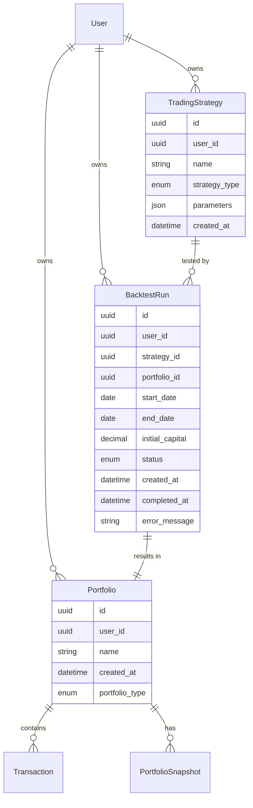
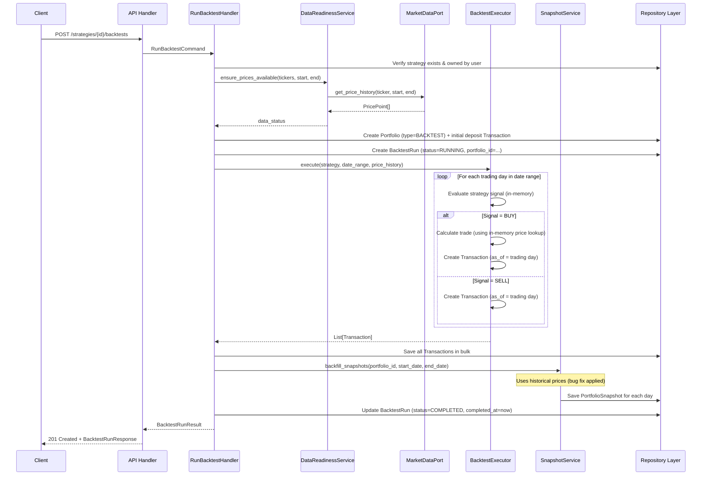

# Phase 4 Architecture: Automated Trading Strategies & Backtesting

**Status**: Proposed  
**Date**: 2026-03-08  
**Author**: Architect Agent  

---

## Overview

Phase 4 adds the ability for users to define trading strategies and backtest them against historical market data. A user specifies a strategy (e.g., "buy AAPL on the first of every month with $500"), a date range, and initial capital. The system rapidly generates all the trades that strategy would have produced and surfaces the results through the existing analytics UI.

### Core Constraints

- Preserve Clean Architecture (dependency rule, pure domain)
- Do not break existing paper-trading functionality
- Reuse existing Portfolio/Transaction/Snapshot/Analytics infrastructure wherever it reduces duplication

---

## 1. Domain Model

### 1.1 New Entities

#### `StrategyType` (Enumeration)

Defines the supported strategy templates for v1.

| Value | Description |
|-------|-------------|
| `BUY_AND_HOLD` | Purchase a position on the first trading day, hold until backtest ends |
| `DOLLAR_COST_AVERAGE` | Purchase a fixed dollar amount at regular intervals |
| `MOVING_AVERAGE_CROSSOVER` | Buy when the short-period MA rises above the long-period MA; sell when it falls below |

#### `TradingStrategy` (Entity — Aggregate Root)

Represents a reusable strategy template owned by a user.

| Property | Type | Constraints | Description |
|----------|------|-------------|-------------|
| `id` | `UUID` | Auto-generated | Unique identifier |
| `user_id` | `UUID` | Required | Owning user |
| `name` | `str` | 1–100 chars, non-empty | Human-readable label |
| `strategy_type` | `StrategyType` | Required | Which template to apply |
| `parameters` | `StrategyParameters` | See below | Type-specific configuration |
| `created_at` | `datetime` | UTC, not future | Creation timestamp |

**Invariants:**
- `name` must be 1–100 non-whitespace characters
- `created_at` must not be in the future
- `parameters` must be valid for the given `strategy_type`

#### `StrategyParameters` (Value Object — sealed hierarchy)

One concrete type per `StrategyType`. All are frozen/immutable.

**`BuyAndHoldParameters`**

| Field | Type | Constraints |
|-------|------|-------------|
| `ticker` | `Ticker` | Valid 1–5-char symbol |
| `allocation_percent` | `Decimal` | 1–100, max 2 decimal places |

**`DollarCostAverageParameters`**

| Field | Type | Constraints |
|-------|------|-------------|
| `ticker` | `Ticker` | Valid 1–5-char symbol |
| `investment_amount` | `Money` | Positive, max 2 decimal places |
| `frequency_days` | `int` | 1–365 |

**`MovingAverageCrossoverParameters`**

| Field | Type | Constraints |
|-------|------|-------------|
| `ticker` | `Ticker` | Valid 1–5-char symbol |
| `short_window` | `int` | 2–50 |
| `long_window` | `int` | `short_window + 1` to 200 |
| `allocation_percent` | `Decimal` | 1–100, max 2 decimal places |

---

#### `BacktestStatus` (Enumeration)

| Value | Description |
|-------|-------------|
| `PENDING` | Created, not yet started |
| `RUNNING` | Execution in progress |
| `COMPLETED` | Successfully finished |
| `FAILED` | Terminated with error |

#### `BacktestRun` (Entity — Aggregate Root)

Records a single execution of a strategy over a historical date range.

| Property | Type | Constraints | Description |
|----------|------|-------------|-------------|
| `id` | `UUID` | Auto-generated | Unique identifier |
| `user_id` | `UUID` | Required | Owning user |
| `strategy_id` | `UUID` | Required, FK to `TradingStrategy` | Strategy being tested |
| `portfolio_id` | `UUID` | Required, FK to `Portfolio` | Backtest portfolio holding results |
| `start_date` | `date` | Required, ≥ 2000-01-01 | Historical range start |
| `end_date` | `date` | Required, > `start_date`, ≤ yesterday | Historical range end |
| `initial_capital` | `Money` | Positive | Starting cash |
| `status` | `BacktestStatus` | Required | Execution state |
| `created_at` | `datetime` | UTC, not future | Creation timestamp |
| `completed_at` | `datetime | None` | UTC | Set when status transitions to COMPLETED or FAILED |
| `error_message` | `str | None` | Max 500 chars | Set on FAILED |

**Invariants:**
- `end_date > start_date`
- `end_date ≤ yesterday` (cannot backtest into the future)
- `completed_at` is set if and only if status is `COMPLETED` or `FAILED`
- `error_message` is set if and only if status is `FAILED`

---

### 1.2 Extended Existing Entity

#### `PortfolioType` (New Enumeration — added to Portfolio)

| Value | Description |
|-------|-------------|
| `PAPER_TRADING` | Default; user-driven live paper trades |
| `BACKTEST` | System-generated; owned by a `BacktestRun` |

The `Portfolio` entity gains one new field:

| New Field | Type | Default | Description |
|-----------|------|---------|-------------|
| `portfolio_type` | `PortfolioType` | `PAPER_TRADING` | Distinguishes backtest portfolios from regular ones |

**Backward compatibility:** The new field defaults to `PAPER_TRADING`. Existing behaviour is entirely unchanged. All existing validation and invariants remain. The `list_portfolios` query for a user excludes `BACKTEST` portfolios by default (opt-in via query parameter).

---

### 1.3 Entity Relationship Diagram



---

## 2. Execution Flow

### 2.1 Design Decision: Synchronous Execution with Pre-fetched Prices

Backtesting is designed for fast, in-memory execution after a one-time price pre-fetch:

1. Fetch complete price history for all strategy tickers (one `get_price_history()` call per ticker — returns up to 20 years of daily data, cached permanently in PostgreSQL after the first call)
2. Execute the strategy loop entirely in memory
3. Persist the resulting portfolio, transactions, and snapshots in a single DB write phase

For a typical backtest (1–2 tickers, 1 year), total wall-clock time is under 500 ms including DB writes. Asynchronous/queued execution is not needed in v1 and can be added if large-scale backtests are introduced later.

### 2.2 Data Readiness

Before executing, the system checks whether price data for all required tickers is available in the price cache (PostgreSQL). If data is missing, it is fetched transparently. Since Alpha Vantage returns full historical data per call (≈20 years), one API call per unseen ticker is sufficient. At 5 calls/minute on the free tier, a strategy with up to 5 new tickers is warmed in under 60 seconds.

The API response includes a `data_status` field indicating whether any price data was freshly fetched:

| `data_status` | Meaning |
|---------------|---------|
| `READY` | All price data was already in the database |
| `FETCHED` | Some prices were fetched during this request |

### 2.3 Sequence Diagram: Run Backtest



### 2.4 Strategy Evaluation Logic (Domain Layer)

Each strategy type is implemented as a pure function in the domain layer:

| Method | Input | Output |
|--------|-------|--------|
| `evaluate_day` | `day: date`, `price_history: dict[date, Money]`, `holdings: list[Holding]`, `cash_balance: Money`, `params: StrategyParameters` | `TradeSignal | None` |

`TradeSignal` is a value object:

| Field | Type | Description |
|-------|------|-------------|
| `action` | `Literal["BUY", "SELL"]` | Trade direction |
| `ticker` | `Ticker` | Which symbol to trade |
| `quantity` | `Quantity` | Number of shares |
| `price_per_share` | `Money` | Historical price at this day |

The executor collects signals, converts them to `Transaction` objects (using existing transaction validation), and tracks running state (holdings, cash balance) via `PortfolioCalculator` static methods — no modifications to the calculator are required.

---

## 3. API Design

### 3.1 Strategy Management

#### `POST /api/v1/strategies`

Create a new trading strategy.

**Request:**

| Field | Type | Required | Description |
|-------|------|----------|-------------|
| `name` | `string` | Yes | Human-readable label (1–100 chars) |
| `strategy_type` | `string` | Yes | One of: `BUY_AND_HOLD`, `DOLLAR_COST_AVERAGE`, `MOVING_AVERAGE_CROSSOVER` |
| `parameters` | `object` | Yes | Type-specific parameters (see Section 1.1) |

**Response `201 Created`:**

| Field | Type | Description |
|-------|------|-------------|
| `strategy_id` | `UUID` | Created strategy identifier |

---

#### `GET /api/v1/strategies`

List all strategies for the authenticated user.

**Response `200 OK`:**  
Array of `StrategyResponse` objects.

**`StrategyResponse`:**

| Field | Type |
|-------|------|
| `id` | `UUID` |
| `name` | `string` |
| `strategy_type` | `string` |
| `parameters` | `object` |
| `created_at` | `datetime` |
| `backtest_count` | `int` |

---

#### `GET /api/v1/strategies/{strategy_id}`

Get a single strategy with its backtest history.

**Response `200 OK`:** `StrategyResponse` (same as above) with embedded `backtests: BacktestSummary[]`.

---

#### `DELETE /api/v1/strategies/{strategy_id}`

Delete a strategy and all associated backtest runs (and their portfolios).

**Response `204 No Content`**

---

### 3.2 Backtest Execution

#### `POST /api/v1/strategies/{strategy_id}/backtests`

Run a backtest for the given strategy.

**Request:**

| Field | Type | Required | Description |
|-------|------|----------|-------------|
| `start_date` | `date` | Yes | Historical range start (format: `YYYY-MM-DD`) |
| `end_date` | `date` | Yes | Historical range end (must be yesterday or earlier) |
| `initial_capital` | `number` | Yes | Starting cash in USD (positive) |
| `name` | `string` | No | Override display name for this run (default: `"{strategy_name} {start_date}–{end_date}"`) |

**Response `201 Created`:**

| Field | Type | Description |
|-------|------|-------------|
| `backtest_id` | `UUID` | Created backtest run identifier |
| `portfolio_id` | `UUID` | Linked backtest portfolio (use existing analytics endpoints) |
| `status` | `string` | Always `COMPLETED` in v1 (synchronous) |
| `data_status` | `string` | `READY` or `FETCHED` |
| `trades_executed` | `int` | Number of transactions created |
| `snapshots_generated` | `int` | Number of daily snapshots created |

**Error responses:**

| Status | Condition |
|--------|-----------|
| `400` | Invalid date range, end_date in future, insufficient price data range |
| `404` | Strategy not found or not owned by user |
| `409` | Price data cannot be fetched (API rate limited) |

---

#### `GET /api/v1/strategies/{strategy_id}/backtests`

List all backtest runs for a strategy.

**Response `200 OK`:**

Array of `BacktestSummary` objects:

| Field | Type |
|-------|------|
| `id` | `UUID` |
| `portfolio_id` | `UUID` |
| `start_date` | `date` |
| `end_date` | `date` |
| `initial_capital` | `number` |
| `status` | `string` |
| `created_at` | `datetime` |
| `completed_at` | `datetime \| null` |

---

#### `GET /api/v1/backtests/{backtest_id}`

Get full details of a single backtest run.

**Response `200 OK`:** `BacktestDetail` — same as `BacktestSummary` plus:

| Additional Field | Type | Description |
|---------|------|-------------|
| `trades_executed` | `int` | Number of transactions |
| `error_message` | `string \| null` | Present if status is `FAILED` |

---

#### `DELETE /api/v1/backtests/{backtest_id}`

Delete a backtest run and its associated portfolio (including all transactions and snapshots).

**Response `204 No Content`**

---

### 3.3 Analytics Reuse

Backtest portfolios are regular `Portfolio` records with `portfolio_type = BACKTEST`. All existing analytics endpoints work unchanged:

| Existing Endpoint | Works for Backtest? | Notes |
|-------------------|---------------------|-------|
| `GET /portfolios/{id}/performance` | ✅ Yes | Shows the full backtest date range |
| `GET /portfolios/{id}/composition` | ✅ Yes | Final-day composition |
| `GET /portfolios/{id}/transactions` | ✅ Yes | All generated trades visible |
| `GET /portfolios/{id}/holdings` | ✅ Yes | Current (end-date) holdings |
| `GET /portfolios/{id}/balance` | ✅ Yes | Final portfolio value |

The `GET /portfolios` list endpoint gains an optional query parameter:

| Parameter | Type | Default | Description |
|-----------|------|---------|-------------|
| `include_backtests` | `boolean` | `false` | Include backtest portfolios in listing |

---

## 4. Data Model

### 4.1 New Tables

#### `trading_strategies`

| Column | Type | Constraints | Description |
|--------|------|-------------|-------------|
| `id` | `UUID` | PK | |
| `user_id` | `UUID` | NOT NULL, indexed | Owner |
| `name` | `VARCHAR(100)` | NOT NULL | Display label |
| `strategy_type` | `VARCHAR(50)` | NOT NULL | Enum value |
| `parameters` | `JSONB` | NOT NULL | Strategy-specific config |
| `created_at` | `TIMESTAMPTZ` | NOT NULL | |

**Indexes:** `(user_id)` for listing by user.

---

#### `backtest_runs`

| Column | Type | Constraints | Description |
|--------|------|-------------|-------------|
| `id` | `UUID` | PK | |
| `user_id` | `UUID` | NOT NULL, indexed | Owner |
| `strategy_id` | `UUID` | NOT NULL, FK → `trading_strategies.id` | |
| `portfolio_id` | `UUID` | NOT NULL, UNIQUE, FK → `portfolios.id` | 1-to-1 with portfolio |
| `start_date` | `DATE` | NOT NULL | Historical backtest period start |
| `end_date` | `DATE` | NOT NULL | Historical backtest period end |
| `initial_capital` | `NUMERIC(15,2)` | NOT NULL | USD amount |
| `status` | `VARCHAR(20)` | NOT NULL | `PENDING|RUNNING|COMPLETED|FAILED` |
| `created_at` | `TIMESTAMPTZ` | NOT NULL | |
| `completed_at` | `TIMESTAMPTZ` | NULL | |
| `error_message` | `VARCHAR(500)` | NULL | |

**Indexes:** `(user_id)`, `(strategy_id)` for listing.

**Cascade delete:** Deleting a `BacktestRun` must also delete the linked `Portfolio` (and its transactions and snapshots via existing cascades).

---

### 4.2 Modified Tables

#### `portfolios` — New Column

| Column | Type | Default | Description |
|--------|------|---------|-------------|
| `portfolio_type` | `VARCHAR(20)` | `'PAPER_TRADING'` | `PAPER_TRADING` or `BACKTEST` |

**Migration strategy:** `ALTER TABLE portfolios ADD COLUMN portfolio_type VARCHAR(20) NOT NULL DEFAULT 'PAPER_TRADING'`. No backfill needed; all existing rows correctly default to `PAPER_TRADING`.

---

### 4.3 Alembic Migrations

Three migration files are needed (each atomic and independently reversible):

1. **`add_portfolio_type_column`** — Adds `portfolio_type` to `portfolios` with default
2. **`add_trading_strategies_table`** — Creates `trading_strategies`
3. **`add_backtest_runs_table`** — Creates `backtest_runs` (depends on migration 1 and 2)

---

## 5. Performance Analysis

### 5.1 Expected Scale

| Scenario | Trading Days | Tickers | API Calls | Execution Time |
|----------|-------------|---------|-----------|----------------|
| 3-month BuyAndHold (1 ticker) | ~65 | 1 | 0–1 | < 200 ms |
| 1-year DCA (1 ticker) | ~252 | 1 | 0–1 | < 500 ms |
| 1-year MA Crossover (1 ticker) | ~252 | 1 | 0–1 | < 500 ms |
| 5-year BuyAndHold (5 tickers) | ~1,260 | 5 | 0–5 | < 2 s |

"API calls" = calls to Alpha Vantage; 0 if data is already in the PostgreSQL price cache.

### 5.2 Optimization Approach

**Pre-fetch in bulk:** Call `get_price_history(ticker, start, end, interval="1day")` once per ticker before the execution loop starts. Store results in an in-memory dictionary keyed by `(ticker, date)` for O(1) lookups during strategy evaluation.

**Bulk DB writes:** Collect all generated `Transaction` objects during the execution loop, then insert them in a single batch operation. Do not insert one-by-one.

**Snapshot backfill:** Reuse the existing `backfill_snapshots()` service. However, the known bug (uses current prices instead of historical prices) **must be fixed before v1 ships**. See Section 6.2 for the fix specification.

**No async execution in v1:** With the above approach, even large backtests (5 years, 5 tickers) complete in under 2 seconds. Async job queuing adds significant complexity without benefit at this scale. Add it in v2 if user demand requires longer backtests.

### 5.3 Rate Limit Considerations

Alpha Vantage free tier: 5 calls/minute, 500 calls/day. Each call returns up to 20 years of daily data, cached permanently in PostgreSQL.

**Worst case:** A user backtests a strategy with 5 previously-unseen tickers. This requires 5 API calls — within the 5/min limit. The data is then cached permanently, so all future backtests using those tickers require zero API calls.

**No rate-limit queuing needed in v1.** If rate limits are hit (e.g., 5 new tickers in rapid succession from multiple users), the existing `MarketDataUnavailableError` handling returns a `409 Conflict` to the client with an appropriate message.

---

## 6. Implementation Plan

### 6.1 Phase 4a — Foundation & Bug Fix (Prerequisite)

These changes are required before any backtesting logic ships.

| # | Task | Layer | Notes |
|---|------|-------|-------|
| 1 | Fix `backfill_snapshots()` to use historical prices | Application service | Critical bug fix — without this, backtest snapshots show wrong values |
| 2 | Add `portfolio_type` field to `Portfolio` entity | Domain entity | Default `PAPER_TRADING`, backward-compatible |
| 3 | Create Alembic migration for `portfolio_type` column | Infrastructure | |
| 4 | Update `list_portfolios` query to filter out `BACKTEST` portfolios by default | Application query | |

### 6.2 Fix Specification: `backfill_snapshots()` Historical Prices

The existing `_calculate_snapshot_for_portfolio()` method calls `get_current_price()` for each holding. For backfilling, it must call `get_price_at(ticker, snapshot_datetime)` instead — this method already exists on `MarketDataPort` and is designed exactly for this use case (returns the closest available price within a ±1 hour window). The `snapshot_date` is already available in the method; it must be converted to a UTC `datetime` (end-of-day: `snapshot_date` at 23:59:59 UTC, or market close equivalent) before passing to `get_price_at`.

This fix benefits both the existing paper-trading backfill (minor improvement) and is essential for backtest snapshots.

---

### 6.3 Phase 4b — Core Backtesting

| # | Task | Layer | Notes |
|---|------|-------|-------|
| 5 | Define `TradingStrategy` entity + `StrategyParameters` value objects | Domain | Three strategy types: BUY_AND_HOLD, DCA, MA_CROSSOVER |
| 6 | Define `BacktestRun` entity | Domain | |
| 7 | Implement `StrategyEvaluator` (pure domain service) | Domain | Pure function; evaluates one strategy per day against in-memory price data |
| 8 | Implement `DataReadinessService` | Application service | Ensures price data is available; calls `get_price_history()` if needed |
| 9 | Implement `BacktestExecutor` | Application service | Orchestrates the execution loop, collects transactions |
| 10 | Implement `RunBacktestHandler` (command handler) | Application command | Top-level orchestrator; creates portfolio, runs executor, triggers snapshot backfill |
| 11 | Add `StrategyRepository` port + SQLModel adapter | Application/Infrastructure | CRUD for `trading_strategies` table |
| 12 | Add `BacktestRunRepository` port + SQLModel adapter | Application/Infrastructure | CRUD for `backtest_runs` table |
| 13 | Create Alembic migrations for new tables | Infrastructure | |
| 14 | Add in-memory repository implementations | Adapters | For testing |
| 15 | Add API endpoints (strategies + backtests) | Adapters/Inbound | See Section 3 |
| 16 | Wire DI for new dependencies | Adapters/Inbound | Update `dependencies.py` |

---

### 6.4 Phase 4c — Enhancements (Post-MVP)

| # | Task | Notes |
|---|------|-------|
| 17 | Multi-ticker portfolio strategies | Allows allocation across multiple tickers |
| 18 | Strategy comparison view | Backend aggregate query: compare multiple `BacktestRun`s side-by-side |
| 19 | Async execution with status polling | Add `GET /backtests/{id}/status` endpoint; useful for multi-year, multi-ticker backtests |
| 20 | Benchmark comparison | Compare backtest against S&P 500 or a simple buy-and-hold baseline |

---

## 7. Key Trade-offs and Decisions

### 7.1 Backtest Results as Portfolio Records

**Decision:** Backtest results are stored as a regular `Portfolio` (with `portfolio_type = BACKTEST`), linked to a `BacktestRun` record.

**Rationale:**
- All existing analytics endpoints (`/performance`, `/composition`, `/transactions`, `/holdings`) work with zero changes
- `PortfolioCalculator` and `SnapshotCalculator` are already pure/reusable — no duplication
- The existing transaction ledger model is exactly what a backtest produces: a sequence of BUY/SELL/DEPOSIT records
- Backtest portfolios are filtered from regular portfolio listings by default, so users do not see noise in their dashboard

**Alternative considered:** Separate `BacktestResult` tables with their own analytics queries. Rejected because it duplicates the entire analytics layer.

---

### 7.2 Reusing `as_of` in Existing Trade Handlers

**Decision:** The `BacktestExecutor` does **not** invoke `BuyStockHandler`/`SellStockHandler` from the application commands layer. Instead, it constructs `Transaction` objects directly in the domain and saves them in bulk.

**Rationale:**
- The existing handlers call `get_current_price()` or `get_price_at()` via the market data port — this is unnecessary overhead when price data is already pre-fetched into an in-memory dict
- Handlers perform DB reads for each transaction (fetch portfolio, recalculate cash balance, recalculate holdings) — this is O(n²) for n trades; the executor maintains running state in memory for O(n) behavior
- The domain-level `Transaction` entity already enforces all business rules in `__post_init__`; handler-level validation (sufficient funds, sufficient shares) is replicated in the executor's in-memory state tracking

The existing `as_of` mechanism in the API `/trades` endpoint remains fully functional and unmodified.

---

### 7.3 V1 Strategy Types: Three Templates vs. Custom DSL

**Decision:** V1 ships with three fixed templates (BUY_AND_HOLD, DCA, MA_CROSSOVER). No custom rule DSL.

**Rationale:**
- A rule DSL (e.g., JSON-based or Python eval) adds significant surface area for security vulnerabilities and parsing complexity
- Three templates cover the most common introductory strategies for a paper-trading learner
- The `parameters` field uses `JSONB` in the DB, making it straightforward to add new strategy types or extend parameters without schema changes

**Future extension:** New strategy types are added by defining a new `StrategyParameters` subtype and a corresponding `StrategyEvaluator` branch. No schema migration is needed (only new enum values).

---

### 7.4 Synchronous vs. Asynchronous Execution

**Decision:** V1 executes backtests synchronously within the API request.

**Rationale:**
- With pre-fetched price data in memory, even a 5-year, 5-ticker backtest completes in under 2 seconds (see Section 5.1)
- Async execution requires a job queue (Redis/Celery/APScheduler), status polling endpoint, and client-side polling logic — significant added complexity
- Synchronous execution is simpler to test and reason about

**Trigger for reconsideration:** If users want multi-decade backtests across 20+ tickers, async execution should be added. At that point, the `BacktestStatus` state machine is already in place; only the transport mechanism changes.

---

### 7.5 Bug Fix: `backfill_snapshots()` Must Use Historical Prices

**This is a prerequisite for Phase 4b, not optional.** The existing `_calculate_snapshot_for_portfolio()` uses `get_current_price()` for all holdings when backfilling. For backtest portfolios, this would produce snapshots with today's prices rather than the prices at the time of the snapshot — making the performance chart meaningless.

The fix is a targeted change: add a `snapshot_datetime` parameter to the internal snapshot calculation method, and call `get_price_at(ticker, snapshot_datetime)` instead of `get_current_price(ticker)` when a date is provided.

---

## 8. Architecture Diagram

```mermaid
graph TD
    subgraph "Domain Layer (Pure)"
        TS[TradingStrategy]
        SP[StrategyParameters]
        BR[BacktestRun]
        SE[StrategyEvaluator<br/>pure domain service]
        PC[PortfolioCalculator<br/>existing, unchanged]
        SC[SnapshotCalculator<br/>existing, unchanged]
        Portfolio[Portfolio<br/>+ portfolio_type field]
    end

    subgraph "Application Layer"
        RBH[RunBacktestHandler<br/>command handler]
        DRS[DataReadinessService]
        BE[BacktestExecutor]
        SJS[SnapshotJobService<br/>existing, bug fixed]
        StratPort[StrategyRepository Port]
        BRPort[BacktestRunRepository Port]
        MDP[MarketDataPort<br/>existing, unchanged]
        PR[PortfolioRepository Port<br/>existing, unchanged]
        TR[TransactionRepository Port<br/>existing, unchanged]
    end

    subgraph "Adapters — Inbound"
        StratAPI[/api/v1/strategies]
        BacktestAPI[/api/v1/backtests]
        AnalyticsAPI[/api/v1/portfolios/.../performance<br/>existing, unchanged]
    end

    subgraph "Adapters — Outbound"
        SQLStrat[SQLModel StrategyRepository]
        SQLBacktest[SQLModel BacktestRunRepository]
        AVAdapter[AlphaVantage Adapter<br/>existing, unchanged]
    end

    StratAPI --> RBH
    BacktestAPI --> RBH
    RBH --> DRS
    RBH --> BE
    RBH --> SJS
    DRS --> MDP
    BE --> SE
    BE --> PC
    SE --> SP
    RBH --> StratPort
    RBH --> BRPort
    RBH --> PR
    RBH --> TR
    SJS --> SC
    StratPort -.->|implements| SQLStrat
    BRPort -.->|implements| SQLBacktest
    MDP -.->|implements| AVAdapter
    AnalyticsAPI --> PC
```

---

## 9. Open Questions for Review

| # | Question | Impact |
|---|----------|--------|
| 1 | Should backtest portfolios be deletable through the standard `DELETE /portfolios/{id}` endpoint, or only through `DELETE /backtests/{id}`? | Minor; both can work — delete via backtest is safer (avoids orphaned `BacktestRun` records) |
| 2 | Should the `StrategyEvaluator` handle fractional shares, or round down to whole shares? | Affects DCA and MA strategies. Fractional shares are more realistic but complicate transaction representation. Current `Quantity` value object supports max 4 decimal places, so fractional is technically possible. |
| 3 | For MA Crossover: how should the system handle the "warm-up" period (days before enough data exists to compute the long-window MA)? | Hold cash during warm-up is the standard approach. |
| 4 | Should `DELETE /strategies/{id}` be blocked if the strategy has completed backtests with meaningful results? Or always cascade-delete? | UX preference |
