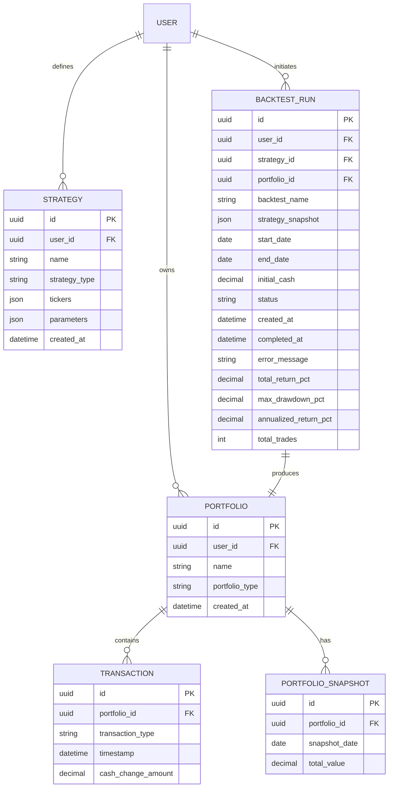
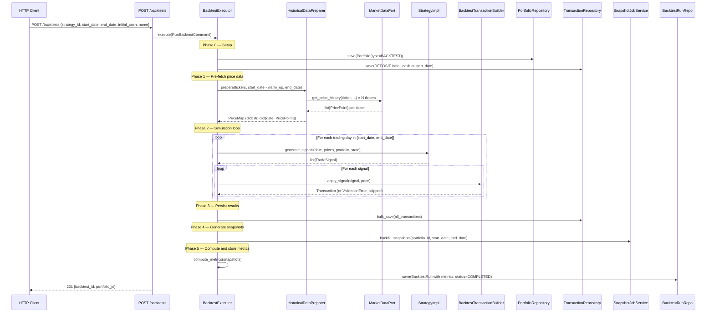

# Phase 4 Architecture: Trading Strategies & Backtesting

**Status**: Proposed
**Author**: Architect Agent (Third Run)
**Date**: 2026-03-08
**Informed By**: PRs #198 and #199 (prior architect runs)

---

## Table of Contents

1. [Executive Summary](#executive-summary)
2. [Domain Model](#domain-model)
3. [Execution Flow](#execution-flow)
4. [API Design](#api-design)
5. [Data Model & Migration Strategy](#data-model--migration-strategy)
6. [Performance Analysis](#performance-analysis)
7. [Implementation Plan](#implementation-plan)
8. [Key Trade-offs](#key-trade-offs)
9. [File Layout Appendix](#file-layout-appendix)
10. [Open Questions](#open-questions)

---

## Executive Summary

Phase 4 lets users define trading strategies, run them over historical periods, and compare the resulting portfolios against their live paper-trading portfolios using the existing analytics system.

A **backtest** runs a strategy over a historical date range (e.g., 1 Jan–31 Dec 2025) and produces a real `Portfolio` record of type `BACKTEST`. Because backtest portfolios are first-class portfolios, all existing analytics endpoints (performance charts, composition, holdings) work automatically with zero changes.

**What is new:**
- `PortfolioType` field on `Portfolio` (PAPER_TRADING | BACKTEST)
- `Strategy` entity: a reusable, named strategy template with parameters
- `BacktestRun` entity: tracks execution, status, and summary metrics
- `BacktestExecutor` application service: the simulation engine
- `HistoricalDataPreparer` application service: pre-fetches and validates price data
- Three built-in strategy types: Buy & Hold, Dollar-Cost Averaging, Moving Average Crossover
- A bug fix to `backfill_snapshots()` to use historical prices (prerequisite)

---

## Domain Model

### New Entities and Value Objects

#### PortfolioType (Enum — Value Object)

| Value | Description |
|-------|-------------|
| `PAPER_TRADING` | Default — live paper trading portfolio |
| `BACKTEST` | Created by the backtest engine, read-only after completion |

Added as a field to the existing `Portfolio` entity. Default: `PAPER_TRADING`.

---

#### StrategyType (Enum — Value Object)

| Value | Description |
|-------|-------------|
| `BUY_AND_HOLD` | Buy proportionally on day 1, hold forever |
| `DOLLAR_COST_AVERAGING` | Invest a fixed amount at regular intervals |
| `MOVING_AVERAGE_CROSSOVER` | Trade on fast/slow moving average crossover signals |

---

#### Strategy (Entity)

Represents a reusable, user-defined trading strategy template.

| Property | Type | Description | Constraints |
|----------|------|-------------|-------------|
| `id` | UUID | Primary key | — |
| `user_id` | UUID | Owning user | — |
| `name` | str | Display name | 1–100 chars, not blank |
| `strategy_type` | StrategyType | One of the three types | — |
| `tickers` | list[str] | Tickers to trade | 1–10 tickers, valid symbols |
| `parameters` | dict | Strategy-specific config (see below) | Type-specific validation |
| `created_at` | datetime | Creation timestamp | Not in future |

**Strategy Parameter Schemas (by type):**

*BUY_AND_HOLD parameters:*

| Key | Type | Description | Constraints |
|-----|------|-------------|-------------|
| `allocation` | dict[str, float] | Fraction of initial cash per ticker | Must sum to 1.0 ± 0.001 |

*DOLLAR_COST_AVERAGING parameters:*

| Key | Type | Description | Constraints |
|-----|------|-------------|-------------|
| `frequency_days` | int | Days between purchases | 1–365 |
| `amount_per_period` | str (Decimal) | USD amount to invest per period | > 0 |
| `allocation` | dict[str, float] | Split per-period amount across tickers | Must sum to 1.0 ± 0.001 |

*MOVING_AVERAGE_CROSSOVER parameters:*

| Key | Type | Description | Constraints |
|-----|------|-------------|-------------|
| `fast_window` | int | Short-term SMA window (days) | 2–200, must be < slow_window |
| `slow_window` | int | Long-term SMA window (days) | 2–200, must be > fast_window |
| `invest_fraction` | float | Fraction of cash to invest on BUY signal | 0 < value ≤ 1.0 |

---

#### TradeSignal (Value Object)

Produced by a strategy implementation for a single trading day.

| Property | Type | Description | Constraints |
|----------|------|-------------|-------------|
| `action` | TradeAction (BUY \| SELL) | Buy or sell | — |
| `ticker` | Ticker | Stock to trade | — |
| `signal_date` | date | Date the signal fires | Within simulation range |
| `quantity` | Quantity \| None | Number of shares (quantity-based) | Exactly one of quantity/amount |
| `amount` | Money \| None | USD amount to invest (amount-based) | Exactly one of quantity/amount |

> The invariant "exactly one of quantity or amount must be set" is enforced at construction time. Quantity-based signals are used by MA Crossover (invest a fraction of cash). Amount-based signals are used by DCA ("invest $500").

---

#### BacktestRun (Entity)

Tracks the execution of a single backtest.

| Property | Type | Description | Constraints |
|----------|------|-------------|-------------|
| `id` | UUID | Primary key | — |
| `user_id` | UUID | User who initiated the backtest | — |
| `strategy_id` | UUID \| None | Source strategy (nullable — strategy may be deleted) | — |
| `portfolio_id` | UUID | The BACKTEST portfolio produced | Set on completion |
| `strategy_snapshot` | dict | Strategy config at time of backtest (immutable record) | Required |
| `backtest_name` | str | Display name for the portfolio | 1–100 chars |
| `start_date` | date | Simulation start | < end_date |
| `end_date` | date | Simulation end | > start_date, ≤ today |
| `initial_cash` | Decimal | Starting cash (USD) | > 0 |
| `status` | BacktestStatus | Current state | RUNNING → COMPLETED \| FAILED |
| `created_at` | datetime | When backtest was triggered | — |
| `completed_at` | datetime \| None | When execution finished | Set on terminal status |
| `error_message` | str \| None | Failure reason | Set on FAILED |
| `total_return_pct` | Decimal \| None | (final_value − initial_cash) / initial_cash × 100 | Set on COMPLETED |
| `max_drawdown_pct` | Decimal \| None | Maximum peak-to-trough decline | Set on COMPLETED |
| `annualized_return_pct` | Decimal \| None | Return annualized to a full year | Set on COMPLETED |
| `total_trades` | int \| None | Count of BUY + SELL transactions | Set on COMPLETED |

---

### Entity Relationship Diagram



---

## Execution Flow

### Backtest Execution Pipeline

The execution pipeline is orchestrated by `BacktestExecutor`, an application-layer service.



### HistoricalDataPreparer

This service is responsible for ensuring all required price data exists **before** the simulation loop starts. It is the single point of failure for data availability — if any ticker is missing data for the date range, the backtest fails early with a clear error.

**Responsibilities:**
1. Accept a list of tickers, a date range (extended by the warm-up window), and the interval
2. Call `get_price_history(ticker, start, end, interval="1day")` once per ticker
3. Build an indexed structure: `dict[str, dict[date, PricePoint]]` (ticker symbol → date → price)
4. For each trading day in the requested range, verify at least one data point exists
5. If data is missing for any ticker on any required date, raise `InsufficientHistoricalDataError` with details

**The warm-up window:** Moving Average Crossover needs `slow_window` days of prices before generating signals. The `HistoricalDataPreparer` must fetch from `start_date - slow_window - 1` calendar days to ensure enough data.

### BacktestTransactionBuilder

This component maintains in-memory portfolio state and creates Transaction domain objects using the shared `trade_factory` functions. It is **not** a service or handler — it is a stateful helper used only by `BacktestExecutor`.

**State maintained:**
- `cash_balance`: Decimal (starts at initial_cash)
- `holdings`: dict[str, Decimal] (ticker symbol → quantity)
- `transactions`: list[Transaction] (accumulated, not yet saved)

**Operations:**

| Operation | Inputs | Outputs | Validation |
|-----------|--------|---------|------------|
| `apply_buy_signal` | signal, price_per_share | Transaction or None | Delegates to `trade_factory.create_buy_transaction()` |
| `apply_sell_signal` | signal, price_per_share | Transaction or None | Delegates to `trade_factory.create_sell_transaction()` |
| `resolve_quantity` | signal with amount | quantity | amount / price (truncated to whole shares) |

The builder catches `InsufficientFundsError` / `InsufficientSharesError` from the trade factory and skips the signal (returns None) instead of raising — a backtest should not abort because a strategy generated a signal the portfolio can't afford.

**Why this approach:** See Decision 6 in Trade-offs. The shared `trade_factory` functions ensure all trade creation logic is defined once and used by both the existing handlers and the backtest builder. The builder adds only state tracking (cash/holdings) and bulk accumulation — no duplicated business rules.

---

## API Design

### Endpoint Summary

| Method | Path | Description |
|--------|------|-------------|
| `POST` | `/strategies` | Create a strategy template |
| `GET` | `/strategies` | List user's strategy templates |
| `GET` | `/strategies/{strategy_id}` | Get strategy details |
| `DELETE` | `/strategies/{strategy_id}` | Delete a strategy |
| `POST` | `/backtests` | Run a backtest (synchronous v1) |
| `GET` | `/backtests` | List user's backtest runs |
| `GET` | `/backtests/{backtest_id}` | Get backtest run details |
| `DELETE` | `/backtests/{backtest_id}` | Delete a backtest and its portfolio |

Existing analytics endpoints work unchanged with `portfolio_id` from any `BacktestRun`.

---

### POST /strategies

**Request body:**

```yaml
name: "My Buy & Hold Strategy"
strategy_type: "BUY_AND_HOLD"  # | DOLLAR_COST_AVERAGING | MOVING_AVERAGE_CROSSOVER
tickers: ["AAPL", "MSFT", "GOOGL"]
parameters:
  allocation:
    AAPL: 0.5
    MSFT: 0.3
    GOOGL: 0.2
```

**Response 201:**
```yaml
id: "uuid"
name: "My Buy & Hold Strategy"
strategy_type: "BUY_AND_HOLD"
tickers: ["AAPL", "MSFT", "GOOGL"]
parameters: { ... }
created_at: "2026-01-01T00:00:00Z"
```

**Error responses:**

| Code | Condition |
|------|-----------|
| `400` | Invalid strategy_type, invalid parameter schema, allocation doesn't sum to 1.0, invalid ticker format, empty tickers list |
| `401` | Unauthenticated |
| `422` | Malformed request body |

---

### GET /strategies

**Query parameters:**

| Param | Type | Description |
|-------|------|-------------|
| `limit` | int | Max results (default 20, max 100) |
| `offset` | int | Pagination offset |

**Response 200:** Paginated list of strategy objects (same shape as POST response).

**Error responses:**

| Code | Condition |
|------|-----------|
| `401` | Unauthenticated |

---

### GET /strategies/{strategy_id}

**Response 200:** Single strategy object.

**Error responses:**

| Code | Condition |
|------|-----------|
| `401` | Unauthenticated |
| `404` | Strategy not found or belongs to another user |

---

### DELETE /strategies/{strategy_id}

**Response 204:** No content.

**Error responses:**

| Code | Condition |
|------|-----------|
| `401` | Unauthenticated |
| `404` | Strategy not found or belongs to another user |
| `409` | Strategy has associated running backtest (status=RUNNING) |

> Soft delete or cascade-allowed on COMPLETED/FAILED backtest runs — `strategy_id` on `BacktestRun` is nullable for this reason.

---

### POST /backtests

**Request body:**

```yaml
strategy_id: "uuid"           # Required
backtest_name: "AAPL 2025"    # Display name for the created portfolio
start_date: "2025-01-01"      # ISO date
end_date: "2025-12-31"        # ISO date
initial_cash: "10000.00"      # USD string (decimal)
```

**Response 201:**
```yaml
backtest_id: "uuid"
portfolio_id: "uuid"          # Use this with existing analytics endpoints
status: "COMPLETED"           # Synchronous v1 — always COMPLETED or error
total_return_pct: "15.23"
max_drawdown_pct: "-8.41"
annualized_return_pct: "14.87"
total_trades: 12
```

**Error responses:**

| Code | Condition |
|------|-----------|
| `400` | start_date >= end_date, end_date > today, initial_cash <= 0, date range > 3 years |
| `401` | Unauthenticated |
| `404` | strategy_id not found or belongs to another user |
| `422` | Malformed request body |
| `503` | Market data unavailable for one or more tickers in the strategy's date range |

> The `503` case is returned when `HistoricalDataPreparer` cannot find price data for a ticker. The backtest is not created. The response body includes which tickers are missing and for what date range.

---

### GET /backtests

**Query parameters:**

| Param | Type | Description |
|-------|------|-------------|
| `limit` | int | Max results (default 20, max 100) |
| `offset` | int | Pagination offset |
| `strategy_id` | UUID | Filter by strategy |

**Response 200:**
```yaml
items:
  - backtest_id: "uuid"
    portfolio_id: "uuid"
    backtest_name: "AAPL 2025"
    strategy_name: "My Buy & Hold"   # From strategy_snapshot, not strategy table
    strategy_type: "BUY_AND_HOLD"
    start_date: "2025-01-01"
    end_date: "2025-12-31"
    initial_cash: "10000.00"
    status: "COMPLETED"
    total_return_pct: "15.23"
    max_drawdown_pct: "-8.41"
    total_trades: 12
    created_at: "2026-03-01T10:00:00Z"
total: 3
```

**Error responses:**

| Code | Condition |
|------|-----------|
| `401` | Unauthenticated |

---

### GET /backtests/{backtest_id}

**Response 200:** Full backtest object including `strategy_snapshot` (the full strategy parameters used).

**Error responses:**

| Code | Condition |
|------|-----------|
| `401` | Unauthenticated |
| `404` | Backtest not found or belongs to another user |

---

### DELETE /backtests/{backtest_id}

**Response 204:** No content.

Deletes the `BacktestRun` record and its associated `BACKTEST` portfolio (including all transactions and snapshots). This is a cascading delete.

**Error responses:**

| Code | Condition |
|------|-----------|
| `401` | Unauthenticated |
| `404` | Backtest not found or belongs to another user |

---

### Portfolio List Changes

The existing `GET /portfolios` response should include `portfolio_type` in each portfolio object (PAPER_TRADING | BACKTEST). No other changes to existing endpoints.

---

## Data Model & Migration Strategy

### New Tables

#### `strategies`

| Column | Type | Constraints |
|--------|------|-------------|
| `id` | UUID | PRIMARY KEY |
| `user_id` | UUID | NOT NULL, INDEX |
| `name` | VARCHAR(100) | NOT NULL |
| `strategy_type` | VARCHAR(50) | NOT NULL |
| `tickers` | JSONB | NOT NULL |
| `parameters` | JSONB | NOT NULL |
| `created_at` | TIMESTAMP | NOT NULL |

Index: `idx_strategy_user_id` on `(user_id)`

#### `backtest_runs`

| Column | Type | Constraints |
|--------|------|-------------|
| `id` | UUID | PRIMARY KEY |
| `user_id` | UUID | NOT NULL, INDEX |
| `strategy_id` | UUID | NULLABLE, no FK (nullable for deleted strategies) |
| `portfolio_id` | UUID | NOT NULL, UNIQUE, references `portfolios(id)` |
| `backtest_name` | VARCHAR(100) | NOT NULL |
| `strategy_snapshot` | JSONB | NOT NULL |
| `start_date` | DATE | NOT NULL |
| `end_date` | DATE | NOT NULL |
| `initial_cash` | NUMERIC(15,2) | NOT NULL |
| `status` | VARCHAR(20) | NOT NULL (RUNNING \| COMPLETED \| FAILED) |
| `created_at` | TIMESTAMP | NOT NULL |
| `completed_at` | TIMESTAMP | NULLABLE |
| `error_message` | TEXT | NULLABLE |
| `total_return_pct` | NUMERIC(10,4) | NULLABLE |
| `max_drawdown_pct` | NUMERIC(10,4) | NULLABLE |
| `annualized_return_pct` | NUMERIC(10,4) | NULLABLE |
| `total_trades` | INTEGER | NULLABLE |

Indexes:
- `idx_backtest_run_user_id` on `(user_id)`
- `idx_backtest_run_portfolio_id` on `(portfolio_id)` (unique)
- `idx_backtest_run_strategy_id` on `(strategy_id)`

### Modified Tables

#### `portfolios` — add `portfolio_type` column

| Column | Type | Constraints |
|--------|------|-------------|
| `portfolio_type` | VARCHAR(20) | NOT NULL, DEFAULT `'PAPER_TRADING'` |

---

### Migration Strategy

**Two migrations are recommended** (one per concern, easier to reason about and roll back):

**Migration 1: `add_portfolio_type`**
- Add `portfolio_type VARCHAR(20) NOT NULL DEFAULT 'PAPER_TRADING'` to `portfolios`
- All existing rows get `PAPER_TRADING` via the column default — no data transformation required

**Migration 2: `add_strategy_and_backtest_tables`**
- Create `strategies` table
- Create `backtest_runs` table

Order: Migration 1 must run before Migration 2 (backtest_runs references portfolios). In practice, Alembic's dependency chain handles this.

> **Single migration alternative:** A single migration is slightly simpler to deploy atomically but harder to roll back if only one part fails. Given the tables are independent (strategies/backtest_runs don't depend on each other), two migrations is the safer choice.

---

## Performance Analysis

### Methodology

All estimates assume:
- Alpha Vantage historical data is already in PostgreSQL (one-time API call)
- Redis is available and functional
- PostgreSQL is local or low-latency (<1ms per query)
- "1 year" = 252 trading days (US market standard)
- "3 tickers" is a typical Buy & Hold scenario

### Phase-by-Phase Breakdown (1 year, 3 tickers, Buy & Hold)

| Phase | Operation | Time Estimate | Bottleneck |
|-------|-----------|--------------|------------|
| **0. Setup** | Create portfolio + deposit transaction (2 DB writes) | ~5ms | DB write |
| **1. Pre-fetch** | `get_price_history()` × 3 tickers from PostgreSQL cache | ~30ms | DB read (3 queries) |
| **1. Pre-fetch (cold)** | `get_price_history()` × 3 tickers from Alpha Vantage API | ~1.5s | Network (3 × ~500ms) |
| **2. Simulation** | 252 days × 3 signals = 756 in-memory ops | <1ms | CPU (trivial) |
| **3. Persist transactions** | INSERT 756 transactions (batched) | ~100ms | DB writes |
| **4. Snapshot backfill** | `backfill_snapshots()` 252 days × 3 `get_price_at()` calls | ~250ms | DB reads (756 queries, but indexed) |
| **5. Compute metrics** | Iterate 252 snapshots in-memory | <1ms | CPU (trivial) |
| **Total (warm cache)** | — | **~390ms** | DB I/O |
| **Total (cold API)** | — | **~1.9s** | Alpha Vantage API |

### Scaling to Longer Periods

| Scenario | Transactions | Snapshot days | Estimated time (warm) |
|----------|-------------|--------------|----------------------|
| 1 year, 1 ticker, B&H | 1 | 252 | ~100ms |
| 1 year, 3 tickers, B&H | 3 | 252 | ~390ms |
| 1 year, DCA monthly, 3 tickers | 36 | 252 | ~350ms |
| 1 year, MA Crossover, 1 ticker | ~20–50 | 252 | ~200ms |
| 5 years, 3 tickers, B&H | 3 | 1260 | ~1.5s |
| 10 years, 3 tickers, B&H | 3 | 2520 | ~3s |

### Key Bottleneck: Snapshot Backfill

The snapshot backfill is the dominant cost for long periods. `_calculate_snapshot_for_portfolio()` calls `get_price_at()` once per holding per day. For 5 years and 3 tickers, that's 3,780 DB queries.

**Optimization path (not required for v1):** Pass pre-fetched `PriceMap` directly to the snapshot calculator, bypassing individual `get_price_at()` calls. This reduces snapshot backfill from O(days × tickers) DB queries to O(0) — all from the already-loaded in-memory dict. This optimization should be considered if 5+ year backtests are desired.

### HTTP Timeout Consideration

For v1 synchronous execution, a 1-year backtest with warm cache completes in ~400ms — well within typical 30-second HTTP timeouts. For 10-year ranges, cold-cache scenarios could approach 5–10 seconds. A hard limit of **3 years maximum date range** in v1 keeps cold-cache worst case under 4 seconds.

---

## Implementation Plan

### Prerequisite: Fix `backfill_snapshots()` Bug

**Current behavior:** `_calculate_snapshot_for_portfolio()` calls `get_current_price(holding.ticker)` for all dates, including historical ones. This produces incorrect snapshots for backtest portfolios (and any future manual backfill).

**Required fix:** When `snapshot_date < today`, call `get_price_at(holding.ticker, snapshot_date_as_end_of_day_utc)` instead of `get_current_price()`. The method `get_price_at()` already exists on `MarketDataPort` and is documented to find the nearest available price within ±1 hour.

This fix must land before any backtest execution code is written.

---

### Phase 4.1 — Foundation (Week 1–2)

**Goal:** Add new domain entities, fix snapshot bug, extract shared trade logic, and create DB schema.

Steps:
1. Fix `backfill_snapshots()` in `snapshot_job.py` to use `get_price_at()`
2. Extract `trade_factory.py` — `create_buy_transaction()` and `create_sell_transaction()` as pure domain functions
3. Refactor `BuyStockHandler` and `SellStockHandler` to call `trade_factory` functions (no behavior change, existing tests pass)
4. Add `PortfolioType` enum to domain value objects
5. Add `portfolio_type` field to `Portfolio` entity (with default `PAPER_TRADING`)
6. Update `PortfolioModel` and `InMemoryPortfolioRepository`
7. Create Migration 1: add `portfolio_type` to portfolios
8. Create `Strategy` domain entity and `StrategyType` enum
9. Create `BacktestRun` domain entity and `BacktestStatus` enum
10. Create `TradeSignal` value object
11. Create Migration 2: add strategies and backtest_runs tables
12. Create `StrategyRepository` port + SQLModel implementation + in-memory implementation
13. Create `BacktestRunRepository` port + SQLModel implementation + in-memory implementation

---

### Phase 4.2 — Execution Engine (Week 3–4)

**Goal:** Implement the simulation engine and the first strategy.

Steps:
1. Implement `HistoricalDataPreparer` application service
2. Implement `BacktestTransactionBuilder` (stateful helper class, not a service)
3. Implement `StrategyProtocol` (Python `Protocol` defining the strategy interface)
4. Implement `BuyAndHoldStrategy` (first strategy, simplest)
5. Implement `BacktestExecutor` application service (orchestrates all of the above)
6. Add `RunBacktestCommand` and wire DI in `dependencies.py`
7. Add `POST /backtests` API endpoint
8. Add `GET /backtests` and `GET /backtests/{id}` endpoints

---

### Phase 4.3 — Strategy Management & More Strategies (Week 5–6)

**Goal:** Strategy CRUD and the remaining two strategy types.

Steps:
1. Add `POST /strategies`, `GET /strategies`, `GET /strategies/{id}`, `DELETE /strategies` endpoints
2. Implement `DollarCostAveragingStrategy`
3. Implement `MovingAverageCrossoverStrategy`
4. Add `HistoricalPriceCalculator` domain service for SMA computation (pure, testable)
5. Add strategy parameter validation in the `POST /strategies` handler
6. Update portfolio list response to include `portfolio_type`

---

### Phase 4.4 — Polish (Week 7)

**Goal:** UX improvements and reliability.

Steps:
1. Validate strategy tickers against `get_supported_tickers()` in `POST /strategies`
2. Add date range maximum (3 years) guard in `POST /backtests`
3. Add `503` response handling when `HistoricalDataPreparer` fails
4. Write integration tests for all three strategies
5. Documentation updates

---

## Key Trade-offs

### Decision 1: Backtest Portfolios as Real Portfolio Records ✅ Settled

**Decision:** Add `portfolio_type` to the existing `Portfolio` entity. Backtest portfolios are first-class portfolios.

**Rationale:** Zero changes to analytics endpoints. `GET /portfolios/{id}/performance` works on a backtest portfolio the same day it's built. Alternative (separate `BacktestResult` entity) would require duplicating or proxying every analytics endpoint.

**Risk:** Backtest portfolios could appear in the regular portfolio list. Mitigated by filtering on `portfolio_type` in the list view.

---

### Decision 2: Strategy Types ✅ Settled

**Decision:** Three predefined templates (Buy & Hold, DCA, MA Crossover). No custom rule DSL.

**Rationale:** A custom DSL would require parsing, validation, security sandboxing, and testing infrastructure that adds months of work. The three strategies cover the most common patterns beginners want to test. The `Strategy` entity's `parameters` JSON field is extensible — new strategy types can be added in Phase 5 without schema changes.

---

### Decision 3: Synchronous Execution ✅ Settled

**Decision:** Backtest runs synchronously within the HTTP request. No background task queue for v1.

**Rationale:** With warm cache and a 3-year limit, execution stays under 2 seconds. Async task queues (Celery, etc.) add significant operational overhead (worker processes, result polling) for minimal benefit. The `BacktestRun.status` field makes the transition to async clean: the API shape (returning `backtest_id`) works identically whether execution is synchronous or async.

---

### Decision 4: Pre-fetch Price Data ✅ Settled

**Decision:** `HistoricalDataPreparer` calls `get_price_history()` once per ticker before the simulation loop. Prices stored in `dict[str, dict[date, PricePoint]]` for O(1) lookup.

**Rationale:** Isolates failure (rate limit) from simulation. Ensures the loop always completes or fails fast. Avoids 252+ individual `get_price_at()` calls interleaved with simulation logic.

---

### Decision 5: Fix backfill_snapshots() as Hard Prerequisite ✅ Settled

**Decision:** Fix the known bug (use `get_price_at()` for historical dates) before any backtest work begins.

**Rationale:** A backtest portfolio generates 250+ historical snapshots via `backfill_snapshots()`. If the bug is not fixed, all backtest performance charts will show incorrect values (current prices instead of historical). This would make the feature fundamentally broken.

---

### Decision 6: Execution Model — Shared Domain Functions + In-Memory Builder ⬅ Key Decision

**Decision:** Extract the core trade creation logic from `BuyStockHandler` and `SellStockHandler` into shared pure domain functions, then use those functions in both the existing handlers and a new `BacktestTransactionBuilder`.

**Alternatives considered:**

| Approach | Pros | Cons |
|----------|------|------|
| A: Call `BuyStockHandler` with DB repos | Full handler reuse | N DB reads per trade (250 × DB fetch), slow (~3–8s) |
| B: Call `BuyStockHandler` with in-memory repos | Handler reuse, no DB reads | Complex wiring — inject in-memory repos through handler infrastructure, subtle interaction risks |
| C: `BacktestTransactionBuilder` with inlined logic | O(1) per trade, simple, fast | Duplicates validation logic — maintenance risk if trade rules evolve |
| **D: Shared domain functions + builder (chosen)** | **O(1) per trade, zero duplication, fast** | **Small refactor of existing handlers required** |

**How this works:**

Today, `BuyStockHandler.execute()` does three things in sequence:
1. **Fetch state** — load portfolio, load all transactions, calculate cash balance via `PortfolioCalculator`
2. **Validate and create** — check `cash >= cost`, construct `Transaction` domain object with correct `cash_change`, `ticker`, `quantity`, `price_per_share`
3. **Persist** — save the transaction to the repository

Steps 1 and 3 are infrastructure concerns. Step 2 is pure domain logic. The refactor extracts step 2 into a pure domain function:

```python
# In domain/services/trade_factory.py (new)
def create_buy_transaction(
    portfolio_id: UUID,
    ticker: Ticker,
    quantity: Quantity,
    price_per_share: Money,
    cash_balance: Money,
    timestamp: datetime,
    notes: str | None = None,
) -> Transaction:
    """Create a validated BUY transaction.

    Raises InsufficientFundsError if cash_balance < total_cost.
    """
    total_cost = price_per_share.multiply(quantity.shares)
    if cash_balance < total_cost:
        raise InsufficientFundsError(available=cash_balance, required=total_cost)
    return Transaction(
        id=uuid4(),
        portfolio_id=portfolio_id,
        transaction_type=TransactionType.BUY,
        timestamp=timestamp,
        cash_change=total_cost.negate(),
        ticker=ticker,
        quantity=quantity,
        price_per_share=price_per_share,
        notes=notes,
    )
```

An equivalent `create_sell_transaction()` checks holdings.

After the refactor:
- `BuyStockHandler.execute()` calls `create_buy_transaction()` — no behavior change, same tests pass
- `BacktestTransactionBuilder` calls `create_buy_transaction()` — zero duplicated validation
- If trade rules ever change (e.g., adding fees, position limits), the change is made in one place

The `BacktestTransactionBuilder` maintains in-memory state (`cash_balance`, `holdings` dict) and calls these shared functions, accumulating `Transaction` objects for bulk save.

**Why not Option B (in-memory repos through handlers):** The existing handlers mix fetch + validate + persist into a single method. Making them work with in-memory repos requires either (a) creating a parallel construction path for handler instances, or (b) making repos runtime-switchable. Both are more complex than extracting a pure function. The shared function approach is a small, safe refactor that improves the codebase regardless of backtesting.

---

### Decision 7: Store Summary Metrics in BacktestRun ⬅ Key Decision

**Decision:** Store `total_return_pct`, `max_drawdown_pct`, `annualized_return_pct`, and `total_trades` on the `BacktestRun` entity.

**Alternative:** Derive on-the-fly from existing analytics endpoints.

**Rationale:** The portfolio list page (`GET /backtests`) needs summary metrics for every backtest row. Running the full analytics pipeline (loading all snapshots, computing return %) per row in a list query would be O(N × analytics_cost). Pre-computing once at backtest completion and storing on `BacktestRun` makes the list endpoint O(1) per row.

**Risk:** Metrics become stale if snapshots are modified. Mitigated: backtest portfolios are immutable after completion — no new transactions are added post-completion.

**Scaling note:** If Phase 4b adds richer metrics (Sharpe ratio, alpha, beta, win rate), the summary fields on `BacktestRun` will grow. At that point, extracting a separate `BacktestMetrics` entity/table (one-to-one with `BacktestRun`) is the right move. For v1, 4 fields on the entity is fine.

---

### Decision 8: TradeSignal — list[TradeSignal] Return Type ⬅ Key Decision

**Decision:** Strategy implementations return `list[TradeSignal]`. A strategy can generate zero, one, or multiple signals per day.

**Alternative:** Return `TradeSignal | None`.

**Rationale:** `list` is strictly more general. Buy & Hold returns a list with signals (3 tickers on day 1). DCA returns a list per period. MA Crossover returns 0 or 1 signal. The `| None` alternative cannot naturally represent multi-ticker strategies.

**Signal resolution:** A `TradeSignal` carries either `quantity` (shares) or `amount` (USD), never both. The `BacktestTransactionBuilder` resolves amount-based signals to quantities: `quantity = floor(amount / price_per_share)` (whole shares for now — see Open Questions).

---

## File Layout Appendix

### New files to create

```
backend/
├── migrations/
│   └── versions/
│       ├── XXXX_add_portfolio_type.py            # Migration 1
│       └── YYYY_add_strategy_and_backtest_tables.py  # Migration 2
│
└── src/zebu/
    ├── domain/
    │   ├── entities/
    │   │   ├── strategy.py                       # Strategy + StrategyType entities
    │   │   └── backtest_run.py                   # BacktestRun + BacktestStatus entities
    │   ├── value_objects/
    │   │   └── trade_signal.py                   # TradeSignal value object
    │   └── services/
    │       ├── trade_factory.py                  # Shared create_buy/sell_transaction() (NEW — refactored from handlers)
    │       ├── historical_price_calculator.py    # SMA and other pure price calculations
    │       └── strategies/                       # Strategy implementations
    │           ├── __init__.py
    │           ├── protocol.py                   # StrategyProtocol (Python Protocol)
    │           ├── buy_and_hold.py               # BuyAndHoldStrategy
    │           ├── dollar_cost_averaging.py      # DollarCostAveragingStrategy
    │           └── moving_average_crossover.py   # MovingAverageCrossoverStrategy
    │
    ├── application/
    │   ├── commands/
    │   │   └── run_backtest.py                   # RunBacktestCommand + RunBacktestHandler
    │   ├── ports/
    │   │   ├── strategy_repository.py            # StrategyRepository Protocol
    │   │   ├── backtest_run_repository.py        # BacktestRunRepository Protocol
    │   │   ├── in_memory_strategy_repository.py  # In-memory impl for tests
    │   │   └── in_memory_backtest_run_repository.py  # In-memory impl for tests
    │   └── services/
    │       ├── historical_data_preparer.py       # Pre-fetches price data for simulation
    │       └── backtest_executor.py              # Orchestrates end-to-end backtest execution
    │
    └── adapters/
        ├── inbound/
        │   └── api/
        │       ├── strategies.py                 # /strategies endpoints
        │       └── backtests.py                  # /backtests endpoints
        └── outbound/
            └── database/
                ├── strategy_repository.py        # SQLModel StrategyRepository
                └── backtest_run_repository.py    # SQLModel BacktestRunRepository
```

### Files to modify

```
backend/
└── src/zebu/
    ├── domain/
    │   └── entities/
    │       └── portfolio.py                      # Add portfolio_type field
    ├── application/
    │   ├── commands/
    │   │   ├── buy_stock.py                      # Refactor: use trade_factory.create_buy_transaction()
    │   │   └── sell_stock.py                     # Refactor: use trade_factory.create_sell_transaction()
    │   └── services/
    │       └── snapshot_job.py                   # Fix backfill bug (get_price_at)
    ├── adapters/
    │   ├── inbound/
    │   │   └── api/
    │   │       ├── api.py                        # Register new routers
    │   │       ├── dependencies.py               # Wire new services and repos
    │   │       └── portfolios.py                 # Add portfolio_type to list response
    │   └── outbound/
    │       └── database/
    │           └── models.py                     # Add portfolio_type column to PortfolioModel
    └── application/
        └── ports/
            └── in_memory_portfolio_repository.py # Support portfolio_type field
```

---

## Open Questions

These are genuine ambiguities that should be resolved during implementation, not assumed away.

### OQ-1: Fractional Shares

**Question:** Should backtests support fractional shares (e.g., buy $500 of AAPL at $185.40 = 2.697 shares)?

**Impact:** DCA amount-based signals produce fractional quantities. The current `Quantity` value object uses `Decimal` precision.

**Options:**
- (A) Whole shares only: `floor(amount / price)`. Simple, but produces leftover cash that can skew DCA results.
- (B) Fractional shares: Allow `Quantity` with up to 4 decimal places. Accurate, but affects existing whole-share assumptions throughout the system.

**Recommendation:** Start with whole shares (A) for v1, document the limitation clearly. Fractional shares can be unlocked in v2 if Quantity validation is relaxed.

---

### OQ-2: MA Crossover Warm-Up Period

**Question:** How should the simulation handle the warm-up period for Moving Average Crossover (the first `slow_window` days before enough data exists for an SMA signal)?

**Options:**
- (A) Skip trading entirely during warm-up — cash sits idle.
- (B) Hold cash until first BUY signal, then invest on first BUY.

**Recommendation:** Option B is the correct behavior — it matches how a real trader would use this strategy. The warm-up is an inherent property of the strategy, not a limitation of the backtest.

**Implementation note:** `HistoricalDataPreparer` must fetch from `start_date - slow_window - 1` calendar days to ensure SMA can be computed from `start_date`.

---

### OQ-3: Strategy Deletion — Cascade or Block?

**Question:** When a user deletes a strategy, what happens to backtest runs that reference it?

**Options:**
- (A) Block deletion if any backtest run references the strategy.
- (B) Allow deletion; set `strategy_id = NULL` on affected backtest runs (already designed this way).
- (C) Soft delete — mark strategy as deleted, keep it in DB.

**Recommendation:** Option B — nullable `strategy_id` is already in the design. The `strategy_snapshot` JSON on each `BacktestRun` preserves the complete strategy config even if the strategy record is gone.

**Guard:** Block deletion only if any backtest is currently in status `RUNNING` (race condition risk).

---

### OQ-4: What Happens When Backtest Fails Mid-Execution?

**Question:** If the backtest executor fails after creating the portfolio but before completing (e.g., crash during snapshot backfill), what is the state of the system?

**Impact:** A `BACKTEST` portfolio with no snapshots could be left orphaned.

**Options:**
- (A) No cleanup — leave orphaned portfolio, mark `BacktestRun.status = FAILED`. User can delete portfolio manually.
- (B) Transactional cleanup — wrap entire execution in a DB transaction; roll back portfolio + transactions on failure.
- (C) Compensating delete — on failure, delete the portfolio and all its transactions.

**Recommendation:** Option A for v1, with clear `error_message` on `BacktestRun`. A `BACKTEST` portfolio with status `FAILED` should be filtered from analytics views. Full transactional cleanup (Option B) requires careful async transaction management.

---

### OQ-5: Maximum Date Range and Request Timeout

**Question:** Should the date range be limited to prevent extremely long-running requests?

**Decision (settled):** Enforce a hard limit of 3 years maximum in the `POST /backtests` endpoint. Returns `400` if `end_date - start_date > 3 * 365 days`. This keeps cold-cache worst-case well under 10 seconds. Already reflected in the API error table for `POST /backtests`.\n\nRaise to 5 or 10 years when/if async execution is implemented (Phase 4c).", "oldString": "### OQ-5: Maximum Date Range and Request Timeout\n\n**Question:** Should the date range be limited to prevent extremely long-running requests?\n\n**Recommendation:** Enforce a hard limit of 3 years maximum in the `POST /backtests` endpoint. Returns `400` if `end_date - start_date > 3 * 365 days`. This keeps cold-cache worst-case well under 10 seconds.

---

### OQ-6: Concurrent Backtests

**Question:** Should users be limited to one concurrent backtest at a time?

**Impact:** Two simultaneous 5-second backtests would create 10 seconds of load. With FastAPI's async execution, they would run concurrently if the executor uses `await` for DB operations.

**Recommendation:** No limit for v1. The synchronous design makes concurrency a request-level concern handled by the web server (uvicorn). Revisit if users abuse the endpoint.

---

### OQ-7: Backtest Portfolio — Prevent User Modification

**Question:** Should users be prevented from manually trading in a `BACKTEST` portfolio (deposit, withdraw, buy, sell)?

**Impact:** If users can add manual trades to a backtest portfolio, it corrupts the backtest results.

**Recommendation:** Add a guard in `BuyStockHandler`, `SellStockHandler`, `DepositCashHandler`, and `WithdrawCashHandler`: if the portfolio has `portfolio_type = BACKTEST`, raise `InvalidPortfolioError` with message "Backtest portfolios are read-only." This is a simple one-line check per handler.

---

### OQ-8: Alpha Vantage Rate Limits During Pre-fetch

**Question:** If a user runs a backtest for 5 tickers and Alpha Vantage data is cold (not yet in DB), the pre-fetcher needs 5 API calls. At 5/min, this takes at minimum 1 minute.

**Impact:** The synchronous v1 design would time out.

**Options:**
- (A) Pre-check: if any ticker lacks price history, return `503` immediately with "please add tickers to watchlist first."
- (B) Pre-warm endpoint: users can explicitly trigger data pre-fetch for a ticker before backtesting.
- (C) Async execution (not for v1).

**Recommendation:** Option A — check the `price_history` DB table for each ticker/date range before starting. Return `503` with the list of tickers that need data. This is a clear UX that tells users exactly what to do. A companion `GET /prices/availability?tickers=AAPL,MSFT&start=2024-01-01&end=2025-01-01` endpoint makes this discoverable.

---

*Document maintained in `docs/architecture/phase4-trading-strategies.md`. Implementation begins with Phase 4.1 after prerequisite bug fix.*
