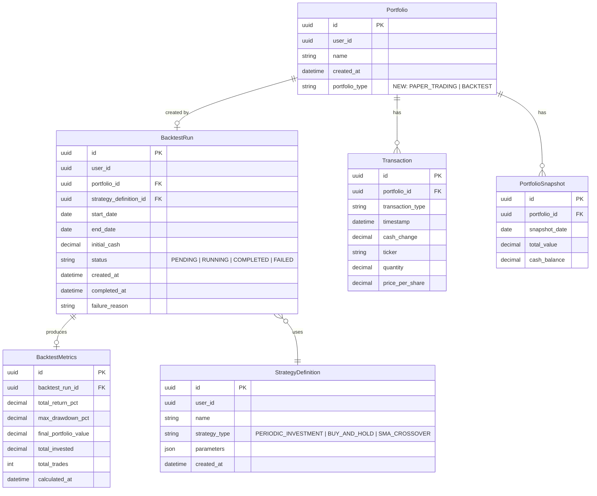
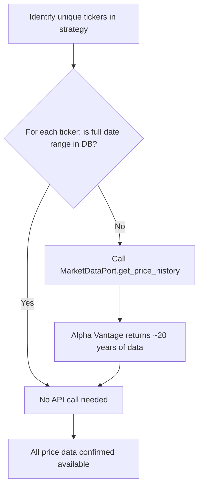

# Phase 4 Architecture: Automated Trading Strategies & Backtesting

**Status**: Design  
**Date**: 2026-03-08  
**Author**: Architect Agent  
**Related Plan**: [Phase 4 Technical Plan](../planning/phase4-technical-plan.md)

---

## Table of Contents

1. [Overview](#overview)
2. [Domain Model](#domain-model)
3. [Execution Flow](#execution-flow)
4. [API Design](#api-design)
5. [Data Model](#data-model)
6. [Performance Analysis](#performance-analysis)
7. [Implementation Plan](#implementation-plan)
8. [Trade-offs and Key Decisions](#trade-offs-and-key-decisions)

---

## Overview

### What We Are Building

Phase 4 adds **strategy backtesting**: users define a trading strategy, choose a historical date range, and the system rapidly simulates all the trades that strategy would have made. Results appear as a fully-formed portfolio with charts and analytics, letting users evaluate the strategy before applying it to their live paper portfolio.

### Design Philosophy

> **Maximum reuse, minimum new concepts.**

The existing system already supports most of what backtesting needs:
- `BuyStockCommand` / `SellStockCommand` accept an `as_of` timestamp — trades can be placed at historical dates
- `MarketDataPort.get_price_history()` and `get_price_at()` retrieve historical prices
- `PortfolioCalculator` is pure and side-effect-free — runs indefinitely without I/O
- `SnapshotJobService.backfill_snapshots()` generates historical daily portfolio values
- All repositories follow Ports & Adapters — no infrastructure lock-in

The design exploits all of this. A backtest produces a **real `Portfolio` record** of type `BACKTEST`. This means every existing analytics endpoint, chart, and snapshot mechanism works for backtest portfolios without modification. Only the creation path is new.

### Scope for v1

| In Scope | Out of Scope (later) |
|----------|----------------------|
| Predefined strategy templates (configurable parameters) | User-defined rule expressions |
| Single-ticker strategies | Multi-ticker correlation strategies |
| Synchronous execution (complete within request) | Async background jobs |
| 3 strategy types: Periodic Investment, Buy & Hold, SMA Crossover | Options, futures, short selling |
| Basic performance metrics: total return, max drawdown | Sharpe ratio, alpha, beta (Phase 4b) |
| Backend architecture only | Frontend design |

---

## Domain Model

### New Entities and Value Objects

The following new domain concepts are introduced alongside the existing model.

#### Relationship to Existing Model



#### Portfolio (Modified)

| Property | Type | Description | Change |
|----------|------|-------------|--------|
| `id` | UUID | Unique identifier | Existing |
| `user_id` | UUID | Owner | Existing |
| `name` | str | Display name | Existing |
| `created_at` | datetime | Creation timestamp | Existing |
| `portfolio_type` | PortfolioType | PAPER_TRADING or BACKTEST | **NEW** |

**PortfolioType** (new value object):

| Value | Meaning |
|-------|---------|
| `PAPER_TRADING` | Normal user portfolio (default) |
| `BACKTEST` | Created by a backtest run, frozen after completion |

All existing portfolio invariants remain. The new field is informational — it does not change how transactions are stored or how holdings are calculated.

#### StrategyDefinition (New Entity)

A named, user-owned specification of a trading strategy. Users may reuse the same definition across multiple backtest runs.

| Property | Type | Description | Constraints |
|----------|------|-------------|-------------|
| `id` | UUID | Unique identifier | — |
| `user_id` | UUID | Owner | Must reference an authenticated user |
| `name` | str | Human-readable label | 1–100 chars |
| `strategy_type` | StrategyType | Which template to use | Must be a known StrategyType |
| `parameters` | StrategyParameters | Template-specific config | Validated per strategy_type |
| `created_at` | datetime | Creation timestamp | UTC, not in future |

**StrategyType** (new enum):

| Value | Description |
|-------|-------------|
| `PERIODIC_INVESTMENT` | Buy a fixed amount of a ticker every N calendar days |
| `BUY_AND_HOLD` | Buy a fixed quantity on the first trading day, hold until end |
| `SMA_CROSSOVER` | Buy when short-term moving average crosses above long-term; sell on reverse |

#### StrategyParameters (New Value Objects, one per StrategyType)

**PeriodicInvestmentParameters**:

| Property | Type | Description | Constraints |
|----------|------|-------------|-------------|
| `ticker` | Ticker | Stock to buy | Must be a valid ticker |
| `investment_amount` | Money | Cash to invest per period | > 0, currency = USD |
| `interval_days` | int | Calendar days between buys | 1–365 |

**BuyAndHoldParameters**:

| Property | Type | Description | Constraints |
|----------|------|-------------|-------------|
| `ticker` | Ticker | Stock to buy | Must be a valid ticker |
| `quantity` | Quantity | Shares to buy on first day | > 0 |

**SmaCrossoverParameters**:

| Property | Type | Description | Constraints |
|----------|------|-------------|-------------|
| `ticker` | Ticker | Stock to trade | Must be a valid ticker |
| `short_window` | int | Short SMA period (days) | 2–50 |
| `long_window` | int | Long SMA period (days) | 10–200, > short_window |
| `trade_quantity` | Quantity | Shares per signal trade | > 0 |

#### BacktestRun (New Entity)

Links a strategy to a portfolio for a specific historical period. Acts as the execution record.

| Property | Type | Description | Constraints |
|----------|------|-------------|-------------|
| `id` | UUID | Unique identifier | — |
| `user_id` | UUID | Who triggered this run | — |
| `portfolio_id` | UUID | The BACKTEST portfolio created | Created atomically with the run |
| `strategy_definition_id` | UUID | Strategy used | Must reference existing strategy |
| `start_date` | date | First day of simulation | In the past |
| `end_date` | date | Last day of simulation | >= start_date, in the past |
| `initial_cash` | Decimal | Starting cash for the portfolio | > 0 |
| `status` | BacktestStatus | Lifecycle state | See transitions below |
| `created_at` | datetime | When the run was triggered | UTC |
| `completed_at` | datetime | When execution finished | UTC, or None if not complete |
| `failure_reason` | str | Error message if FAILED | None unless status=FAILED |

**BacktestStatus** transitions:

```
PENDING → RUNNING → COMPLETED
                 ↘ FAILED
```

#### BacktestMetrics (New Entity)

Calculated performance summary for a completed backtest. Stored separately to allow recalculation without re-running the backtest.

| Property | Type | Description |
|----------|------|-------------|
| `id` | UUID | Unique identifier |
| `backtest_run_id` | UUID | Associated backtest |
| `total_return_pct` | Decimal | (final_value - total_invested) / total_invested × 100; stored as NULL if total_invested = 0 (no trades were executed) |
| `max_drawdown_pct` | Decimal | Maximum observed loss from equity-curve peak to subsequent trough before a new peak; computed from daily PortfolioSnapshot values; expressed as a negative percentage (e.g. -15.3); stored as 0.0 if there is only one snapshot |
| `final_portfolio_value` | Decimal | Total value on end_date |
| `total_invested` | Decimal | Total cash deployed (sum of buy costs) |
| `total_trades` | int | Number of BUY/SELL transactions generated |
| `calculated_at` | datetime | When metrics were computed |

### New Domain Services

#### StrategyEvaluator (Pure Domain Service)

Stateless service that, given a strategy definition and a slice of market data, returns the signals (trades) to execute for a given date.

| Method | Parameters | Returns | Description |
|--------|-----------|---------|-------------|
| `evaluate_signals` | strategy: StrategyDefinition, current_date: date, price_history: list[PricePoint], portfolio_state: PortfolioState | list[TradeSignal] | Returns trades to execute for current_date (may be empty) |

`TradeSignal` is a value object:

| Property | Type | Description |
|----------|------|-------------|
| `action` | SignalAction | BUY or SELL |
| `ticker` | Ticker | Stock to trade |
| `quantity` | Quantity or None | Shares to trade (None = compute from amount) |
| `target_amount` | Money or None | Cash amount to invest (None = use quantity) |
| `reason` | str | Human-readable explanation |

`PortfolioState` is a value object summarizing the current state of a portfolio mid-backtest:

| Property | Type | Description |
|----------|------|-------------|
| `cash_balance` | Money | Available cash |
| `holdings` | list[Holding] | Current holdings (derived from transactions) |

#### PerformanceMetricsCalculator (Pure Domain Service)

Computes `BacktestMetrics` from snapshots and transactions.

| Method | Parameters | Returns | Description |
|--------|-----------|---------|-------------|
| `calculate` | snapshots: list[PortfolioSnapshot], transactions: list[Transaction] | BacktestMetrics | Computes all performance metrics from raw data |

---

## Execution Flow

### High-Level Flow

```mermaid
sequenceDiagram
    actor User
    participant API as BacktestRouter (FastAPI)
    participant Service as BacktestExecutionService
    participant DataPrep as HistoricalDataPreparer
    participant Market as MarketDataPort
    participant Eval as StrategyEvaluator
    participant BuyH as BuyStockHandler
    participant SellH as SellStockHandler
    participant SnapJob as SnapshotJobService
    participant Metrics as PerformanceMetricsCalculator
    participant DB as Repositories

    User->>API: POST /backtests {strategy_id, start_date, end_date, initial_cash}
    API->>Service: execute(RunBacktestCommand)

    Service->>DB: fetch StrategyDefinition
    Service->>DB: create Portfolio(type=BACKTEST)
    Service->>DB: deposit initial_cash (DepositCashHandler)
    Service->>DB: create BacktestRun(status=PENDING)

    Service->>DataPrep: ensure_data_available(tickers, start_date, end_date)
    DataPrep->>Market: get_price_history(ticker, start_date - lookback, end_date)
    Note over DataPrep: Fetches missing data from Alpha Vantage;<br/>already-cached tickers require no API call

    Service->>DB: update BacktestRun(status=RUNNING)

    loop For each trading day in [start_date, end_date]
        Service->>Market: get_price_history(ticker, window_start, current_date)
        Note over Service: Prices already in DB — no API calls
        Service->>DB: get_by_portfolio(portfolio_id) → transactions
        Service->>Eval: evaluate_signals(strategy, current_date, prices, portfolio_state)
        alt Signal: BUY
            Service->>BuyH: execute(BuyStockCommand{as_of=current_date, ...})
        else Signal: SELL
            Service->>SellH: execute(SellStockCommand{as_of=current_date, ...})
        else No signal
            Note over Service: Skip, continue to next day
        end
    end

    Service->>SnapJob: backfill_snapshots(portfolio_id, start_date, end_date)
    Note over SnapJob: Uses historical prices via get_price_at();<br/>generates PortfolioSnapshot for each day
    Service->>Metrics: calculate(snapshots, transactions)
    Service->>DB: save BacktestMetrics
    Service->>DB: update BacktestRun(status=COMPLETED, completed_at=now)

    API-->>User: 200 OK {backtest_id, portfolio_id, status: "COMPLETED", metrics: {...}}
```

### HistoricalDataPreparer

Before the simulation loop begins, all required price data must be available in the `price_history` table (PostgreSQL). This component ensures that.



**Key insight**: Alpha Vantage's daily endpoint returns ~20 years of history per API call. Once a ticker is fetched once (for any reason), its entire history is cached in PostgreSQL permanently. Most tickers users would backtest will already be cached from prior live trading.

**Rate limit budget**:
- Free tier: 5 calls/min, 500/day
- A strategy with 3 tickers that are not yet in the database: 3 API calls (well within limits)
- If all tickers are already cached: 0 API calls

### SMA Crossover — Signal Evaluation Detail

The SMA Crossover strategy requires a rolling window of historical prices to compute. This is available because `HistoricalDataPreparer` fetched `start_date - long_window_days` of extra history before `start_date`.

Signal logic (structured, not code):

| Condition | Signal |
|-----------|--------|
| short_sma crosses above long_sma AND no current holding | BUY `trade_quantity` shares |
| short_sma crosses below long_sma AND holding exists | SELL all shares |
| Otherwise | No signal |

"Crosses above" means: on `current_date`, short_sma > long_sma; on `previous_date`, short_sma <= long_sma.

---

## API Design

### New Endpoints

All endpoints follow the existing REST convention at `/api/v1/`. Authentication uses Clerk JWT (existing pattern).

#### Strategy Definitions

**Create a strategy definition**

```
POST /api/v1/strategies

Request body:
{
  "name": string (1–100 chars),
  "strategy_type": "PERIODIC_INVESTMENT" | "BUY_AND_HOLD" | "SMA_CROSSOVER",
  "parameters": {
    // PERIODIC_INVESTMENT:
    "ticker": string,
    "investment_amount": decimal,
    "interval_days": integer

    // BUY_AND_HOLD:
    "ticker": string,
    "quantity": decimal

    // SMA_CROSSOVER:
    "ticker": string,
    "short_window": integer,
    "long_window": integer,
    "trade_quantity": decimal
  }
}

Response 201:
{
  "id": uuid,
  "name": string,
  "strategy_type": string,
  "parameters": { ... },
  "created_at": datetime
}

Errors:
  400 - Validation error (invalid ticker, parameters out of range)
  422 - Unprocessable entity (malformed request body)
```

**List strategy definitions**

```
GET /api/v1/strategies

Response 200:
[
  {
    "id": uuid,
    "name": string,
    "strategy_type": string,
    "parameters": { ... },
    "created_at": datetime
  }
]
```

**Get a strategy definition**

```
GET /api/v1/strategies/{strategy_id}

Response 200: (same shape as POST response)
Errors:
  404 - Strategy not found or does not belong to user
```

**Delete a strategy definition**

```
DELETE /api/v1/strategies/{strategy_id}

Response 204: No Content
Errors:
  404 - Not found
  409 - Strategy has associated backtest runs (prevent orphaning)
```

#### Backtest Runs

**Run a backtest**

```
POST /api/v1/backtests

Request body:
{
  "strategy_id": uuid,
  "start_date": date (ISO 8601, e.g. "2024-01-01"),
  "end_date": date (ISO 8601, e.g. "2024-06-30"),
  "initial_cash": decimal (> 0)
}

Response 200:
{
  "id": uuid,               // backtest run ID
  "portfolio_id": uuid,     // use with existing portfolio/analytics endpoints
  "strategy_id": uuid,
  "start_date": date,
  "end_date": date,
  "initial_cash": decimal,
  "status": "COMPLETED",
  "created_at": datetime,
  "completed_at": datetime,
  "metrics": {
    "total_return_pct": decimal,
    "max_drawdown_pct": decimal,
    "final_portfolio_value": decimal,
    "total_invested": decimal,
    "total_trades": integer
  }
}

Errors:
  400 - end_date is in the future, start_date > end_date, range too large (> 5 years)
  404 - strategy_id not found or not owned by user
  503 - Market data temporarily unavailable (rate limit hit during data prep)
```

**List backtest runs**

```
GET /api/v1/backtests?strategy_id={uuid}&status={status}

Response 200:
[
  {
    "id": uuid,
    "portfolio_id": uuid,
    "strategy_id": uuid,
    "strategy_name": string,
    "start_date": date,
    "end_date": date,
    "status": string,
    "created_at": datetime,
    "metrics": { ... } or null if not completed
  }
]
```

**Get a backtest run**

```
GET /api/v1/backtests/{backtest_id}

Response 200: (same shape as POST response)
Errors:
  404 - Not found or not owned by user
```

**Delete a backtest run**

```
DELETE /api/v1/backtests/{backtest_id}

Response 204: No Content
Note: Also deletes the associated BACKTEST portfolio and all its transactions/snapshots.
Errors:
  404 - Not found
```

### Existing Endpoints — Unchanged but Reused

Because backtests produce real `Portfolio` records (with `portfolio_type=BACKTEST`), the following existing endpoints work without modification:

| Existing Endpoint | What It Shows for a Backtest Portfolio |
|-------------------|----------------------------------------|
| `GET /api/v1/portfolios/{id}` | Portfolio overview (name = strategy name + period) |
| `GET /api/v1/portfolios/{id}/transactions` | All simulated trades |
| `GET /api/v1/portfolios/{id}/snapshots` | Daily equity curve (from backfill) |
| `GET /api/v1/portfolios/{id}/performance` | Return chart |
| `GET /api/v1/portfolios/{id}/holdings` | Final holdings on end_date |

The `GET /api/v1/portfolios` (list all portfolios) endpoint is the only one that needs a minor update: it should accept a `portfolio_type` filter so the UI can show paper-trading portfolios and backtest portfolios separately.

**Updated portfolios list endpoint**:

```
GET /api/v1/portfolios?type=PAPER_TRADING|BACKTEST

New query parameter: type (optional, defaults to both)
```

---

## Data Model

### New Tables

#### `strategy_definitions`

| Column | Type | Constraints | Notes |
|--------|------|-------------|-------|
| `id` | UUID | PRIMARY KEY | |
| `user_id` | VARCHAR(255) | NOT NULL, INDEX | Clerk user ID |
| `name` | VARCHAR(100) | NOT NULL | |
| `strategy_type` | VARCHAR(50) | NOT NULL | Enum value |
| `parameters` | JSONB | NOT NULL | Strategy-specific config |
| `created_at` | TIMESTAMP WITH TIME ZONE | NOT NULL | |

Index: `(user_id)` for listing strategies by user.

#### `backtest_runs`

| Column | Type | Constraints | Notes |
|--------|------|-------------|-------|
| `id` | UUID | PRIMARY KEY | |
| `user_id` | VARCHAR(255) | NOT NULL, INDEX | |
| `portfolio_id` | UUID | NOT NULL, UNIQUE, FK → portfolios.id | One-to-one |
| `strategy_definition_id` | UUID | NOT NULL, FK → strategy_definitions.id | |
| `start_date` | DATE | NOT NULL | |
| `end_date` | DATE | NOT NULL | |
| `initial_cash` | NUMERIC(15, 2) | NOT NULL | |
| `status` | VARCHAR(20) | NOT NULL | PENDING/RUNNING/COMPLETED/FAILED |
| `created_at` | TIMESTAMP WITH TIME ZONE | NOT NULL | |
| `completed_at` | TIMESTAMP WITH TIME ZONE | NULL | |
| `failure_reason` | TEXT | NULL | |

Indexes: `(user_id)`, `(portfolio_id)`, `(strategy_definition_id)`.

#### `backtest_metrics`

| Column | Type | Constraints | Notes |
|--------|------|-------------|-------|
| `id` | UUID | PRIMARY KEY | |
| `backtest_run_id` | UUID | NOT NULL, UNIQUE, FK → backtest_runs.id | One-to-one |
| `total_return_pct` | NUMERIC(10, 4) | NULL | NULL when no trades were executed (total_invested = 0) |
| `max_drawdown_pct` | NUMERIC(10, 4) | NOT NULL | Negative value (e.g. -15.3000); 0.0 if only one snapshot |
| `final_portfolio_value` | NUMERIC(15, 2) | NOT NULL | |
| `total_invested` | NUMERIC(15, 2) | NOT NULL | |
| `total_trades` | INTEGER | NOT NULL | |
| `calculated_at` | TIMESTAMP WITH TIME ZONE | NOT NULL | |

Index: `(backtest_run_id)`.

### Modified Tables

#### `portfolios` — Add `portfolio_type` Column

```
ALTER TABLE portfolios 
  ADD COLUMN portfolio_type VARCHAR(20) NOT NULL DEFAULT 'PAPER_TRADING';
```

| New Column | Type | Default | Allowed Values |
|-----------|------|---------|----------------|
| `portfolio_type` | VARCHAR(20) | `'PAPER_TRADING'` | `'PAPER_TRADING'`, `'BACKTEST'` |

Add index: `(user_id, portfolio_type)` for filtered queries.

This is a backward-compatible migration: all existing rows get `PAPER_TRADING` as their default, no data loss.

### Migration Strategy

**Migration order** (single Alembic migration file):

1. Add `portfolio_type` column to `portfolios` with default `'PAPER_TRADING'`
2. Create `strategy_definitions` table
3. Create `backtest_runs` table (depends on `portfolios` and `strategy_definitions`)
4. Create `backtest_metrics` table (depends on `backtest_runs`)

No data migration required — all new rows and the default covers existing data.

---

## Performance Analysis

### Expected Execution Times

| Backtest Scenario | Trading Days | Ticker Count | Estimated Time |
|-------------------|-------------|--------------|----------------|
| 1 month, 1 ticker | ~21 | 1 | < 1 second |
| 3 months, 1 ticker | ~65 | 1 | 1–3 seconds |
| 1 year, 1 ticker | ~252 | 1 | 3–8 seconds |
| 1 year, 3 tickers (SMA) | ~252 | 1 (sequential) | 3–8 seconds |
| 3 years, 1 ticker | ~756 | 1 | 8–20 seconds |
| 5 years, 1 ticker | ~1,260 | 1 | 15–35 seconds |

These estimates assume price data is already in PostgreSQL. The main bottleneck is writing individual transactions row-by-row.

### Optimization Approach

**Step 1: Batch price data loading** (pre-loop)

Before the simulation loop, fetch ALL price data for the full date range in a single query per ticker. Store as an in-memory dict keyed by `(ticker, date)`. This eliminates N×M database queries inside the loop (one query per ticker per day).

**Step 2: Batch transaction writes** (post-loop)

Accumulate all generated trade transactions in memory during the simulation. Write them all in a single batch insert at the end. This avoids N individual `INSERT` statements (where N is the number of trades generated, typically 10–100 for a 1-year backtest).

**Step 3: Parallel portfolio state calculation**

`PortfolioCalculator` is pure. Mid-loop, we call it to check current holdings (for signal evaluation). Because all transactions are in memory (not yet persisted), this is an O(n transactions so far) in-memory scan. For typical strategies generating <100 trades per year, this is negligible.

**Step 4: Snapshot backfill uses historical prices already in DB**

`backfill_snapshots()` calls `get_price_at(ticker, timestamp)` for each trading day. These prices are already in the database from Step 1 (loaded during data prep). No additional API calls.

### Concurrency Considerations

For v1, each user's backtest runs synchronously within their HTTP request. Multiple users can run backtests concurrently without interference because:
- Each backtest creates its own `Portfolio` and `Transaction` records
- `PortfolioCalculator` is stateless — no shared mutable state
- Market data reads are read-only

**Rate limit safety**: During the `HistoricalDataPreparer` phase, API calls to Alpha Vantage may be made for uncached tickers. If two users simultaneously request backtests involving the same uncached ticker, the adapter's rate limiter handles this correctly. If a rate limit is hit, the backtest fails with a retryable error.

### Scale Ceiling

The synchronous approach (blocking HTTP) is suitable for:
- Backtests up to ~2–3 years in length
- Strategies with 1–3 tickers

For longer periods or complex multi-ticker strategies (Phase 4b+), background job execution should be added. The API design (returning a `backtest_id` that the client can poll) is already structured to support this: the v1 implementation blocks until complete, but a v2 implementation would return immediately with `status: "PENDING"` and complete asynchronously.

---

## Implementation Plan

### Phase 4a: MVP Backtesting (Recommended First)

**Goal**: Users can define a strategy and run a backtest. Results are viewable via existing portfolio analytics.

**Deliverables**:

1. **Domain layer**
   - `PortfolioType` enum, add to `Portfolio`
   - `StrategyDefinition` entity + `StrategyType` enum
   - `StrategyParameters` value objects (all 3 types)
   - `BacktestRun` entity
   - `StrategyEvaluator` domain service (all 3 strategy types)

2. **Application layer**
   - `HistoricalDataPreparer` service
   - `BacktestExecutionService` (orchestrates the full run)
   - `CreateStrategyDefinitionCommand` + handler
   - `RunBacktestCommand` + handler
   - `DeleteStrategyDefinitionCommand` + handler
   - `DeleteBacktestRunCommand` + handler
   - `ListStrategiesQuery` + handler
   - `GetBacktestRunQuery` + handler
   - `ListBacktestRunsQuery` + handler
   - `StrategyDefinitionRepository` port
   - `BacktestRunRepository` port

3. **Infrastructure layer**
   - `SQLModelStrategyDefinitionRepository`
   - `SQLModelBacktestRunRepository`
   - Alembic migration (all new tables + portfolio_type column)

4. **API layer**
   - `POST /api/v1/strategies`
   - `GET /api/v1/strategies`
   - `GET /api/v1/strategies/{id}`
   - `DELETE /api/v1/strategies/{id}`
   - `POST /api/v1/backtests`
   - `GET /api/v1/backtests`
   - `GET /api/v1/backtests/{id}`
   - `DELETE /api/v1/backtests/{id}`
   - Update `GET /api/v1/portfolios` to support `?type=` filter

5. **Tests**
   - Unit tests: `StrategyEvaluator` (signal generation for all 3 types)
   - Unit tests: `PerformanceMetricsCalculator`
   - Integration tests: `BacktestExecutionService` (using in-memory repositories and `InMemoryMarketDataAdapter`)
   - API tests: all new endpoints

**Estimated effort**: 2–3 weeks

### Phase 4b: Enhanced Metrics (After MVP)

**Goal**: Richer performance analytics and comparison to benchmarks.

**Deliverables**:
- `PerformanceMetricsCalculator` domain service with Sharpe ratio, annualized return, win rate
- Extend `BacktestMetrics` entity with new fields
- Benchmark comparison: run a "buy and hold index" backtest alongside user strategy

**Estimated effort**: 1 week

### Phase 4c: Async Execution (If Needed)

**Goal**: Support long-running backtests (3+ years) without HTTP timeouts.

**Deliverables**:
- Background job runner (APScheduler or Celery task)
- `POST /api/v1/backtests` returns immediately with `status: "PENDING"`
- Polling support (existing `GET /api/v1/backtests/{id}` already returns `status`)
- WebSocket notification when backtest completes (if WebSockets implemented)

**Estimated effort**: 1 week (depends on Phase 4d if Celery is used)

---

## Trade-offs and Key Decisions

### Decision 1: Backtest Portfolios as Real Portfolios

**Choice**: Backtest results are stored as `Portfolio` records with `portfolio_type=BACKTEST`.

**Rationale**: Maximum reuse. All existing analytics (snapshots, performance charts, holdings view) work automatically. The domain change is a single new enum field. The alternative (a separate `BacktestResult` entity with its own time-series data) would require duplicating the entire analytics data pipeline.

**Trade-off accepted**: The `portfolios` table holds a mix of paper-trading and backtest records. Queries must filter by `portfolio_type`. This is a well-understood pattern and costs nothing at scale (indexed column).

**Alternative rejected**: A standalone `BacktestResult` aggregate with embedded equity curve. This would duplicate the analytics system and prevent reuse of existing snapshot infrastructure. It might be the right choice if backtests needed fundamentally different analytics, but in v1 they do not.

---

### Decision 2: Reuse Existing Command Handlers (BuyStockHandler, SellStockHandler)

**Choice**: The backtest simulation loop calls the same `BuyStockHandler` and `SellStockHandler` that the live paper-trading system uses, passing `as_of=current_date`.

**Rationale**: These handlers already contain all the business logic: balance validation, price/quantity math, transaction creation. Reusing them means backtesting logic is tested for free by the existing command handler tests. The `as_of` parameter was designed exactly for this purpose.

**Trade-off accepted**: Each handler call validates the portfolio exists, calculates cash balance from transactions, etc. For a 1-year daily backtest with 50 trades, this is 50 handler executions — negligible. For more complex strategies that evaluate signals every day (e.g., SMA), most evaluations produce no trade, so handler calls are rare.

**Alternative considered**: A dedicated in-memory backtest executor that bypasses handlers and writes transactions directly. This would be faster but would duplicate business logic (balance checks, invariant enforcement) and defeat the purpose of the command pattern.

---

### Decision 3: Synchronous Execution for v1

**Choice**: Backtest runs synchronously within the HTTP request lifecycle.

**Rationale**: For v1's scope (strategies up to 2–3 years, 1 ticker), execution takes < 30 seconds. Most backtests complete in < 5 seconds. HTTP keep-alive connections handle this comfortably. Adding async job infrastructure (Celery, task queue) is non-trivial engineering effort that is not justified for v1.

**Trade-off accepted**: Requests may take 10–30 seconds for longer backtests. This is acceptable for a tool (backtesting) that users understand is not instant.

**Forward compatibility**: The API already returns a `backtest_id`. If v2 makes execution async, the only change is: `POST /backtests` returns immediately with `status: "PENDING"` instead of blocking until `COMPLETED`. Clients already have the polling pattern available via `GET /backtests/{id}`.

---

### Decision 4: Predefined Strategy Templates (Not User-Defined Rules)

**Choice**: v1 provides three strategy templates (Periodic Investment, Buy & Hold, SMA Crossover) with configurable parameters. Users select a template and configure it; they cannot write custom logic.

**Rationale**: User-defined rules require an expression parser, a safe execution sandbox, and significant complexity for a first version. The three templates cover a wide range of realistic strategies and are sufficient to demonstrate the backtesting concept. They are well-understood, testable as pure functions, and cover beginner, intermediate, and technical users respectively.

**Trade-off accepted**: Power users wanting custom strategies (e.g., "buy on RSI < 30") are not served by v1.

**Path to v2**: The `StrategyEvaluator` design isolates signal generation behind a clean interface. Adding new strategy types later requires adding a new enum value, new parameter value object, and new evaluation logic in `StrategyEvaluator` — no changes to the execution engine.

---

### Decision 5: Historical Data Prep Before Simulation Loop

**Choice**: Before the simulation loop begins, `HistoricalDataPreparer` ensures all required price history is in the database. The loop then reads only from the database (no API calls mid-loop).

**Rationale**: Making API calls inside the simulation loop is dangerous: if a rate limit is hit mid-backtest, the run fails partway through with a partially-created portfolio. Pre-loading isolates the failure point (data prep), makes it retryable, and guarantees the simulation loop always completes if it starts.

**Rate limit impact**: Pre-loading fetches one API call per uncached ticker. Alpha Vantage returns ~20 years of daily data per call. After the first backtest involving a ticker, all future backtests for that ticker require zero additional API calls.

---

### Decision 6: The `backfill_snapshots` Known Bug

**Context**: `SnapshotJobService.backfill_snapshots()` has a known bug where it uses current prices instead of historical prices. A code comment acknowledges this.

**Design response**: This bug **must be fixed before Phase 4 ships**. The backtest system depends on accurate historical snapshots to generate correct equity curves. Using current prices for historical snapshots would make all backtest charts incorrect.

**Fix**: In `_calculate_snapshot_for_portfolio`, replace calls to `get_current_price(ticker)` with `get_price_at(ticker, snapshot_date)` when the `snapshot_date` is in the past. The `MarketDataPort.get_price_at()` method already exists and handles this correctly.

This fix also benefits the existing paper-trading backfill path (e.g., when a user creates a portfolio for an old date). It is a prerequisite for Phase 4, not a Phase 4 concern.

---

## Appendix: New File Locations

Following the existing directory structure:

```
backend/src/zebu/
├── domain/
│   ├── entities/
│   │   ├── portfolio.py            (modify: add PortfolioType)
│   │   ├── strategy_definition.py  (new)
│   │   └── backtest_run.py         (new)
│   ├── services/
│   │   ├── strategy_evaluator.py   (new)
│   │   └── performance_metrics_calculator.py  (new)
│   └── value_objects/
│       └── strategy_parameters.py  (new: PeriodicInvestmentParameters, etc.)
│
├── application/
│   ├── commands/
│   │   ├── create_strategy_definition.py  (new)
│   │   ├── delete_strategy_definition.py  (new)
│   │   ├── run_backtest.py                (new)
│   │   └── delete_backtest_run.py         (new)
│   ├── queries/
│   │   ├── list_strategies.py       (new)
│   │   ├── get_strategy.py          (new)
│   │   ├── list_backtest_runs.py    (new)
│   │   └── get_backtest_run.py      (new)
│   ├── ports/
│   │   ├── strategy_definition_repository.py  (new)
│   │   └── backtest_run_repository.py         (new)
│   └── services/
│       ├── backtest_execution_service.py  (new)
│       ├── historical_data_preparer.py    (new)
│       └── snapshot_job.py               (modify: fix backfill bug)
│
└── adapters/
    ├── inbound/
    │   └── api/
    │       ├── strategies.py    (new router)
    │       ├── backtests.py     (new router)
    │       ├── portfolios.py    (modify: add ?type= filter)
    │       └── dependencies.py  (modify: add new repo deps)
    └── outbound/
        └── persistence/
            ├── strategy_definition_repository.py  (new SQLModel impl)
            └── backtest_run_repository.py          (new SQLModel impl)
```

---

*This document describes the backend architecture only. Frontend design will be handled separately.*
