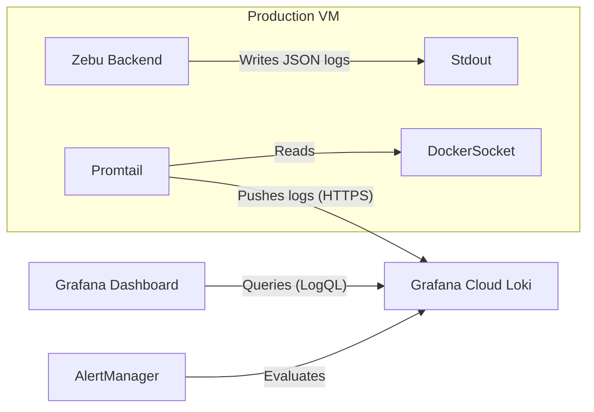

# Monitoring & Observability

Zebu uses **Grafana Cloud (Free Tier)** for production monitoring, leveraging **Loki** for log aggregation and **Promtail** for log shipping.

## Quick Links

- [Setup Guide](setup.md) - How to configure Grafana Cloud and install Promtail.
- [Alert Configuration](alerts.md) - Documentation of critical, high, and medium severity alerts.
- [Runbook](runbook.md) - Operational procedures for responding to alerts.

## Dashboards

Dashboards are stored as JSON models in [`dashboards/`](dashboards/).

### 1. [Application Overview](dashboards/application-overview.md)
**Purpose**: Comprehensive view of Zebu application health and performance.
- **Key Metrics**: Request rate, error rate, P95/P99 latency.
- **Cache**: Redis hit/miss ratios.
- **Errors**: Top error types and full error logs.

### 2. [Trading Activity](dashboards/trading-activity.md)
**Purpose**: Monitor user trading behavior and portfolio operations.
- **Volume**: Trades executed, buy vs sell ratios.
- **Patterns**: Popular tickers, trade size distribution.
- **Users**: Active portfolios and user activity.

### 3. [External Services](dashboards/external-services.md)
**Purpose**: Monitor dependencies (Alpha Vantage, PostgreSQL, Redis).
- **Alpha Vantage**: Rate limit consumption, API errors.
- **Database**: Connection pool status, slow queries.
- **System**: Network errors and connectivity checks.

## Architecture



## Log Standards

The backend uses `structlog` to emit structured JSON logs.

**Essential Fields**:
- `event`: Human readable description
- `level`: `info`, `warning`, `error`, `debug`
- `timestamp`: ISO8601
- `context`: (Optional) Request ID, user ID, etc.

Example:
```json
{"event": "Trade executed", "level": "info", "symbol": "AAPL", "price": 150.25}
```
